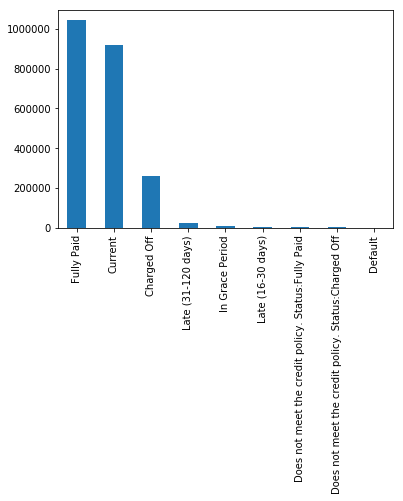
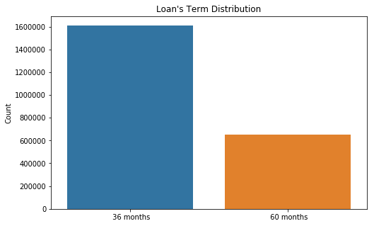
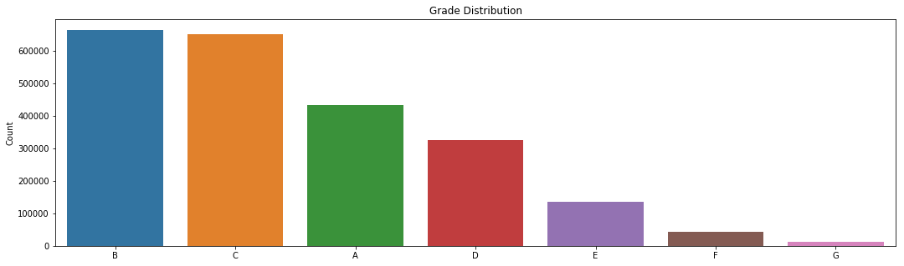
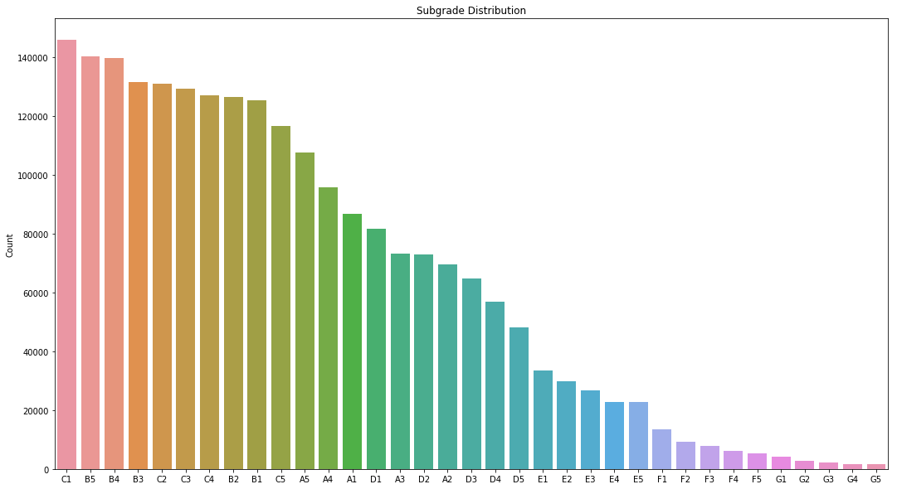
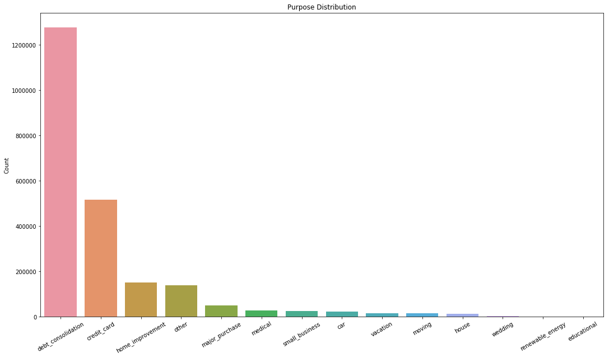
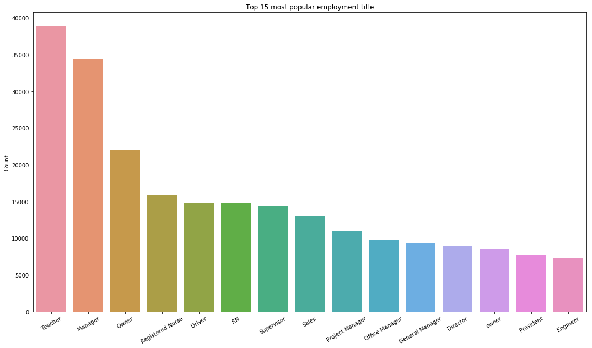
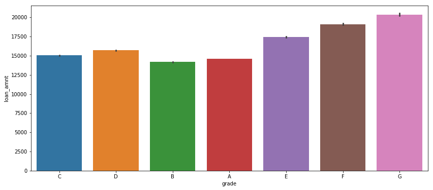
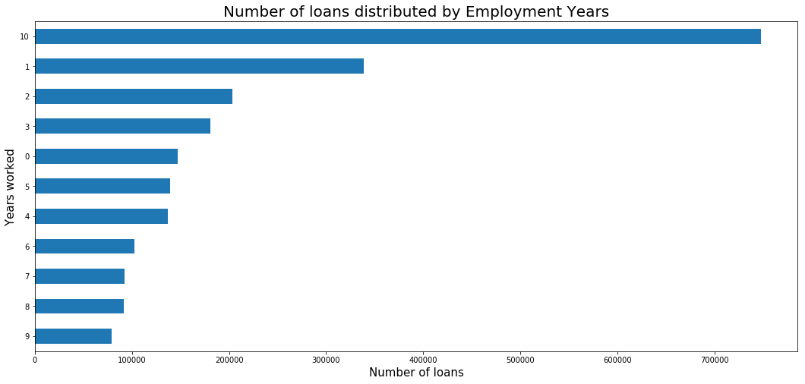

<a href="https://colab.research.google.com/github//findalexli/LendingClubKaggle/blob/master/LendingClub.ipynb">
  
</a>

```python
# The Python 3 environment comes with many helpful analytics libraries installed
# It is defined by the kaggle/python docker image: https://github.com/kaggle/docker-python
# For example, here's several helpful packages to load in 

import numpy as np # linear algebra
import pandas as pd # data processing, CSV file I/O (e.g. pd.read_csv)
import matplotlib.pyplot as plt 
import seaborn as sns
# Input data files are available in the "../input/" directory.
# For example, running this (by clicking run or pressing Shift+Enter) will list the files in the input directory

import os
print(os.listdir("./input"))

# Any results you write to the current directory are saved as output.
```

    ['LCDataDictionary.xlsx', 'Untitled.ipynb', 'loan.csv', 'loan_untouched.csv', 'corrected_target_with_default_and_charged_off_combined.csv', 'target_with_default_and_charged_off_combined.csv', 'cleaned.csv', '.ipynb_checkpoints', 'cleaned_up_loan.csv']


The loan_untouched data is the dataset that we can download from Kaggle Lending Club Data. These files contain complete loan data for all loans issued through the 2007-2015, including the current loan status (Current, Late, Fully Paid, etc.) and latest payment information. The file containing loan data through the "present" contains complete loan data for all loans issued through the previous completed calendar quarter. Additional features include credit scores, number of finance inquiries, address including zip codes, and state, and collections among others. The file is a matrix of about 890 thousand observations and 75 variables. 

https://www.kaggle.com/wendykan/lending-club-loan-data


```python
##Reading the dataset
df = pd.read_csv("./input/loan_untouched.csv", low_memory=False)
df.head(3)
```


<div>
<style scoped>
    .dataframe tbody tr th:only-of-type {
        vertical-align: middle;
    }

    .dataframe tbody tr th {
        vertical-align: top;
    }

    .dataframe thead th {
        text-align: right;
    }
</style>
<table border="1" class="dataframe">
  <thead>
    <tr style="text-align: right;">
      <th></th>
      <th>id</th>
      <th>member_id</th>
      <th>loan_amnt</th>
      <th>funded_amnt</th>
      <th>funded_amnt_inv</th>
      <th>term</th>
      <th>int_rate</th>
      <th>installment</th>
      <th>grade</th>
      <th>sub_grade</th>
      <th>...</th>
      <th>hardship_payoff_balance_amount</th>
      <th>hardship_last_payment_amount</th>
      <th>disbursement_method</th>
      <th>debt_settlement_flag</th>
      <th>debt_settlement_flag_date</th>
      <th>settlement_status</th>
      <th>settlement_date</th>
      <th>settlement_amount</th>
      <th>settlement_percentage</th>
      <th>settlement_term</th>
    </tr>
  </thead>
  <tbody>
    <tr>
      <th>0</th>
      <td>NaN</td>
      <td>NaN</td>
      <td>2500</td>
      <td>2500</td>
      <td>2500.0</td>
      <td>36 months</td>
      <td>13.56</td>
      <td>84.92</td>
      <td>C</td>
      <td>C1</td>
      <td>...</td>
      <td>NaN</td>
      <td>NaN</td>
      <td>Cash</td>
      <td>N</td>
      <td>NaN</td>
      <td>NaN</td>
      <td>NaN</td>
      <td>NaN</td>
      <td>NaN</td>
      <td>NaN</td>
    </tr>
    <tr>
      <th>1</th>
      <td>NaN</td>
      <td>NaN</td>
      <td>30000</td>
      <td>30000</td>
      <td>30000.0</td>
      <td>60 months</td>
      <td>18.94</td>
      <td>777.23</td>
      <td>D</td>
      <td>D2</td>
      <td>...</td>
      <td>NaN</td>
      <td>NaN</td>
      <td>Cash</td>
      <td>N</td>
      <td>NaN</td>
      <td>NaN</td>
      <td>NaN</td>
      <td>NaN</td>
      <td>NaN</td>
      <td>NaN</td>
    </tr>
    <tr>
      <th>2</th>
      <td>NaN</td>
      <td>NaN</td>
      <td>5000</td>
      <td>5000</td>
      <td>5000.0</td>
      <td>36 months</td>
      <td>17.97</td>
      <td>180.69</td>
      <td>D</td>
      <td>D1</td>
      <td>...</td>
      <td>NaN</td>
      <td>NaN</td>
      <td>Cash</td>
      <td>N</td>
      <td>NaN</td>
      <td>NaN</td>
      <td>NaN</td>
      <td>NaN</td>
      <td>NaN</td>
      <td>NaN</td>
    </tr>
  </tbody>
</table>
<p>3 rows × 145 columns</p>
</div>


Note that it has consumed about 10Gb of memory, 11.8GB specifically. This is a sign that we need to be very careful about memory mangagement, especially in a low-resource setting.

Let us check some basics about the dataset. First about its size and then about its dimensions. 


```python
df.shape 
```


    (2260668, 145)


```python
df.columns
```


    Index(['id', 'member_id', 'loan_amnt', 'funded_amnt', 'funded_amnt_inv',
           'term', 'int_rate', 'installment', 'grade', 'sub_grade',
           ...
           'hardship_payoff_balance_amount', 'hardship_last_payment_amount',
           'disbursement_method', 'debt_settlement_flag',
           'debt_settlement_flag_date', 'settlement_status', 'settlement_date',
           'settlement_amount', 'settlement_percentage', 'settlement_term'],
          dtype='object', length=145)


What does the various columns mean? We can rely on the dictionary provided by the Lending Street. We use Pandas to read the xlsx file, along with display style formatting


```python
#df_description = pd.read_excel('./input/LCDataDictionary.xlsx').dropna()
#df_description.style.set_properties(subset=['Description'], **{'width': '1000px'})
```

## Exploratory Data Analytics

We start out with the metric of the game: loan status


```python
df["loan_status"].value_counts()
```


    Fully Paid                                             1041952
    Current                                                 919695
    Charged Off                                             261655
    Late (31-120 days)                                       21897
    In Grace Period                                           8952
    Late (16-30 days)                                         3737
    Does not meet the credit policy. Status:Fully Paid        1988
    Does not meet the credit policy. Status:Charged Off        761
    Default                                                     31
    Name: loan_status, dtype: int64


```python
df["loan_status"].value_counts().plot(kind='bar');

```





We see that there are only 31 default cases. In the light that harges off means that the consumer has defaulted for long enough time such that the creditors has 'given up' in getting the money back, we include them in our default cases. 


```python
target_list = [1 if i=='Default' or i=='Charged Off' else 0 for i in df['loan_status']]

df['TARGET'] = target_list
df['TARGET'].value_counts()
```


    0    1998982
    1     261686
    Name: TARGET, dtype: int64


Even after including the charges off cases, we have a class imbalance issue: the 'positive' cases of defaults are much less frequent than the 'negative' non-default cases. Later in training, we need to be careful about this. 


```python
# loan_status cross
loan_status_cross = pd.crosstab(df['addr_state'], df['loan_status']).apply(lambda x: x/x.sum() * 100)
number_of_loanstatus = pd.crosstab(df['addr_state'], df['loan_status'])


# Round our values
loan_status_cross['Charged Off'] = loan_status_cross['Charged Off'].apply(lambda x: round(x, 2))
loan_status_cross['Default'] = loan_status_cross['Default'].apply(lambda x: round(x, 2))
loan_status_cross['Does not meet the credit policy. Status:Charged Off'] = loan_status_cross['Does not meet the credit policy. Status:Charged Off'].apply(lambda x: round(x, 2))
loan_status_cross['In Grace Period'] = loan_status_cross['In Grace Period'].apply(lambda x: round(x, 2))
loan_status_cross['Late (16-30 days)'] = loan_status_cross['Late (16-30 days)'].apply(lambda x: round(x, 2))
loan_status_cross['Late (31-120 days)'] = loan_status_cross['Late (31-120 days)'].apply(lambda x: round(x, 2))


number_of_loanstatus['Total'] = number_of_loanstatus.sum(axis=1) 
# number_of_badloans
number_of_loanstatus
```


<div>
<style scoped>
    .dataframe tbody tr th:only-of-type {
        vertical-align: middle;
    }

    .dataframe tbody tr th {
        vertical-align: top;
    }

    .dataframe thead th {
        text-align: right;
    }
</style>
<table border="1" class="dataframe">
  <thead>
    <tr style="text-align: right;">
      <th>loan_status</th>
      <th>Charged Off</th>
      <th>Current</th>
      <th>Default</th>
      <th>Does not meet the credit policy. Status:Charged Off</th>
      <th>Does not meet the credit policy. Status:Fully Paid</th>
      <th>Fully Paid</th>
      <th>In Grace Period</th>
      <th>Late (16-30 days)</th>
      <th>Late (31-120 days)</th>
      <th>Total</th>
    </tr>
    <tr>
      <th>addr_state</th>
      <th></th>
      <th></th>
      <th></th>
      <th></th>
      <th></th>
      <th></th>
      <th></th>
      <th></th>
      <th></th>
      <th></th>
    </tr>
  </thead>
  <tbody>
    <tr>
      <th>AK</th>
      <td>617</td>
      <td>2051</td>
      <td>0</td>
      <td>1</td>
      <td>4</td>
      <td>2480</td>
      <td>24</td>
      <td>8</td>
      <td>46</td>
      <td>5231</td>
    </tr>
    <tr>
      <th>AL</th>
      <td>3828</td>
      <td>10651</td>
      <td>1</td>
      <td>8</td>
      <td>24</td>
      <td>12301</td>
      <td>110</td>
      <td>50</td>
      <td>311</td>
      <td>27284</td>
    </tr>
    <tr>
      <th>AR</th>
      <td>2346</td>
      <td>7061</td>
      <td>0</td>
      <td>6</td>
      <td>9</td>
      <td>7362</td>
      <td>61</td>
      <td>38</td>
      <td>191</td>
      <td>17074</td>
    </tr>
    <tr>
      <th>AZ</th>
      <td>6241</td>
      <td>21241</td>
      <td>0</td>
      <td>18</td>
      <td>33</td>
      <td>25475</td>
      <td>179</td>
      <td>78</td>
      <td>512</td>
      <td>53777</td>
    </tr>
    <tr>
      <th>CA</th>
      <td>37653</td>
      <td>118612</td>
      <td>4</td>
      <td>101</td>
      <td>223</td>
      <td>153379</td>
      <td>1087</td>
      <td>540</td>
      <td>2934</td>
      <td>314533</td>
    </tr>
    <tr>
      <th>CO</th>
      <td>4500</td>
      <td>18698</td>
      <td>1</td>
      <td>13</td>
      <td>52</td>
      <td>24358</td>
      <td>140</td>
      <td>61</td>
      <td>360</td>
      <td>48183</td>
    </tr>
    <tr>
      <th>CT</th>
      <td>3334</td>
      <td>16089</td>
      <td>0</td>
      <td>12</td>
      <td>50</td>
      <td>15729</td>
      <td>181</td>
      <td>63</td>
      <td>327</td>
      <td>35785</td>
    </tr>
    <tr>
      <th>DC</th>
      <td>442</td>
      <td>1896</td>
      <td>0</td>
      <td>2</td>
      <td>8</td>
      <td>2928</td>
      <td>26</td>
      <td>9</td>
      <td>45</td>
      <td>5356</td>
    </tr>
    <tr>
      <th>DE</th>
      <td>741</td>
      <td>2682</td>
      <td>0</td>
      <td>4</td>
      <td>18</td>
      <td>2925</td>
      <td>29</td>
      <td>9</td>
      <td>50</td>
      <td>6458</td>
    </tr>
    <tr>
      <th>FL</th>
      <td>19970</td>
      <td>66340</td>
      <td>1</td>
      <td>72</td>
      <td>160</td>
      <td>72649</td>
      <td>696</td>
      <td>291</td>
      <td>1812</td>
      <td>161991</td>
    </tr>
    <tr>
      <th>GA</th>
      <td>7743</td>
      <td>30916</td>
      <td>1</td>
      <td>35</td>
      <td>69</td>
      <td>34288</td>
      <td>317</td>
      <td>152</td>
      <td>675</td>
      <td>74196</td>
    </tr>
    <tr>
      <th>HI</th>
      <td>1333</td>
      <td>3922</td>
      <td>0</td>
      <td>2</td>
      <td>5</td>
      <td>5235</td>
      <td>38</td>
      <td>14</td>
      <td>119</td>
      <td>10668</td>
    </tr>
    <tr>
      <th>IA</th>
      <td>1</td>
      <td>0</td>
      <td>0</td>
      <td>2</td>
      <td>5</td>
      <td>6</td>
      <td>0</td>
      <td>0</td>
      <td>0</td>
      <td>14</td>
    </tr>
    <tr>
      <th>ID</th>
      <td>301</td>
      <td>2677</td>
      <td>0</td>
      <td>0</td>
      <td>3</td>
      <td>1256</td>
      <td>23</td>
      <td>9</td>
      <td>39</td>
      <td>4308</td>
    </tr>
    <tr>
      <th>IL</th>
      <td>9120</td>
      <td>39830</td>
      <td>3</td>
      <td>36</td>
      <td>111</td>
      <td>40907</td>
      <td>326</td>
      <td>117</td>
      <td>723</td>
      <td>91173</td>
    </tr>
    <tr>
      <th>IN</th>
      <td>4541</td>
      <td>15972</td>
      <td>2</td>
      <td>7</td>
      <td>3</td>
      <td>16477</td>
      <td>129</td>
      <td>55</td>
      <td>329</td>
      <td>37515</td>
    </tr>
    <tr>
      <th>KS</th>
      <td>1826</td>
      <td>7967</td>
      <td>0</td>
      <td>5</td>
      <td>21</td>
      <td>9066</td>
      <td>46</td>
      <td>22</td>
      <td>156</td>
      <td>19109</td>
    </tr>
    <tr>
      <th>KY</th>
      <td>2623</td>
      <td>9110</td>
      <td>1</td>
      <td>10</td>
      <td>22</td>
      <td>9815</td>
      <td>78</td>
      <td>36</td>
      <td>192</td>
      <td>21887</td>
    </tr>
    <tr>
      <th>LA</th>
      <td>3516</td>
      <td>10268</td>
      <td>0</td>
      <td>5</td>
      <td>20</td>
      <td>11505</td>
      <td>127</td>
      <td>49</td>
      <td>269</td>
      <td>25759</td>
    </tr>
    <tr>
      <th>MA</th>
      <td>5735</td>
      <td>20883</td>
      <td>0</td>
      <td>24</td>
      <td>70</td>
      <td>24272</td>
      <td>222</td>
      <td>76</td>
      <td>502</td>
      <td>51784</td>
    </tr>
    <tr>
      <th>MD</th>
      <td>6450</td>
      <td>22651</td>
      <td>2</td>
      <td>23</td>
      <td>47</td>
      <td>23772</td>
      <td>297</td>
      <td>124</td>
      <td>642</td>
      <td>54008</td>
    </tr>
    <tr>
      <th>ME</th>
      <td>267</td>
      <td>2979</td>
      <td>1</td>
      <td>0</td>
      <td>0</td>
      <td>1653</td>
      <td>29</td>
      <td>8</td>
      <td>37</td>
      <td>4974</td>
    </tr>
    <tr>
      <th>MI</th>
      <td>6950</td>
      <td>23680</td>
      <td>0</td>
      <td>19</td>
      <td>55</td>
      <td>27178</td>
      <td>217</td>
      <td>91</td>
      <td>580</td>
      <td>58770</td>
    </tr>
    <tr>
      <th>MN</th>
      <td>4634</td>
      <td>15690</td>
      <td>1</td>
      <td>11</td>
      <td>25</td>
      <td>18607</td>
      <td>151</td>
      <td>50</td>
      <td>348</td>
      <td>39517</td>
    </tr>
    <tr>
      <th>MO</th>
      <td>4404</td>
      <td>14873</td>
      <td>0</td>
      <td>26</td>
      <td>53</td>
      <td>16159</td>
      <td>139</td>
      <td>44</td>
      <td>386</td>
      <td>36084</td>
    </tr>
    <tr>
      <th>MS</th>
      <td>1655</td>
      <td>6004</td>
      <td>0</td>
      <td>4</td>
      <td>3</td>
      <td>4661</td>
      <td>80</td>
      <td>29</td>
      <td>203</td>
      <td>12639</td>
    </tr>
    <tr>
      <th>MT</th>
      <td>628</td>
      <td>2518</td>
      <td>0</td>
      <td>6</td>
      <td>5</td>
      <td>3071</td>
      <td>20</td>
      <td>7</td>
      <td>44</td>
      <td>6299</td>
    </tr>
    <tr>
      <th>NC</th>
      <td>7668</td>
      <td>25112</td>
      <td>0</td>
      <td>12</td>
      <td>29</td>
      <td>28947</td>
      <td>265</td>
      <td>108</td>
      <td>589</td>
      <td>62730</td>
    </tr>
    <tr>
      <th>ND</th>
      <td>315</td>
      <td>2013</td>
      <td>0</td>
      <td>0</td>
      <td>0</td>
      <td>1196</td>
      <td>14</td>
      <td>7</td>
      <td>46</td>
      <td>3591</td>
    </tr>
    <tr>
      <th>NE</th>
      <td>870</td>
      <td>4256</td>
      <td>0</td>
      <td>3</td>
      <td>3</td>
      <td>2552</td>
      <td>23</td>
      <td>20</td>
      <td>92</td>
      <td>7819</td>
    </tr>
    <tr>
      <th>NH</th>
      <td>911</td>
      <td>4730</td>
      <td>0</td>
      <td>2</td>
      <td>14</td>
      <td>5332</td>
      <td>31</td>
      <td>12</td>
      <td>110</td>
      <td>11142</td>
    </tr>
    <tr>
      <th>NJ</th>
      <td>9973</td>
      <td>34797</td>
      <td>1</td>
      <td>26</td>
      <td>107</td>
      <td>36911</td>
      <td>399</td>
      <td>145</td>
      <td>773</td>
      <td>83132</td>
    </tr>
    <tr>
      <th>NM</th>
      <td>1542</td>
      <td>4632</td>
      <td>0</td>
      <td>3</td>
      <td>12</td>
      <td>5616</td>
      <td>40</td>
      <td>22</td>
      <td>119</td>
      <td>11986</td>
    </tr>
    <tr>
      <th>NV</th>
      <td>4334</td>
      <td>12530</td>
      <td>0</td>
      <td>16</td>
      <td>13</td>
      <td>15318</td>
      <td>106</td>
      <td>34</td>
      <td>306</td>
      <td>32657</td>
    </tr>
    <tr>
      <th>NY</th>
      <td>23559</td>
      <td>76455</td>
      <td>3</td>
      <td>57</td>
      <td>191</td>
      <td>82825</td>
      <td>838</td>
      <td>353</td>
      <td>2108</td>
      <td>186389</td>
    </tr>
    <tr>
      <th>OH</th>
      <td>8830</td>
      <td>31662</td>
      <td>2</td>
      <td>18</td>
      <td>85</td>
      <td>33606</td>
      <td>286</td>
      <td>88</td>
      <td>555</td>
      <td>75132</td>
    </tr>
    <tr>
      <th>OK</th>
      <td>2809</td>
      <td>8490</td>
      <td>0</td>
      <td>3</td>
      <td>14</td>
      <td>9037</td>
      <td>62</td>
      <td>51</td>
      <td>225</td>
      <td>20691</td>
    </tr>
    <tr>
      <th>OR</th>
      <td>2299</td>
      <td>10478</td>
      <td>0</td>
      <td>6</td>
      <td>11</td>
      <td>13666</td>
      <td>101</td>
      <td>26</td>
      <td>202</td>
      <td>26789</td>
    </tr>
    <tr>
      <th>PA</th>
      <td>9212</td>
      <td>31498</td>
      <td>0</td>
      <td>43</td>
      <td>89</td>
      <td>34905</td>
      <td>295</td>
      <td>162</td>
      <td>735</td>
      <td>76939</td>
    </tr>
    <tr>
      <th>RI</th>
      <td>1025</td>
      <td>4167</td>
      <td>0</td>
      <td>2</td>
      <td>7</td>
      <td>4667</td>
      <td>40</td>
      <td>10</td>
      <td>87</td>
      <td>10005</td>
    </tr>
    <tr>
      <th>SC</th>
      <td>2550</td>
      <td>12125</td>
      <td>0</td>
      <td>4</td>
      <td>13</td>
      <td>12927</td>
      <td>111</td>
      <td>38</td>
      <td>235</td>
      <td>28003</td>
    </tr>
    <tr>
      <th>SD</th>
      <td>572</td>
      <td>1799</td>
      <td>0</td>
      <td>1</td>
      <td>2</td>
      <td>2107</td>
      <td>14</td>
      <td>7</td>
      <td>47</td>
      <td>4549</td>
    </tr>
    <tr>
      <th>TN</th>
      <td>4247</td>
      <td>15222</td>
      <td>1</td>
      <td>4</td>
      <td>11</td>
      <td>15419</td>
      <td>169</td>
      <td>50</td>
      <td>360</td>
      <td>35483</td>
    </tr>
    <tr>
      <th>TX</th>
      <td>21241</td>
      <td>76499</td>
      <td>4</td>
      <td>55</td>
      <td>126</td>
      <td>85432</td>
      <td>728</td>
      <td>312</td>
      <td>1938</td>
      <td>186335</td>
    </tr>
    <tr>
      <th>UT</th>
      <td>1681</td>
      <td>5011</td>
      <td>0</td>
      <td>5</td>
      <td>14</td>
      <td>8104</td>
      <td>49</td>
      <td>16</td>
      <td>113</td>
      <td>14993</td>
    </tr>
    <tr>
      <th>VA</th>
      <td>7379</td>
      <td>25023</td>
      <td>0</td>
      <td>16</td>
      <td>63</td>
      <td>29473</td>
      <td>271</td>
      <td>106</td>
      <td>623</td>
      <td>62954</td>
    </tr>
    <tr>
      <th>VT</th>
      <td>361</td>
      <td>2312</td>
      <td>0</td>
      <td>1</td>
      <td>2</td>
      <td>2198</td>
      <td>24</td>
      <td>4</td>
      <td>35</td>
      <td>4937</td>
    </tr>
    <tr>
      <th>WA</th>
      <td>4506</td>
      <td>18067</td>
      <td>1</td>
      <td>16</td>
      <td>30</td>
      <td>23855</td>
      <td>162</td>
      <td>74</td>
      <td>349</td>
      <td>47060</td>
    </tr>
    <tr>
      <th>WI</th>
      <td>3139</td>
      <td>12183</td>
      <td>1</td>
      <td>14</td>
      <td>42</td>
      <td>13998</td>
      <td>104</td>
      <td>49</td>
      <td>347</td>
      <td>29877</td>
    </tr>
    <tr>
      <th>WV</th>
      <td>752</td>
      <td>3527</td>
      <td>0</td>
      <td>2</td>
      <td>8</td>
      <td>3993</td>
      <td>19</td>
      <td>9</td>
      <td>41</td>
      <td>8351</td>
    </tr>
    <tr>
      <th>WY</th>
      <td>481</td>
      <td>1846</td>
      <td>0</td>
      <td>0</td>
      <td>4</td>
      <td>2354</td>
      <td>29</td>
      <td>4</td>
      <td>30</td>
      <td>4748</td>
    </tr>
  </tbody>
</table>
</div>


Actually, after we set the target column, we can drop the loan_status column, as a role of thumb


```python
df.drop('loan_status',axis=1,inplace=True)
```

# Exploratory Data Visualization


```python
plt.figure(figsize=(8, 5))
sns.barplot(y=df.term.value_counts(), x=df.term.value_counts().index)
plt.xticks(rotation=0)
plt.title("Loan's Term Distribution")
plt.ylabel("Count")
```


    Text(0, 0.5, 'Count')





```python
plt.figure(figsize=(18, 5))
sns.barplot(y=df.grade.value_counts(), x=df.grade.value_counts().index)
plt.xticks(rotation=0)
plt.title("Grade Distribution")
plt.ylabel("Count")
```


    Text(0, 0.5, 'Count')





```python
plt.figure(figsize=(18, 10))
sns.barplot(y=df.sub_grade.value_counts(), x=df.sub_grade.value_counts().index)
plt.xticks(rotation=0)
plt.title("Subgrade Distribution")
plt.ylabel("Count")
```


    Text(0, 0.5, 'Count')





```python
plt.figure(figsize=(18, 10))
sns.barplot(y=df.purpose.value_counts(), x=df.purpose.value_counts().index)
plt.xticks(rotation=0)
plt.title("Purpose Distribution")
plt.ylabel("Count")
plt.xticks(rotation=30)
```


    (array([ 0,  1,  2,  3,  4,  5,  6,  7,  8,  9, 10, 11, 12, 13]),
     <a list of 14 Text xticklabel objects>)





```python
plt.figure(figsize=(18, 10))
sns.barplot(y=df.emp_title.value_counts()[:15], x=df.emp_title.value_counts()[:15].index)
plt.xticks(rotation=0)
plt.title("Top 15 most popular employment title")
plt.ylabel("Count")
plt.xticks(rotation=30)
```


    (array([ 0,  1,  2,  3,  4,  5,  6,  7,  8,  9, 10, 11, 12, 13, 14]),
     <a list of 15 Text xticklabel objects>)





```python
plt.figure(figsize = (14,6))

sns.barplot(x='grade', y='loan_amnt', 
              data=df)
g.set_xticklabels(g.get_xticklabels(),rotation=90)
g.set_xlabel("Duration Distribuition", fontsize=15)
g.set_ylabel("Mean amount", fontsize=15)
g.set_title("Loan Amount by Grades", fontsize=20)
plt.legend(loc=1)
plt.show()
```

    /opt/anaconda3/lib/python3.7/site-packages/scipy/stats/stats.py:1713: FutureWarning:
    
    Using a non-tuple sequence for multidimensional indexing is deprecated; use `arr[tuple(seq)]` instead of `arr[seq]`. In the future this will be interpreted as an array index, `arr[np.array(seq)]`, which will result either in an error or a different result.
    


    ---------------------------------------------------------------------------

    NameError                                 Traceback (most recent call last)

    <ipython-input-17-ca8b1cb1938e> in <module>
          3 sns.barplot(x='grade', y='loan_amnt', 
          4               data=df)
    ----> 5 g.set_xticklabels(g.get_xticklabels(),rotation=90)
          6 g.set_xlabel("Duration Distribuition", fontsize=15)
          7 g.set_ylabel("Mean amount", fontsize=15)


    NameError: name 'g' is not defined





## Missing Value Analysis

### Part 1, Dataset-wide analysis


```python
def null_values(df):
        mis_val = df.isnull().sum()
        mis_val_percent = 100 * df.isnull().sum() / len(df)
        mis_val_table = pd.concat([mis_val, mis_val_percent], axis=1)
        mis_val_table_ren_columns = mis_val_table.rename(
        columns = {0 : 'Missing Values', 1 : '% of Total Values'})
        mis_val_table_ren_columns = mis_val_table_ren_columns[
            mis_val_table_ren_columns.iloc[:,1] != 0].sort_values(
        '% of Total Values', ascending=False).round(1)
        print ("Dataframe has " + str(df.shape[1]) + " columns.\n"      
            "There are " + str(mis_val_table_ren_columns.shape[0]) +
              " columns that have missing values.")
        return mis_val_table_ren_columns
```


```python
missing_values = null_values(df)
```

    Dataframe has 145 columns.
    There are 113 columns that have missing values.


```python
missing_values
```


<div>
<style scoped>
    .dataframe tbody tr th:only-of-type {
        vertical-align: middle;
    }

    .dataframe tbody tr th {
        vertical-align: top;
    }

    .dataframe thead th {
        text-align: right;
    }
</style>
<table border="1" class="dataframe">
  <thead>
    <tr style="text-align: right;">
      <th></th>
      <th>Missing Values</th>
      <th>% of Total Values</th>
    </tr>
  </thead>
  <tbody>
    <tr>
      <th>id</th>
      <td>2260668</td>
      <td>100.0</td>
    </tr>
    <tr>
      <th>url</th>
      <td>2260668</td>
      <td>100.0</td>
    </tr>
    <tr>
      <th>member_id</th>
      <td>2260668</td>
      <td>100.0</td>
    </tr>
    <tr>
      <th>orig_projected_additional_accrued_interest</th>
      <td>2252242</td>
      <td>99.6</td>
    </tr>
    <tr>
      <th>hardship_length</th>
      <td>2250055</td>
      <td>99.5</td>
    </tr>
    <tr>
      <th>hardship_reason</th>
      <td>2250055</td>
      <td>99.5</td>
    </tr>
    <tr>
      <th>hardship_status</th>
      <td>2250055</td>
      <td>99.5</td>
    </tr>
    <tr>
      <th>deferral_term</th>
      <td>2250055</td>
      <td>99.5</td>
    </tr>
    <tr>
      <th>hardship_amount</th>
      <td>2250055</td>
      <td>99.5</td>
    </tr>
    <tr>
      <th>hardship_start_date</th>
      <td>2250055</td>
      <td>99.5</td>
    </tr>
    <tr>
      <th>hardship_end_date</th>
      <td>2250055</td>
      <td>99.5</td>
    </tr>
    <tr>
      <th>payment_plan_start_date</th>
      <td>2250055</td>
      <td>99.5</td>
    </tr>
    <tr>
      <th>hardship_loan_status</th>
      <td>2250055</td>
      <td>99.5</td>
    </tr>
    <tr>
      <th>hardship_dpd</th>
      <td>2250055</td>
      <td>99.5</td>
    </tr>
    <tr>
      <th>hardship_payoff_balance_amount</th>
      <td>2250055</td>
      <td>99.5</td>
    </tr>
    <tr>
      <th>hardship_last_payment_amount</th>
      <td>2250055</td>
      <td>99.5</td>
    </tr>
    <tr>
      <th>hardship_type</th>
      <td>2250055</td>
      <td>99.5</td>
    </tr>
    <tr>
      <th>debt_settlement_flag_date</th>
      <td>2227612</td>
      <td>98.5</td>
    </tr>
    <tr>
      <th>settlement_status</th>
      <td>2227612</td>
      <td>98.5</td>
    </tr>
    <tr>
      <th>settlement_date</th>
      <td>2227612</td>
      <td>98.5</td>
    </tr>
    <tr>
      <th>settlement_amount</th>
      <td>2227612</td>
      <td>98.5</td>
    </tr>
    <tr>
      <th>settlement_percentage</th>
      <td>2227612</td>
      <td>98.5</td>
    </tr>
    <tr>
      <th>settlement_term</th>
      <td>2227612</td>
      <td>98.5</td>
    </tr>
    <tr>
      <th>sec_app_mths_since_last_major_derog</th>
      <td>2224726</td>
      <td>98.4</td>
    </tr>
    <tr>
      <th>sec_app_revol_util</th>
      <td>2154484</td>
      <td>95.3</td>
    </tr>
    <tr>
      <th>revol_bal_joint</th>
      <td>2152648</td>
      <td>95.2</td>
    </tr>
    <tr>
      <th>sec_app_open_acc</th>
      <td>2152647</td>
      <td>95.2</td>
    </tr>
    <tr>
      <th>sec_app_chargeoff_within_12_mths</th>
      <td>2152647</td>
      <td>95.2</td>
    </tr>
    <tr>
      <th>sec_app_open_act_il</th>
      <td>2152647</td>
      <td>95.2</td>
    </tr>
    <tr>
      <th>sec_app_collections_12_mths_ex_med</th>
      <td>2152647</td>
      <td>95.2</td>
    </tr>
    <tr>
      <th>...</th>
      <td>...</td>
      <td>...</td>
    </tr>
    <tr>
      <th>num_rev_tl_bal_gt_0</th>
      <td>70276</td>
      <td>3.1</td>
    </tr>
    <tr>
      <th>num_tl_30dpd</th>
      <td>70276</td>
      <td>3.1</td>
    </tr>
    <tr>
      <th>tot_hi_cred_lim</th>
      <td>70276</td>
      <td>3.1</td>
    </tr>
    <tr>
      <th>num_bc_tl</th>
      <td>70276</td>
      <td>3.1</td>
    </tr>
    <tr>
      <th>total_il_high_credit_limit</th>
      <td>70276</td>
      <td>3.1</td>
    </tr>
    <tr>
      <th>num_bc_sats</th>
      <td>58590</td>
      <td>2.6</td>
    </tr>
    <tr>
      <th>num_sats</th>
      <td>58590</td>
      <td>2.6</td>
    </tr>
    <tr>
      <th>acc_open_past_24mths</th>
      <td>50030</td>
      <td>2.2</td>
    </tr>
    <tr>
      <th>mort_acc</th>
      <td>50030</td>
      <td>2.2</td>
    </tr>
    <tr>
      <th>total_bc_limit</th>
      <td>50030</td>
      <td>2.2</td>
    </tr>
    <tr>
      <th>total_bal_ex_mort</th>
      <td>50030</td>
      <td>2.2</td>
    </tr>
    <tr>
      <th>title</th>
      <td>23325</td>
      <td>1.0</td>
    </tr>
    <tr>
      <th>last_pymnt_d</th>
      <td>2426</td>
      <td>0.1</td>
    </tr>
    <tr>
      <th>revol_util</th>
      <td>1802</td>
      <td>0.1</td>
    </tr>
    <tr>
      <th>dti</th>
      <td>1711</td>
      <td>0.1</td>
    </tr>
    <tr>
      <th>pub_rec_bankruptcies</th>
      <td>1365</td>
      <td>0.1</td>
    </tr>
    <tr>
      <th>chargeoff_within_12_mths</th>
      <td>145</td>
      <td>0.0</td>
    </tr>
    <tr>
      <th>collections_12_mths_ex_med</th>
      <td>145</td>
      <td>0.0</td>
    </tr>
    <tr>
      <th>tax_liens</th>
      <td>105</td>
      <td>0.0</td>
    </tr>
    <tr>
      <th>last_credit_pull_d</th>
      <td>73</td>
      <td>0.0</td>
    </tr>
    <tr>
      <th>inq_last_6mths</th>
      <td>30</td>
      <td>0.0</td>
    </tr>
    <tr>
      <th>open_acc</th>
      <td>29</td>
      <td>0.0</td>
    </tr>
    <tr>
      <th>total_acc</th>
      <td>29</td>
      <td>0.0</td>
    </tr>
    <tr>
      <th>earliest_cr_line</th>
      <td>29</td>
      <td>0.0</td>
    </tr>
    <tr>
      <th>delinq_2yrs</th>
      <td>29</td>
      <td>0.0</td>
    </tr>
    <tr>
      <th>delinq_amnt</th>
      <td>29</td>
      <td>0.0</td>
    </tr>
    <tr>
      <th>acc_now_delinq</th>
      <td>29</td>
      <td>0.0</td>
    </tr>
    <tr>
      <th>pub_rec</th>
      <td>29</td>
      <td>0.0</td>
    </tr>
    <tr>
      <th>annual_inc</th>
      <td>4</td>
      <td>0.0</td>
    </tr>
    <tr>
      <th>zip_code</th>
      <td>1</td>
      <td>0.0</td>
    </tr>
  </tbody>
</table>
<p>113 rows × 2 columns</p>
</div>


More specifically, we can look at the missing values for float64 type of columns, sorted by the percentage of missing


```python
df.select_dtypes(include=['float64']).describe()\
.T.assign(missing = df.apply(lambda x : (1 - x.count() /len(x)))).sort_values(by = 'missing',ascending = False)

```


<div>
<style scoped>
    .dataframe tbody tr th:only-of-type {
        vertical-align: middle;
    }

    .dataframe tbody tr th {
        vertical-align: top;
    }

    .dataframe thead th {
        text-align: right;
    }
</style>
<table border="1" class="dataframe">
  <thead>
    <tr style="text-align: right;">
      <th></th>
      <th>count</th>
      <th>mean</th>
      <th>std</th>
      <th>min</th>
      <th>25%</th>
      <th>50%</th>
      <th>75%</th>
      <th>max</th>
      <th>missing</th>
    </tr>
  </thead>
  <tbody>
    <tr>
      <th>id</th>
      <td>0.0</td>
      <td>NaN</td>
      <td>NaN</td>
      <td>NaN</td>
      <td>NaN</td>
      <td>NaN</td>
      <td>NaN</td>
      <td>NaN</td>
      <td>1.000000</td>
    </tr>
    <tr>
      <th>member_id</th>
      <td>0.0</td>
      <td>NaN</td>
      <td>NaN</td>
      <td>NaN</td>
      <td>NaN</td>
      <td>NaN</td>
      <td>NaN</td>
      <td>NaN</td>
      <td>1.000000</td>
    </tr>
    <tr>
      <th>url</th>
      <td>0.0</td>
      <td>NaN</td>
      <td>NaN</td>
      <td>NaN</td>
      <td>NaN</td>
      <td>NaN</td>
      <td>NaN</td>
      <td>NaN</td>
      <td>1.000000</td>
    </tr>
    <tr>
      <th>orig_projected_additional_accrued_interest</th>
      <td>8426.0</td>
      <td>454.840802</td>
      <td>375.830737</td>
      <td>1.920000e+00</td>
      <td>174.9675</td>
      <td>352.605000</td>
      <td>622.792500</td>
      <td>2.680890e+03</td>
      <td>0.996273</td>
    </tr>
    <tr>
      <th>hardship_last_payment_amount</th>
      <td>10613.0</td>
      <td>193.606331</td>
      <td>198.694368</td>
      <td>1.000000e-02</td>
      <td>43.7800</td>
      <td>132.890000</td>
      <td>284.180000</td>
      <td>1.407860e+03</td>
      <td>0.995305</td>
    </tr>
    <tr>
      <th>hardship_payoff_balance_amount</th>
      <td>10613.0</td>
      <td>11628.036442</td>
      <td>7615.161123</td>
      <td>5.573000e+01</td>
      <td>5628.7300</td>
      <td>10044.220000</td>
      <td>16114.940000</td>
      <td>4.030641e+04</td>
      <td>0.995305</td>
    </tr>
    <tr>
      <th>hardship_dpd</th>
      <td>10613.0</td>
      <td>13.686422</td>
      <td>9.728138</td>
      <td>0.000000e+00</td>
      <td>5.0000</td>
      <td>15.000000</td>
      <td>22.000000</td>
      <td>3.700000e+01</td>
      <td>0.995305</td>
    </tr>
    <tr>
      <th>hardship_length</th>
      <td>10613.0</td>
      <td>3.000000</td>
      <td>0.000000</td>
      <td>3.000000e+00</td>
      <td>3.0000</td>
      <td>3.000000</td>
      <td>3.000000</td>
      <td>3.000000e+00</td>
      <td>0.995305</td>
    </tr>
    <tr>
      <th>hardship_amount</th>
      <td>10613.0</td>
      <td>155.006696</td>
      <td>129.113137</td>
      <td>6.400000e-01</td>
      <td>59.3700</td>
      <td>119.040000</td>
      <td>213.260000</td>
      <td>9.439400e+02</td>
      <td>0.995305</td>
    </tr>
    <tr>
      <th>deferral_term</th>
      <td>10613.0</td>
      <td>3.000000</td>
      <td>0.000000</td>
      <td>3.000000e+00</td>
      <td>3.0000</td>
      <td>3.000000</td>
      <td>3.000000</td>
      <td>3.000000e+00</td>
      <td>0.995305</td>
    </tr>
    <tr>
      <th>settlement_percentage</th>
      <td>33056.0</td>
      <td>47.775600</td>
      <td>7.336379</td>
      <td>2.000000e-01</td>
      <td>45.0000</td>
      <td>45.000000</td>
      <td>50.000000</td>
      <td>5.213500e+02</td>
      <td>0.985378</td>
    </tr>
    <tr>
      <th>settlement_amount</th>
      <td>33056.0</td>
      <td>5030.606922</td>
      <td>3692.027842</td>
      <td>4.421000e+01</td>
      <td>2227.0000</td>
      <td>4172.855000</td>
      <td>6870.782500</td>
      <td>3.360100e+04</td>
      <td>0.985378</td>
    </tr>
    <tr>
      <th>settlement_term</th>
      <td>33056.0</td>
      <td>13.148596</td>
      <td>8.192319</td>
      <td>0.000000e+00</td>
      <td>6.0000</td>
      <td>14.000000</td>
      <td>18.000000</td>
      <td>1.810000e+02</td>
      <td>0.985378</td>
    </tr>
    <tr>
      <th>sec_app_mths_since_last_major_derog</th>
      <td>35942.0</td>
      <td>36.937928</td>
      <td>23.924584</td>
      <td>0.000000e+00</td>
      <td>16.0000</td>
      <td>36.000000</td>
      <td>56.000000</td>
      <td>1.850000e+02</td>
      <td>0.984101</td>
    </tr>
    <tr>
      <th>sec_app_revol_util</th>
      <td>106184.0</td>
      <td>58.169101</td>
      <td>25.548212</td>
      <td>0.000000e+00</td>
      <td>39.8000</td>
      <td>60.200000</td>
      <td>78.600000</td>
      <td>4.343000e+02</td>
      <td>0.953030</td>
    </tr>
    <tr>
      <th>revol_bal_joint</th>
      <td>108020.0</td>
      <td>33617.278847</td>
      <td>28153.874309</td>
      <td>0.000000e+00</td>
      <td>15106.7500</td>
      <td>26516.500000</td>
      <td>43769.000000</td>
      <td>1.110019e+06</td>
      <td>0.952218</td>
    </tr>
    <tr>
      <th>sec_app_open_acc</th>
      <td>108021.0</td>
      <td>11.469455</td>
      <td>6.627271</td>
      <td>0.000000e+00</td>
      <td>7.0000</td>
      <td>10.000000</td>
      <td>15.000000</td>
      <td>8.200000e+01</td>
      <td>0.952217</td>
    </tr>
    <tr>
      <th>sec_app_inq_last_6mths</th>
      <td>108021.0</td>
      <td>0.633256</td>
      <td>0.993401</td>
      <td>0.000000e+00</td>
      <td>0.0000</td>
      <td>0.000000</td>
      <td>1.000000</td>
      <td>6.000000e+00</td>
      <td>0.952217</td>
    </tr>
    <tr>
      <th>sec_app_mort_acc</th>
      <td>108021.0</td>
      <td>1.538997</td>
      <td>1.760569</td>
      <td>0.000000e+00</td>
      <td>0.0000</td>
      <td>1.000000</td>
      <td>2.000000</td>
      <td>2.700000e+01</td>
      <td>0.952217</td>
    </tr>
    <tr>
      <th>sec_app_collections_12_mths_ex_med</th>
      <td>108021.0</td>
      <td>0.077568</td>
      <td>0.407996</td>
      <td>0.000000e+00</td>
      <td>0.0000</td>
      <td>0.000000</td>
      <td>0.000000</td>
      <td>2.300000e+01</td>
      <td>0.952217</td>
    </tr>
    <tr>
      <th>sec_app_chargeoff_within_12_mths</th>
      <td>108021.0</td>
      <td>0.046352</td>
      <td>0.411496</td>
      <td>0.000000e+00</td>
      <td>0.0000</td>
      <td>0.000000</td>
      <td>0.000000</td>
      <td>2.100000e+01</td>
      <td>0.952217</td>
    </tr>
    <tr>
      <th>sec_app_num_rev_accts</th>
      <td>108021.0</td>
      <td>12.533072</td>
      <td>8.150964</td>
      <td>0.000000e+00</td>
      <td>7.0000</td>
      <td>11.000000</td>
      <td>17.000000</td>
      <td>1.060000e+02</td>
      <td>0.952217</td>
    </tr>
    <tr>
      <th>sec_app_open_act_il</th>
      <td>108021.0</td>
      <td>3.010554</td>
      <td>3.275893</td>
      <td>0.000000e+00</td>
      <td>1.0000</td>
      <td>2.000000</td>
      <td>4.000000</td>
      <td>4.300000e+01</td>
      <td>0.952217</td>
    </tr>
    <tr>
      <th>dti_joint</th>
      <td>120706.0</td>
      <td>19.251817</td>
      <td>7.822086</td>
      <td>0.000000e+00</td>
      <td>13.5300</td>
      <td>18.840000</td>
      <td>24.620000</td>
      <td>6.949000e+01</td>
      <td>0.946606</td>
    </tr>
    <tr>
      <th>annual_inc_joint</th>
      <td>120710.0</td>
      <td>123624.636701</td>
      <td>74161.346328</td>
      <td>5.693510e+03</td>
      <td>83400.0000</td>
      <td>110000.000000</td>
      <td>147995.000000</td>
      <td>7.874821e+06</td>
      <td>0.946604</td>
    </tr>
    <tr>
      <th>mths_since_last_record</th>
      <td>359156.0</td>
      <td>72.312842</td>
      <td>26.464094</td>
      <td>0.000000e+00</td>
      <td>55.0000</td>
      <td>74.000000</td>
      <td>92.000000</td>
      <td>1.290000e+02</td>
      <td>0.841128</td>
    </tr>
    <tr>
      <th>mths_since_recent_bc_dlq</th>
      <td>519701.0</td>
      <td>39.303090</td>
      <td>22.617689</td>
      <td>0.000000e+00</td>
      <td>21.0000</td>
      <td>37.000000</td>
      <td>57.000000</td>
      <td>2.020000e+02</td>
      <td>0.770112</td>
    </tr>
    <tr>
      <th>mths_since_last_major_derog</th>
      <td>580775.0</td>
      <td>44.164220</td>
      <td>21.533121</td>
      <td>0.000000e+00</td>
      <td>27.0000</td>
      <td>44.000000</td>
      <td>62.000000</td>
      <td>2.260000e+02</td>
      <td>0.743096</td>
    </tr>
    <tr>
      <th>mths_since_recent_revol_delinq</th>
      <td>740359.0</td>
      <td>35.782223</td>
      <td>22.307239</td>
      <td>0.000000e+00</td>
      <td>17.0000</td>
      <td>33.000000</td>
      <td>51.000000</td>
      <td>2.020000e+02</td>
      <td>0.672504</td>
    </tr>
    <tr>
      <th>mths_since_last_delinq</th>
      <td>1102166.0</td>
      <td>34.540916</td>
      <td>21.900471</td>
      <td>0.000000e+00</td>
      <td>16.0000</td>
      <td>31.000000</td>
      <td>50.000000</td>
      <td>2.260000e+02</td>
      <td>0.512460</td>
    </tr>
    <tr>
      <th>...</th>
      <td>...</td>
      <td>...</td>
      <td>...</td>
      <td>...</td>
      <td>...</td>
      <td>...</td>
      <td>...</td>
      <td>...</td>
      <td>...</td>
    </tr>
    <tr>
      <th>acc_open_past_24mths</th>
      <td>2210638.0</td>
      <td>4.521656</td>
      <td>3.164229</td>
      <td>0.000000e+00</td>
      <td>2.0000</td>
      <td>4.000000</td>
      <td>6.000000</td>
      <td>6.400000e+01</td>
      <td>0.022131</td>
    </tr>
    <tr>
      <th>total_bc_limit</th>
      <td>2210638.0</td>
      <td>23193.768173</td>
      <td>23006.558239</td>
      <td>0.000000e+00</td>
      <td>8300.0000</td>
      <td>16300.000000</td>
      <td>30300.000000</td>
      <td>1.569000e+06</td>
      <td>0.022131</td>
    </tr>
    <tr>
      <th>total_bal_ex_mort</th>
      <td>2210638.0</td>
      <td>51022.938462</td>
      <td>49911.235666</td>
      <td>0.000000e+00</td>
      <td>20892.0000</td>
      <td>37864.000000</td>
      <td>64350.000000</td>
      <td>3.408095e+06</td>
      <td>0.022131</td>
    </tr>
    <tr>
      <th>revol_util</th>
      <td>2258866.0</td>
      <td>50.337696</td>
      <td>24.713073</td>
      <td>0.000000e+00</td>
      <td>31.5000</td>
      <td>50.300000</td>
      <td>69.400000</td>
      <td>8.923000e+02</td>
      <td>0.000797</td>
    </tr>
    <tr>
      <th>dti</th>
      <td>2258957.0</td>
      <td>18.824196</td>
      <td>14.183329</td>
      <td>-1.000000e+00</td>
      <td>11.8900</td>
      <td>17.840000</td>
      <td>24.490000</td>
      <td>9.990000e+02</td>
      <td>0.000757</td>
    </tr>
    <tr>
      <th>pub_rec_bankruptcies</th>
      <td>2259303.0</td>
      <td>0.128194</td>
      <td>0.364613</td>
      <td>0.000000e+00</td>
      <td>0.0000</td>
      <td>0.000000</td>
      <td>0.000000</td>
      <td>1.200000e+01</td>
      <td>0.000604</td>
    </tr>
    <tr>
      <th>chargeoff_within_12_mths</th>
      <td>2260523.0</td>
      <td>0.008464</td>
      <td>0.104810</td>
      <td>0.000000e+00</td>
      <td>0.0000</td>
      <td>0.000000</td>
      <td>0.000000</td>
      <td>1.000000e+01</td>
      <td>0.000064</td>
    </tr>
    <tr>
      <th>collections_12_mths_ex_med</th>
      <td>2260523.0</td>
      <td>0.018146</td>
      <td>0.150813</td>
      <td>0.000000e+00</td>
      <td>0.0000</td>
      <td>0.000000</td>
      <td>0.000000</td>
      <td>2.000000e+01</td>
      <td>0.000064</td>
    </tr>
    <tr>
      <th>tax_liens</th>
      <td>2260563.0</td>
      <td>0.046771</td>
      <td>0.377534</td>
      <td>0.000000e+00</td>
      <td>0.0000</td>
      <td>0.000000</td>
      <td>0.000000</td>
      <td>8.500000e+01</td>
      <td>0.000046</td>
    </tr>
    <tr>
      <th>inq_last_6mths</th>
      <td>2260638.0</td>
      <td>0.576835</td>
      <td>0.885963</td>
      <td>0.000000e+00</td>
      <td>0.0000</td>
      <td>0.000000</td>
      <td>1.000000</td>
      <td>3.300000e+01</td>
      <td>0.000013</td>
    </tr>
    <tr>
      <th>delinq_amnt</th>
      <td>2260639.0</td>
      <td>12.369828</td>
      <td>726.464781</td>
      <td>0.000000e+00</td>
      <td>0.0000</td>
      <td>0.000000</td>
      <td>0.000000</td>
      <td>2.499250e+05</td>
      <td>0.000013</td>
    </tr>
    <tr>
      <th>total_acc</th>
      <td>2260639.0</td>
      <td>24.162552</td>
      <td>11.987528</td>
      <td>1.000000e+00</td>
      <td>15.0000</td>
      <td>22.000000</td>
      <td>31.000000</td>
      <td>1.760000e+02</td>
      <td>0.000013</td>
    </tr>
    <tr>
      <th>delinq_2yrs</th>
      <td>2260639.0</td>
      <td>0.306879</td>
      <td>0.867230</td>
      <td>0.000000e+00</td>
      <td>0.0000</td>
      <td>0.000000</td>
      <td>0.000000</td>
      <td>5.800000e+01</td>
      <td>0.000013</td>
    </tr>
    <tr>
      <th>pub_rec</th>
      <td>2260639.0</td>
      <td>0.197528</td>
      <td>0.570515</td>
      <td>0.000000e+00</td>
      <td>0.0000</td>
      <td>0.000000</td>
      <td>0.000000</td>
      <td>8.600000e+01</td>
      <td>0.000013</td>
    </tr>
    <tr>
      <th>acc_now_delinq</th>
      <td>2260639.0</td>
      <td>0.004148</td>
      <td>0.069617</td>
      <td>0.000000e+00</td>
      <td>0.0000</td>
      <td>0.000000</td>
      <td>0.000000</td>
      <td>1.400000e+01</td>
      <td>0.000013</td>
    </tr>
    <tr>
      <th>open_acc</th>
      <td>2260639.0</td>
      <td>11.612402</td>
      <td>5.640861</td>
      <td>0.000000e+00</td>
      <td>8.0000</td>
      <td>11.000000</td>
      <td>14.000000</td>
      <td>1.010000e+02</td>
      <td>0.000013</td>
    </tr>
    <tr>
      <th>annual_inc</th>
      <td>2260664.0</td>
      <td>77992.428687</td>
      <td>112696.199574</td>
      <td>0.000000e+00</td>
      <td>46000.0000</td>
      <td>65000.000000</td>
      <td>93000.000000</td>
      <td>1.100000e+08</td>
      <td>0.000002</td>
    </tr>
    <tr>
      <th>recoveries</th>
      <td>2260668.0</td>
      <td>136.073998</td>
      <td>725.831678</td>
      <td>0.000000e+00</td>
      <td>0.0000</td>
      <td>0.000000</td>
      <td>0.000000</td>
      <td>3.985955e+04</td>
      <td>0.000000</td>
    </tr>
    <tr>
      <th>total_rec_late_fee</th>
      <td>2260668.0</td>
      <td>1.462469</td>
      <td>11.502095</td>
      <td>-9.500000e-09</td>
      <td>0.0000</td>
      <td>0.000000</td>
      <td>0.000000</td>
      <td>1.427250e+03</td>
      <td>0.000000</td>
    </tr>
    <tr>
      <th>total_rec_int</th>
      <td>2260668.0</td>
      <td>2386.351954</td>
      <td>2663.086087</td>
      <td>0.000000e+00</td>
      <td>693.6100</td>
      <td>1485.280000</td>
      <td>3052.220000</td>
      <td>2.819250e+04</td>
      <td>0.000000</td>
    </tr>
    <tr>
      <th>total_rec_prncp</th>
      <td>2260668.0</td>
      <td>9300.142079</td>
      <td>8304.885568</td>
      <td>0.000000e+00</td>
      <td>2846.1800</td>
      <td>6823.385000</td>
      <td>13397.500000</td>
      <td>4.000000e+04</td>
      <td>0.000000</td>
    </tr>
    <tr>
      <th>collection_recovery_fee</th>
      <td>2260668.0</td>
      <td>22.593284</td>
      <td>127.111362</td>
      <td>0.000000e+00</td>
      <td>0.0000</td>
      <td>0.000000</td>
      <td>0.000000</td>
      <td>7.174719e+03</td>
      <td>0.000000</td>
    </tr>
    <tr>
      <th>total_pymnt</th>
      <td>2260668.0</td>
      <td>11824.030498</td>
      <td>9889.599027</td>
      <td>0.000000e+00</td>
      <td>4272.5800</td>
      <td>9060.869904</td>
      <td>16707.972704</td>
      <td>6.329688e+04</td>
      <td>0.000000</td>
    </tr>
    <tr>
      <th>out_prncp_inv</th>
      <td>2260668.0</td>
      <td>4445.294869</td>
      <td>7546.656886</td>
      <td>0.000000e+00</td>
      <td>0.0000</td>
      <td>0.000000</td>
      <td>6710.320000</td>
      <td>4.000000e+04</td>
      <td>0.000000</td>
    </tr>
    <tr>
      <th>out_prncp</th>
      <td>2260668.0</td>
      <td>4446.292883</td>
      <td>7547.611729</td>
      <td>0.000000e+00</td>
      <td>0.0000</td>
      <td>0.000000</td>
      <td>6712.632500</td>
      <td>4.000000e+04</td>
      <td>0.000000</td>
    </tr>
    <tr>
      <th>last_pymnt_amnt</th>
      <td>2260668.0</td>
      <td>3364.015261</td>
      <td>5971.757409</td>
      <td>0.000000e+00</td>
      <td>308.6400</td>
      <td>588.470000</td>
      <td>3534.965000</td>
      <td>4.219205e+04</td>
      <td>0.000000</td>
    </tr>
    <tr>
      <th>installment</th>
      <td>2260668.0</td>
      <td>445.807646</td>
      <td>267.173725</td>
      <td>4.930000e+00</td>
      <td>251.6500</td>
      <td>377.990000</td>
      <td>593.320000</td>
      <td>1.719830e+03</td>
      <td>0.000000</td>
    </tr>
    <tr>
      <th>int_rate</th>
      <td>2260668.0</td>
      <td>13.092913</td>
      <td>4.832114</td>
      <td>5.310000e+00</td>
      <td>9.4900</td>
      <td>12.620000</td>
      <td>15.990000</td>
      <td>3.099000e+01</td>
      <td>0.000000</td>
    </tr>
    <tr>
      <th>funded_amnt_inv</th>
      <td>2260668.0</td>
      <td>15023.437624</td>
      <td>9192.331807</td>
      <td>0.000000e+00</td>
      <td>8000.0000</td>
      <td>12800.000000</td>
      <td>20000.000000</td>
      <td>4.000000e+04</td>
      <td>0.000000</td>
    </tr>
    <tr>
      <th>total_pymnt_inv</th>
      <td>2260668.0</td>
      <td>11805.943515</td>
      <td>9884.834668</td>
      <td>0.000000e+00</td>
      <td>4257.7300</td>
      <td>9043.080000</td>
      <td>16682.572500</td>
      <td>6.329688e+04</td>
      <td>0.000000</td>
    </tr>
  </tbody>
</table>
<p>105 rows × 9 columns</p>
</div>


We can also look at the missing values for object type of columns, sorted by the percentage of missing


```python
df.select_dtypes(include=['O']).describe()\
.T.assign(missing = df.apply(lambda x : (1 - x.count() /len(x)))).sort_values(by = 'missing',ascending = False)
```


<div>
<style scoped>
    .dataframe tbody tr th:only-of-type {
        vertical-align: middle;
    }

    .dataframe tbody tr th {
        vertical-align: top;
    }

    .dataframe thead th {
        text-align: right;
    }
</style>
<table border="1" class="dataframe">
  <thead>
    <tr style="text-align: right;">
      <th></th>
      <th>count</th>
      <th>unique</th>
      <th>top</th>
      <th>freq</th>
      <th>missing</th>
    </tr>
  </thead>
  <tbody>
    <tr>
      <th>hardship_loan_status</th>
      <td>10613</td>
      <td>5</td>
      <td>Late (16-30 days)</td>
      <td>4622</td>
      <td>9.953054e-01</td>
    </tr>
    <tr>
      <th>payment_plan_start_date</th>
      <td>10613</td>
      <td>26</td>
      <td>Sep-2017</td>
      <td>1715</td>
      <td>9.953054e-01</td>
    </tr>
    <tr>
      <th>hardship_end_date</th>
      <td>10613</td>
      <td>27</td>
      <td>Dec-2017</td>
      <td>1756</td>
      <td>9.953054e-01</td>
    </tr>
    <tr>
      <th>hardship_start_date</th>
      <td>10613</td>
      <td>26</td>
      <td>Sep-2017</td>
      <td>2444</td>
      <td>9.953054e-01</td>
    </tr>
    <tr>
      <th>hardship_status</th>
      <td>10613</td>
      <td>3</td>
      <td>COMPLETED</td>
      <td>7541</td>
      <td>9.953054e-01</td>
    </tr>
    <tr>
      <th>hardship_reason</th>
      <td>10613</td>
      <td>9</td>
      <td>NATURAL_DISASTER</td>
      <td>2965</td>
      <td>9.953054e-01</td>
    </tr>
    <tr>
      <th>hardship_type</th>
      <td>10613</td>
      <td>1</td>
      <td>INTEREST ONLY-3 MONTHS DEFERRAL</td>
      <td>10613</td>
      <td>9.953054e-01</td>
    </tr>
    <tr>
      <th>settlement_date</th>
      <td>33056</td>
      <td>89</td>
      <td>Jan-2019</td>
      <td>1725</td>
      <td>9.853778e-01</td>
    </tr>
    <tr>
      <th>settlement_status</th>
      <td>33056</td>
      <td>3</td>
      <td>ACTIVE</td>
      <td>14811</td>
      <td>9.853778e-01</td>
    </tr>
    <tr>
      <th>debt_settlement_flag_date</th>
      <td>33056</td>
      <td>82</td>
      <td>Feb-2019</td>
      <td>2730</td>
      <td>9.853778e-01</td>
    </tr>
    <tr>
      <th>sec_app_earliest_cr_line</th>
      <td>108021</td>
      <td>663</td>
      <td>Aug-2006</td>
      <td>998</td>
      <td>9.522172e-01</td>
    </tr>
    <tr>
      <th>verification_status_joint</th>
      <td>115730</td>
      <td>3</td>
      <td>Not Verified</td>
      <td>57403</td>
      <td>9.488072e-01</td>
    </tr>
    <tr>
      <th>desc</th>
      <td>126067</td>
      <td>124501</td>
      <td></td>
      <td>252</td>
      <td>9.442346e-01</td>
    </tr>
    <tr>
      <th>next_pymnt_d</th>
      <td>957061</td>
      <td>105</td>
      <td>Mar-2019</td>
      <td>953821</td>
      <td>5.766468e-01</td>
    </tr>
    <tr>
      <th>emp_title</th>
      <td>2093699</td>
      <td>512694</td>
      <td>Teacher</td>
      <td>38824</td>
      <td>7.385826e-02</td>
    </tr>
    <tr>
      <th>emp_length</th>
      <td>2113761</td>
      <td>11</td>
      <td>10+ years</td>
      <td>748005</td>
      <td>6.498389e-02</td>
    </tr>
    <tr>
      <th>title</th>
      <td>2237343</td>
      <td>63155</td>
      <td>Debt consolidation</td>
      <td>1153293</td>
      <td>1.031775e-02</td>
    </tr>
    <tr>
      <th>last_pymnt_d</th>
      <td>2258242</td>
      <td>135</td>
      <td>Feb-2019</td>
      <td>934725</td>
      <td>1.073134e-03</td>
    </tr>
    <tr>
      <th>last_credit_pull_d</th>
      <td>2260595</td>
      <td>140</td>
      <td>Feb-2019</td>
      <td>1398266</td>
      <td>3.229134e-05</td>
    </tr>
    <tr>
      <th>earliest_cr_line</th>
      <td>2260639</td>
      <td>754</td>
      <td>Sep-2004</td>
      <td>15400</td>
      <td>1.282807e-05</td>
    </tr>
    <tr>
      <th>zip_code</th>
      <td>2260667</td>
      <td>956</td>
      <td>112xx</td>
      <td>23908</td>
      <td>4.423471e-07</td>
    </tr>
    <tr>
      <th>verification_status</th>
      <td>2260668</td>
      <td>3</td>
      <td>Source Verified</td>
      <td>886231</td>
      <td>0.000000e+00</td>
    </tr>
    <tr>
      <th>sub_grade</th>
      <td>2260668</td>
      <td>35</td>
      <td>C1</td>
      <td>145903</td>
      <td>0.000000e+00</td>
    </tr>
    <tr>
      <th>debt_settlement_flag</th>
      <td>2260668</td>
      <td>2</td>
      <td>N</td>
      <td>2227612</td>
      <td>0.000000e+00</td>
    </tr>
    <tr>
      <th>disbursement_method</th>
      <td>2260668</td>
      <td>2</td>
      <td>Cash</td>
      <td>2182546</td>
      <td>0.000000e+00</td>
    </tr>
    <tr>
      <th>home_ownership</th>
      <td>2260668</td>
      <td>6</td>
      <td>MORTGAGE</td>
      <td>1111450</td>
      <td>0.000000e+00</td>
    </tr>
    <tr>
      <th>purpose</th>
      <td>2260668</td>
      <td>14</td>
      <td>debt_consolidation</td>
      <td>1277877</td>
      <td>0.000000e+00</td>
    </tr>
    <tr>
      <th>issue_d</th>
      <td>2260668</td>
      <td>139</td>
      <td>Mar-2016</td>
      <td>61992</td>
      <td>0.000000e+00</td>
    </tr>
    <tr>
      <th>pymnt_plan</th>
      <td>2260668</td>
      <td>2</td>
      <td>n</td>
      <td>2259986</td>
      <td>0.000000e+00</td>
    </tr>
    <tr>
      <th>initial_list_status</th>
      <td>2260668</td>
      <td>2</td>
      <td>w</td>
      <td>1535467</td>
      <td>0.000000e+00</td>
    </tr>
    <tr>
      <th>hardship_flag</th>
      <td>2260668</td>
      <td>2</td>
      <td>N</td>
      <td>2259783</td>
      <td>0.000000e+00</td>
    </tr>
    <tr>
      <th>addr_state</th>
      <td>2260668</td>
      <td>51</td>
      <td>CA</td>
      <td>314533</td>
      <td>0.000000e+00</td>
    </tr>
    <tr>
      <th>application_type</th>
      <td>2260668</td>
      <td>2</td>
      <td>Individual</td>
      <td>2139958</td>
      <td>0.000000e+00</td>
    </tr>
    <tr>
      <th>grade</th>
      <td>2260668</td>
      <td>7</td>
      <td>B</td>
      <td>663557</td>
      <td>0.000000e+00</td>
    </tr>
    <tr>
      <th>term</th>
      <td>2260668</td>
      <td>2</td>
      <td>36 months</td>
      <td>1609754</td>
      <td>0.000000e+00</td>
    </tr>
  </tbody>
</table>
</div>


We decides to drop the columns where 25% or more values is missing 


```python
df.dropna(
    axis=1, thresh=int(0.75 * len(df)),
    inplace=True)
```

We can take a look at the new dataframe


```python
df.describe().T.assign(
    missing_pct=df.apply(
        lambda x: (1 - x.count() / len(x)))).sort_values(
            by='missing_pct', ascending=False)
```


<div>
<style scoped>
    .dataframe tbody tr th:only-of-type {
        vertical-align: middle;
    }

    .dataframe tbody tr th {
        vertical-align: top;
    }

    .dataframe thead th {
        text-align: right;
    }
</style>
<table border="1" class="dataframe">
  <thead>
    <tr style="text-align: right;">
      <th></th>
      <th>count</th>
      <th>mean</th>
      <th>std</th>
      <th>min</th>
      <th>25%</th>
      <th>50%</th>
      <th>75%</th>
      <th>max</th>
      <th>missing_pct</th>
    </tr>
  </thead>
  <tbody>
    <tr>
      <th>mths_since_recent_inq</th>
      <td>1965233.0</td>
      <td>7.024194</td>
      <td>5.965411</td>
      <td>0.000000e+00</td>
      <td>2.00</td>
      <td>5.000000</td>
      <td>11.000000</td>
      <td>2.500000e+01</td>
      <td>0.130685</td>
    </tr>
    <tr>
      <th>num_tl_120dpd_2m</th>
      <td>2107011.0</td>
      <td>0.000637</td>
      <td>0.027106</td>
      <td>0.000000e+00</td>
      <td>0.00</td>
      <td>0.000000</td>
      <td>0.000000</td>
      <td>7.000000e+00</td>
      <td>0.067970</td>
    </tr>
    <tr>
      <th>mo_sin_old_il_acct</th>
      <td>2121597.0</td>
      <td>125.737761</td>
      <td>53.382175</td>
      <td>0.000000e+00</td>
      <td>96.00</td>
      <td>130.000000</td>
      <td>154.000000</td>
      <td>9.990000e+02</td>
      <td>0.061518</td>
    </tr>
    <tr>
      <th>bc_util</th>
      <td>2184597.0</td>
      <td>57.899948</td>
      <td>28.583475</td>
      <td>0.000000e+00</td>
      <td>35.40</td>
      <td>60.200000</td>
      <td>83.100000</td>
      <td>3.396000e+02</td>
      <td>0.033650</td>
    </tr>
    <tr>
      <th>percent_bc_gt_75</th>
      <td>2185289.0</td>
      <td>42.435127</td>
      <td>36.216157</td>
      <td>0.000000e+00</td>
      <td>0.00</td>
      <td>37.500000</td>
      <td>71.400000</td>
      <td>1.000000e+02</td>
      <td>0.033344</td>
    </tr>
    <tr>
      <th>bc_open_to_buy</th>
      <td>2185733.0</td>
      <td>11394.262688</td>
      <td>16599.534400</td>
      <td>0.000000e+00</td>
      <td>1722.00</td>
      <td>5442.000000</td>
      <td>14187.000000</td>
      <td>7.111400e+05</td>
      <td>0.033147</td>
    </tr>
    <tr>
      <th>mths_since_recent_bc</th>
      <td>2187256.0</td>
      <td>24.844851</td>
      <td>32.319253</td>
      <td>0.000000e+00</td>
      <td>6.00</td>
      <td>14.000000</td>
      <td>30.000000</td>
      <td>6.610000e+02</td>
      <td>0.032474</td>
    </tr>
    <tr>
      <th>pct_tl_nvr_dlq</th>
      <td>2190237.0</td>
      <td>94.114576</td>
      <td>9.036140</td>
      <td>0.000000e+00</td>
      <td>91.30</td>
      <td>100.000000</td>
      <td>100.000000</td>
      <td>1.000000e+02</td>
      <td>0.031155</td>
    </tr>
    <tr>
      <th>avg_cur_bal</th>
      <td>2190322.0</td>
      <td>13547.797509</td>
      <td>16474.075010</td>
      <td>0.000000e+00</td>
      <td>3080.00</td>
      <td>7335.000000</td>
      <td>18783.000000</td>
      <td>9.580840e+05</td>
      <td>0.031117</td>
    </tr>
    <tr>
      <th>mo_sin_rcnt_rev_tl_op</th>
      <td>2190391.0</td>
      <td>14.024089</td>
      <td>17.533083</td>
      <td>0.000000e+00</td>
      <td>4.00</td>
      <td>8.000000</td>
      <td>17.000000</td>
      <td>5.470000e+02</td>
      <td>0.031087</td>
    </tr>
    <tr>
      <th>mo_sin_old_rev_tl_op</th>
      <td>2190391.0</td>
      <td>181.491567</td>
      <td>97.118454</td>
      <td>1.000000e+00</td>
      <td>116.00</td>
      <td>164.000000</td>
      <td>232.000000</td>
      <td>9.990000e+02</td>
      <td>0.031087</td>
    </tr>
    <tr>
      <th>num_rev_accts</th>
      <td>2190391.0</td>
      <td>14.004630</td>
      <td>8.038868</td>
      <td>0.000000e+00</td>
      <td>8.00</td>
      <td>12.000000</td>
      <td>18.000000</td>
      <td>1.510000e+02</td>
      <td>0.031087</td>
    </tr>
    <tr>
      <th>tot_cur_bal</th>
      <td>2190392.0</td>
      <td>142492.195202</td>
      <td>160692.640617</td>
      <td>0.000000e+00</td>
      <td>29092.00</td>
      <td>79240.000000</td>
      <td>213204.000000</td>
      <td>9.971659e+06</td>
      <td>0.031086</td>
    </tr>
    <tr>
      <th>num_il_tl</th>
      <td>2190392.0</td>
      <td>8.413439</td>
      <td>7.359114</td>
      <td>0.000000e+00</td>
      <td>3.00</td>
      <td>6.000000</td>
      <td>11.000000</td>
      <td>1.590000e+02</td>
      <td>0.031086</td>
    </tr>
    <tr>
      <th>tot_coll_amt</th>
      <td>2190392.0</td>
      <td>232.731739</td>
      <td>8518.461819</td>
      <td>0.000000e+00</td>
      <td>0.00</td>
      <td>0.000000</td>
      <td>0.000000</td>
      <td>9.152545e+06</td>
      <td>0.031086</td>
    </tr>
    <tr>
      <th>num_accts_ever_120_pd</th>
      <td>2190392.0</td>
      <td>0.500208</td>
      <td>1.350326</td>
      <td>0.000000e+00</td>
      <td>0.00</td>
      <td>0.000000</td>
      <td>0.000000</td>
      <td>5.800000e+01</td>
      <td>0.031086</td>
    </tr>
    <tr>
      <th>total_rev_hi_lim</th>
      <td>2190392.0</td>
      <td>34573.942769</td>
      <td>36728.495448</td>
      <td>0.000000e+00</td>
      <td>14700.00</td>
      <td>25400.000000</td>
      <td>43200.000000</td>
      <td>9.999999e+06</td>
      <td>0.031086</td>
    </tr>
    <tr>
      <th>num_actv_bc_tl</th>
      <td>2190392.0</td>
      <td>3.676069</td>
      <td>2.324646</td>
      <td>0.000000e+00</td>
      <td>2.00</td>
      <td>3.000000</td>
      <td>5.000000</td>
      <td>5.000000e+01</td>
      <td>0.031086</td>
    </tr>
    <tr>
      <th>num_rev_tl_bal_gt_0</th>
      <td>2190392.0</td>
      <td>5.577951</td>
      <td>3.293434</td>
      <td>0.000000e+00</td>
      <td>3.00</td>
      <td>5.000000</td>
      <td>7.000000</td>
      <td>6.500000e+01</td>
      <td>0.031086</td>
    </tr>
    <tr>
      <th>num_actv_rev_tl</th>
      <td>2190392.0</td>
      <td>5.629468</td>
      <td>3.382874</td>
      <td>0.000000e+00</td>
      <td>3.00</td>
      <td>5.000000</td>
      <td>7.000000</td>
      <td>7.200000e+01</td>
      <td>0.031086</td>
    </tr>
    <tr>
      <th>mo_sin_rcnt_tl</th>
      <td>2190392.0</td>
      <td>8.297469</td>
      <td>9.208557</td>
      <td>0.000000e+00</td>
      <td>3.00</td>
      <td>6.000000</td>
      <td>11.000000</td>
      <td>3.820000e+02</td>
      <td>0.031086</td>
    </tr>
    <tr>
      <th>num_op_rev_tl</th>
      <td>2190392.0</td>
      <td>8.246523</td>
      <td>4.683928</td>
      <td>0.000000e+00</td>
      <td>5.00</td>
      <td>7.000000</td>
      <td>10.000000</td>
      <td>9.100000e+01</td>
      <td>0.031086</td>
    </tr>
    <tr>
      <th>num_bc_tl</th>
      <td>2190392.0</td>
      <td>7.726402</td>
      <td>4.701430</td>
      <td>0.000000e+00</td>
      <td>4.00</td>
      <td>7.000000</td>
      <td>10.000000</td>
      <td>8.600000e+01</td>
      <td>0.031086</td>
    </tr>
    <tr>
      <th>num_tl_90g_dpd_24m</th>
      <td>2190392.0</td>
      <td>0.082938</td>
      <td>0.493573</td>
      <td>0.000000e+00</td>
      <td>0.00</td>
      <td>0.000000</td>
      <td>0.000000</td>
      <td>5.800000e+01</td>
      <td>0.031086</td>
    </tr>
    <tr>
      <th>num_tl_op_past_12m</th>
      <td>2190392.0</td>
      <td>2.076755</td>
      <td>1.830711</td>
      <td>0.000000e+00</td>
      <td>1.00</td>
      <td>2.000000</td>
      <td>3.000000</td>
      <td>3.200000e+01</td>
      <td>0.031086</td>
    </tr>
    <tr>
      <th>total_il_high_credit_limit</th>
      <td>2190392.0</td>
      <td>43732.013476</td>
      <td>45072.982191</td>
      <td>0.000000e+00</td>
      <td>15000.00</td>
      <td>32696.000000</td>
      <td>58804.250000</td>
      <td>2.118996e+06</td>
      <td>0.031086</td>
    </tr>
    <tr>
      <th>tot_hi_cred_lim</th>
      <td>2190392.0</td>
      <td>178242.753744</td>
      <td>181574.814655</td>
      <td>0.000000e+00</td>
      <td>50731.00</td>
      <td>114298.500000</td>
      <td>257755.000000</td>
      <td>9.999999e+06</td>
      <td>0.031086</td>
    </tr>
    <tr>
      <th>num_tl_30dpd</th>
      <td>2190392.0</td>
      <td>0.002814</td>
      <td>0.056165</td>
      <td>0.000000e+00</td>
      <td>0.00</td>
      <td>0.000000</td>
      <td>0.000000</td>
      <td>4.000000e+00</td>
      <td>0.031086</td>
    </tr>
    <tr>
      <th>num_sats</th>
      <td>2202078.0</td>
      <td>11.628130</td>
      <td>5.644027</td>
      <td>0.000000e+00</td>
      <td>8.00</td>
      <td>11.000000</td>
      <td>14.000000</td>
      <td>1.010000e+02</td>
      <td>0.025917</td>
    </tr>
    <tr>
      <th>num_bc_sats</th>
      <td>2202078.0</td>
      <td>4.774183</td>
      <td>3.037921</td>
      <td>0.000000e+00</td>
      <td>3.00</td>
      <td>4.000000</td>
      <td>6.000000</td>
      <td>7.100000e+01</td>
      <td>0.025917</td>
    </tr>
    <tr>
      <th>...</th>
      <td>...</td>
      <td>...</td>
      <td>...</td>
      <td>...</td>
      <td>...</td>
      <td>...</td>
      <td>...</td>
      <td>...</td>
      <td>...</td>
    </tr>
    <tr>
      <th>pub_rec_bankruptcies</th>
      <td>2259303.0</td>
      <td>0.128194</td>
      <td>0.364613</td>
      <td>0.000000e+00</td>
      <td>0.00</td>
      <td>0.000000</td>
      <td>0.000000</td>
      <td>1.200000e+01</td>
      <td>0.000604</td>
    </tr>
    <tr>
      <th>collections_12_mths_ex_med</th>
      <td>2260523.0</td>
      <td>0.018146</td>
      <td>0.150813</td>
      <td>0.000000e+00</td>
      <td>0.00</td>
      <td>0.000000</td>
      <td>0.000000</td>
      <td>2.000000e+01</td>
      <td>0.000064</td>
    </tr>
    <tr>
      <th>chargeoff_within_12_mths</th>
      <td>2260523.0</td>
      <td>0.008464</td>
      <td>0.104810</td>
      <td>0.000000e+00</td>
      <td>0.00</td>
      <td>0.000000</td>
      <td>0.000000</td>
      <td>1.000000e+01</td>
      <td>0.000064</td>
    </tr>
    <tr>
      <th>tax_liens</th>
      <td>2260563.0</td>
      <td>0.046771</td>
      <td>0.377534</td>
      <td>0.000000e+00</td>
      <td>0.00</td>
      <td>0.000000</td>
      <td>0.000000</td>
      <td>8.500000e+01</td>
      <td>0.000046</td>
    </tr>
    <tr>
      <th>inq_last_6mths</th>
      <td>2260638.0</td>
      <td>0.576835</td>
      <td>0.885963</td>
      <td>0.000000e+00</td>
      <td>0.00</td>
      <td>0.000000</td>
      <td>1.000000</td>
      <td>3.300000e+01</td>
      <td>0.000013</td>
    </tr>
    <tr>
      <th>delinq_2yrs</th>
      <td>2260639.0</td>
      <td>0.306879</td>
      <td>0.867230</td>
      <td>0.000000e+00</td>
      <td>0.00</td>
      <td>0.000000</td>
      <td>0.000000</td>
      <td>5.800000e+01</td>
      <td>0.000013</td>
    </tr>
    <tr>
      <th>open_acc</th>
      <td>2260639.0</td>
      <td>11.612402</td>
      <td>5.640861</td>
      <td>0.000000e+00</td>
      <td>8.00</td>
      <td>11.000000</td>
      <td>14.000000</td>
      <td>1.010000e+02</td>
      <td>0.000013</td>
    </tr>
    <tr>
      <th>pub_rec</th>
      <td>2260639.0</td>
      <td>0.197528</td>
      <td>0.570515</td>
      <td>0.000000e+00</td>
      <td>0.00</td>
      <td>0.000000</td>
      <td>0.000000</td>
      <td>8.600000e+01</td>
      <td>0.000013</td>
    </tr>
    <tr>
      <th>total_acc</th>
      <td>2260639.0</td>
      <td>24.162552</td>
      <td>11.987528</td>
      <td>1.000000e+00</td>
      <td>15.00</td>
      <td>22.000000</td>
      <td>31.000000</td>
      <td>1.760000e+02</td>
      <td>0.000013</td>
    </tr>
    <tr>
      <th>acc_now_delinq</th>
      <td>2260639.0</td>
      <td>0.004148</td>
      <td>0.069617</td>
      <td>0.000000e+00</td>
      <td>0.00</td>
      <td>0.000000</td>
      <td>0.000000</td>
      <td>1.400000e+01</td>
      <td>0.000013</td>
    </tr>
    <tr>
      <th>delinq_amnt</th>
      <td>2260639.0</td>
      <td>12.369828</td>
      <td>726.464781</td>
      <td>0.000000e+00</td>
      <td>0.00</td>
      <td>0.000000</td>
      <td>0.000000</td>
      <td>2.499250e+05</td>
      <td>0.000013</td>
    </tr>
    <tr>
      <th>annual_inc</th>
      <td>2260664.0</td>
      <td>77992.428687</td>
      <td>112696.199574</td>
      <td>0.000000e+00</td>
      <td>46000.00</td>
      <td>65000.000000</td>
      <td>93000.000000</td>
      <td>1.100000e+08</td>
      <td>0.000002</td>
    </tr>
    <tr>
      <th>loan_amnt</th>
      <td>2260668.0</td>
      <td>15046.931228</td>
      <td>9190.245488</td>
      <td>5.000000e+02</td>
      <td>8000.00</td>
      <td>12900.000000</td>
      <td>20000.000000</td>
      <td>4.000000e+04</td>
      <td>0.000000</td>
    </tr>
    <tr>
      <th>funded_amnt</th>
      <td>2260668.0</td>
      <td>15041.664057</td>
      <td>9188.413022</td>
      <td>5.000000e+02</td>
      <td>8000.00</td>
      <td>12875.000000</td>
      <td>20000.000000</td>
      <td>4.000000e+04</td>
      <td>0.000000</td>
    </tr>
    <tr>
      <th>total_pymnt</th>
      <td>2260668.0</td>
      <td>11824.030498</td>
      <td>9889.599027</td>
      <td>0.000000e+00</td>
      <td>4272.58</td>
      <td>9060.869904</td>
      <td>16707.972704</td>
      <td>6.329688e+04</td>
      <td>0.000000</td>
    </tr>
    <tr>
      <th>funded_amnt_inv</th>
      <td>2260668.0</td>
      <td>15023.437624</td>
      <td>9192.331807</td>
      <td>0.000000e+00</td>
      <td>8000.00</td>
      <td>12800.000000</td>
      <td>20000.000000</td>
      <td>4.000000e+04</td>
      <td>0.000000</td>
    </tr>
    <tr>
      <th>int_rate</th>
      <td>2260668.0</td>
      <td>13.092913</td>
      <td>4.832114</td>
      <td>5.310000e+00</td>
      <td>9.49</td>
      <td>12.620000</td>
      <td>15.990000</td>
      <td>3.099000e+01</td>
      <td>0.000000</td>
    </tr>
    <tr>
      <th>installment</th>
      <td>2260668.0</td>
      <td>445.807646</td>
      <td>267.173725</td>
      <td>4.930000e+00</td>
      <td>251.65</td>
      <td>377.990000</td>
      <td>593.320000</td>
      <td>1.719830e+03</td>
      <td>0.000000</td>
    </tr>
    <tr>
      <th>revol_bal</th>
      <td>2260668.0</td>
      <td>16658.458078</td>
      <td>22948.305028</td>
      <td>0.000000e+00</td>
      <td>5950.00</td>
      <td>11324.000000</td>
      <td>20246.000000</td>
      <td>2.904836e+06</td>
      <td>0.000000</td>
    </tr>
    <tr>
      <th>out_prncp</th>
      <td>2260668.0</td>
      <td>4446.292883</td>
      <td>7547.611729</td>
      <td>0.000000e+00</td>
      <td>0.00</td>
      <td>0.000000</td>
      <td>6712.632500</td>
      <td>4.000000e+04</td>
      <td>0.000000</td>
    </tr>
    <tr>
      <th>out_prncp_inv</th>
      <td>2260668.0</td>
      <td>4445.294869</td>
      <td>7546.656886</td>
      <td>0.000000e+00</td>
      <td>0.00</td>
      <td>0.000000</td>
      <td>6710.320000</td>
      <td>4.000000e+04</td>
      <td>0.000000</td>
    </tr>
    <tr>
      <th>total_pymnt_inv</th>
      <td>2260668.0</td>
      <td>11805.943515</td>
      <td>9884.834668</td>
      <td>0.000000e+00</td>
      <td>4257.73</td>
      <td>9043.080000</td>
      <td>16682.572500</td>
      <td>6.329688e+04</td>
      <td>0.000000</td>
    </tr>
    <tr>
      <th>policy_code</th>
      <td>2260668.0</td>
      <td>1.000000</td>
      <td>0.000000</td>
      <td>1.000000e+00</td>
      <td>1.00</td>
      <td>1.000000</td>
      <td>1.000000</td>
      <td>1.000000e+00</td>
      <td>0.000000</td>
    </tr>
    <tr>
      <th>total_rec_prncp</th>
      <td>2260668.0</td>
      <td>9300.142079</td>
      <td>8304.885568</td>
      <td>0.000000e+00</td>
      <td>2846.18</td>
      <td>6823.385000</td>
      <td>13397.500000</td>
      <td>4.000000e+04</td>
      <td>0.000000</td>
    </tr>
    <tr>
      <th>total_rec_int</th>
      <td>2260668.0</td>
      <td>2386.351954</td>
      <td>2663.086087</td>
      <td>0.000000e+00</td>
      <td>693.61</td>
      <td>1485.280000</td>
      <td>3052.220000</td>
      <td>2.819250e+04</td>
      <td>0.000000</td>
    </tr>
    <tr>
      <th>total_rec_late_fee</th>
      <td>2260668.0</td>
      <td>1.462469</td>
      <td>11.502095</td>
      <td>-9.500000e-09</td>
      <td>0.00</td>
      <td>0.000000</td>
      <td>0.000000</td>
      <td>1.427250e+03</td>
      <td>0.000000</td>
    </tr>
    <tr>
      <th>recoveries</th>
      <td>2260668.0</td>
      <td>136.073998</td>
      <td>725.831678</td>
      <td>0.000000e+00</td>
      <td>0.00</td>
      <td>0.000000</td>
      <td>0.000000</td>
      <td>3.985955e+04</td>
      <td>0.000000</td>
    </tr>
    <tr>
      <th>collection_recovery_fee</th>
      <td>2260668.0</td>
      <td>22.593284</td>
      <td>127.111362</td>
      <td>0.000000e+00</td>
      <td>0.00</td>
      <td>0.000000</td>
      <td>0.000000</td>
      <td>7.174719e+03</td>
      <td>0.000000</td>
    </tr>
    <tr>
      <th>last_pymnt_amnt</th>
      <td>2260668.0</td>
      <td>3364.015261</td>
      <td>5971.757409</td>
      <td>0.000000e+00</td>
      <td>308.64</td>
      <td>588.470000</td>
      <td>3534.965000</td>
      <td>4.219205e+04</td>
      <td>0.000000</td>
    </tr>
    <tr>
      <th>TARGET</th>
      <td>2260668.0</td>
      <td>0.115756</td>
      <td>0.319932</td>
      <td>0.000000e+00</td>
      <td>0.00</td>
      <td>0.000000</td>
      <td>0.000000</td>
      <td>1.000000e+00</td>
      <td>0.000000</td>
    </tr>
  </tbody>
</table>
<p>66 rows × 9 columns</p>
</div>


### Part 2, finding columns with missing value that needs to be filled with mean instead of zero

Here we look at each columns in the above, we can just take a look at the top columns and analyze the financial context of each column. 

The basic logic below is that we assume a 'good' population that follow a summary statistics that makes sense simply by common sense, like positive annual income (instead of 0 income)

mths_since_recent_inq: should be filled with mean


num_tl_120dpd_2m: Number of accounts currently 120 days past due: should be filled with mean


mo_sin_old_il_acct:Months since oldest bank installment account opened. Should be filled with mean

bc_util: Ratio of total current balance to high credit/credit limit for all bankcard accounts: Should be filled with mean

percent_bc_gt_75: Percentage of all bankcard accounts > 75% of limit: should be filled with zero 

bc_open_to_buy: Total open to buy on revolving bankcards. Should be filled with zero

mths_since_recent_bc: Months since most recent bankcard account opened: Should be filled with zero 

pct_tl_nvr_dlq: Percent of trades never delinquent: should be filled with zero 

avg_cur_bal: Average current balance of all accounts: should be filled with zero 

mo_sin_rcnt_rev_tl_op: Months since most recent revolving account opened: should be filled with zero 

mo_sin_old_rev_tl_op: Months since most recent revolving account opened: should be filled with mean

num_rev_accts:Number of revolving accounts: should be filled with zero 

tot_cur_bal: Total current balance of all accounts: should be filled with zero 

num_il_tl:  Number of installment accounts: should be filled with zero 

tot_coll_amt: Total collection amounts ever owed: Should be filled with zero 

num_accts_ever_120_pd:Number of accounts ever 120 or more days past due: Should be filled with zero


```python
cols_fill_with_mean = ['mths_since_recent_inq',
                       'num_tl_120dpd_2m',
                       'mo_sin_old_il_acct',
                       'bc_util',
                       'mo_sin_old_rev_tl_op',
                       'revol_util', 'open_acc', 'total_acc', 
                       'annual_inc']

```


```python
for col in cols_fill_with_mean:
    mean_of_col = df[col].mean()
    df[col] = df[col].fillna(mean_of_col)
```

### Dropping columns that does not contribute to analysis


```python
df['emp_title'].value_counts()
```


    Teacher                                 38824
    Manager                                 34298
    Owner                                   21977
    Registered Nurse                        15867
    Driver                                  14753
    RN                                      14737
    Supervisor                              14297
    Sales                                   13050
    Project Manager                         10971
    Office Manager                           9772
    General Manager                          9251
    Director                                 8934
    owner                                    8507
    President                                7660
    Engineer                                 7304
    manager                                  7060
    teacher                                  6692
    Operations Manager                       6128
    Vice President                           5874
    Accountant                               5596
    Sales Manager                            5408
    driver                                   5386
    Attorney                                 5365
    Administrative Assistant                 5270
    Nurse                                    5189
    Truck Driver                             4911
    Account Manager                          4727
    Police Officer                           4572
    Technician                               4525
    Analyst                                  4238
                                            ...  
    diet tech                                   1
    Associate, Research Consulting              1
    Sidewall Operator                           1
    Physician / Shareholder                     1
    Wellness Team Member                        1
    Patient Care Nurse Assistant                1
    Swedish Covenant Hospital                   1
    Adult Trauma Coordinator RN                 1
    Statistical Analyst 1                       1
    Log team specialist                         1
    Administrative LEL                          1
    Head of Framing Dept.                       1
    Vuteq Corp.                                 1
    event consultant                            1
    Tradeshow and Conference Coordinator        1
    STGC                                        1
    California Bike Gear                        1
    Seafood Manager                             1
    EFDA supervisor                             1
    guest service/cashier                       1
    VP, Credit and Portfolio Analyst            1
    Doctor of Physical Therapy /DPT 4           1
    Sr Network Support                          1
    Rhonda Allison                              1
    Insurance Sales Consultant                  1
    IPDI                                        1
    Regional Risk                               1
    Group Leader IV                             1
    Missouri Dept of Health                     1
    IS Assurance Manager                        1
    Name: emp_title, Length: 512694, dtype: int64


```python
df['title'].value_counts()
```


    Debt consolidation                       1153293
    Credit card refinancing                   469691
    Home improvement                          137437
    Other                                     127714
    Major purchase                             44840
    Medical expenses                           25388
    Business                                   20804
    Car financing                              20526
    Debt Consolidation                         15763
    Vacation                                   14443
    Moving and relocation                      13800
    Home buying                                12714
    Consolidation                               5385
    debt consolidation                          4837
    Debt Consolidation Loan                     3804
    Credit Card Consolidation                   2360
    consolidation                               2175
    Personal Loan                               2133
    Consolidation Loan                          1778
    Home Improvement                            1773
    Credit Card Refinance                       1468
    Credit Card Payoff                          1386
    Consolidate                                 1268
    Green loan                                  1232
    Personal                                    1185
    Loan                                        1033
    Freedom                                      803
    Credit Card Loan                             783
    personal                                     774
    consolidate                                  763
                                              ...   
    Consolidate at a better interest rate          1
    Refinance Prior Loan                           1
    Getting ready for 2010                         1
    Credit Cards on Ice                            1
    Mitch's Loan                                   1
    cleaninghouse                                  1
    FuelOilTank                                    1
    No more credit cards!                          1
    creditcard pymt                                1
    everything                                     1
    WHOLEHOG                                       1
    Debt Free Forever!!!                           1
    College+                                       1
    low & sweet                                    1
    for the home                                   1
    Kurtis                                         1
    Bill condenser                                 1
    Lending club/credit card refi                  1
    Cnsolidation                                   1
    Getting Finances in Order FY14                 1
    paying off credit card loan                    1
     Card Payoff                                   1
    tagaytay                                       1
    prelude loan                                   1
    refi highrate ccards                           1
    Invest in future                               1
    dreams coming true                             1
    fire the credit card companies                 1
    FreshSlate                                     1
    debt free now                                  1
    Name: title, Length: 63155, dtype: int64


```python
df['zip_code']
```


    0          109xx
    1          713xx
    2          490xx
    3          985xx
    4          212xx
    5          461xx
    6          606xx
    7          460xx
    8          327xx
    9          068xx
    10         711xx
    11         300xx
    12         840xx
    13         278xx
    14         413xx
    15         604xx
    16         436xx
    17         453xx
    18         720xx
    19         741xx
    20         937xx
    21         611xx
    22         265xx
    23         078xx
    24         290xx
    25         756xx
    26         191xx
    27         672xx
    28         357xx
    29         231xx
               ...  
    2260638    605xx
    2260639    233xx
    2260640    461xx
    2260641    852xx
    2260642    113xx
    2260643    363xx
    2260644    958xx
    2260645    330xx
    2260646    294xx
    2260647    633xx
    2260648    606xx
    2260649    117xx
    2260650    945xx
    2260651    601xx
    2260652    841xx
    2260653    071xx
    2260654    112xx
    2260655    799xx
    2260656    600xx
    2260657    660xx
    2260658    119xx
    2260659    770xx
    2260660    770xx
    2260661    312xx
    2260662    338xx
    2260663    054xx
    2260664    971xx
    2260665    603xx
    2260666    996xx
    2260667    112xx
    Name: zip_code, Length: 2260668, dtype: object


For emp_title and title, we notice that there are too many entries that appears only once. If we were to do one-hot encoding, they would add unnecessary complexity to our parameter space. We do recognize that if we have more time, we should convert low-frequency title and emp-titles into one category while keeping high-frequency titles. For zip_code, since the last two digits are missing, it also will add necessary complexity in parameter space while not contributing to analysis. 


```python
df.drop(['emp_title','title','zip_code'],axis=1,inplace=True)
```


```python
df.shape
```


    (2260668, 84)


### Part 3, column(feature)-specific missing value analysis and cleaning for object columns

As the last step we take a look at the columns with missing values after basic cleaning and dropping. We need to specifiy object columns and number columns


```python
df.select_dtypes(include=['O']).describe()\
.T.assign(missing = df.apply(lambda x : (1 - x.count() /len(x)))).sort_values(by = 'missing',ascending = False)
```


<div>
<style scoped>
    .dataframe tbody tr th:only-of-type {
        vertical-align: middle;
    }

    .dataframe tbody tr th {
        vertical-align: top;
    }

    .dataframe thead th {
        text-align: right;
    }
</style>
<table border="1" class="dataframe">
  <thead>
    <tr style="text-align: right;">
      <th></th>
      <th>count</th>
      <th>unique</th>
      <th>top</th>
      <th>freq</th>
      <th>missing</th>
    </tr>
  </thead>
  <tbody>
    <tr>
      <th>emp_length</th>
      <td>2113761</td>
      <td>11</td>
      <td>10+ years</td>
      <td>748005</td>
      <td>0.064984</td>
    </tr>
    <tr>
      <th>last_pymnt_d</th>
      <td>2258242</td>
      <td>135</td>
      <td>Feb-2019</td>
      <td>934725</td>
      <td>0.001073</td>
    </tr>
    <tr>
      <th>last_credit_pull_d</th>
      <td>2260595</td>
      <td>140</td>
      <td>Feb-2019</td>
      <td>1398266</td>
      <td>0.000032</td>
    </tr>
    <tr>
      <th>earliest_cr_line</th>
      <td>2260639</td>
      <td>754</td>
      <td>Sep-2004</td>
      <td>15400</td>
      <td>0.000013</td>
    </tr>
    <tr>
      <th>term</th>
      <td>2260668</td>
      <td>2</td>
      <td>36 months</td>
      <td>1609754</td>
      <td>0.000000</td>
    </tr>
    <tr>
      <th>disbursement_method</th>
      <td>2260668</td>
      <td>2</td>
      <td>Cash</td>
      <td>2182546</td>
      <td>0.000000</td>
    </tr>
    <tr>
      <th>hardship_flag</th>
      <td>2260668</td>
      <td>2</td>
      <td>N</td>
      <td>2259783</td>
      <td>0.000000</td>
    </tr>
    <tr>
      <th>application_type</th>
      <td>2260668</td>
      <td>2</td>
      <td>Individual</td>
      <td>2139958</td>
      <td>0.000000</td>
    </tr>
    <tr>
      <th>initial_list_status</th>
      <td>2260668</td>
      <td>2</td>
      <td>w</td>
      <td>1535467</td>
      <td>0.000000</td>
    </tr>
    <tr>
      <th>addr_state</th>
      <td>2260668</td>
      <td>51</td>
      <td>CA</td>
      <td>314533</td>
      <td>0.000000</td>
    </tr>
    <tr>
      <th>grade</th>
      <td>2260668</td>
      <td>7</td>
      <td>B</td>
      <td>663557</td>
      <td>0.000000</td>
    </tr>
    <tr>
      <th>purpose</th>
      <td>2260668</td>
      <td>14</td>
      <td>debt_consolidation</td>
      <td>1277877</td>
      <td>0.000000</td>
    </tr>
    <tr>
      <th>pymnt_plan</th>
      <td>2260668</td>
      <td>2</td>
      <td>n</td>
      <td>2259986</td>
      <td>0.000000</td>
    </tr>
    <tr>
      <th>issue_d</th>
      <td>2260668</td>
      <td>139</td>
      <td>Mar-2016</td>
      <td>61992</td>
      <td>0.000000</td>
    </tr>
    <tr>
      <th>verification_status</th>
      <td>2260668</td>
      <td>3</td>
      <td>Source Verified</td>
      <td>886231</td>
      <td>0.000000</td>
    </tr>
    <tr>
      <th>home_ownership</th>
      <td>2260668</td>
      <td>6</td>
      <td>MORTGAGE</td>
      <td>1111450</td>
      <td>0.000000</td>
    </tr>
    <tr>
      <th>sub_grade</th>
      <td>2260668</td>
      <td>35</td>
      <td>C1</td>
      <td>145903</td>
      <td>0.000000</td>
    </tr>
    <tr>
      <th>debt_settlement_flag</th>
      <td>2260668</td>
      <td>2</td>
      <td>N</td>
      <td>2227612</td>
      <td>0.000000</td>
    </tr>
  </tbody>
</table>
</div>


Note that only the first four columns have value missing. 

Since there are only a few columns


```python
df['emp_length'].head()
```


    0    10+ years
    1    10+ years
    2      6 years
    3    10+ years
    4    10+ years
    Name: emp_length, dtype: object


Let us fill in the null values with 0 assuming the applicant does not work and consequently does not report their employment length. And then we convert the format of the column from object to 


```python
df['emp_length'].fillna(value=0,inplace=True)

df['emp_length'].replace(to_replace='[^0-9]+', value='', inplace=True, regex=True)

df['emp_length'].value_counts().sort_values().plot(kind='barh',figsize=(18,8))
plt.title('Number of loans distributed by Employment Years',fontsize=20)
plt.xlabel('Number of loans',fontsize=15)
plt.ylabel('Years worked',fontsize=15);
```





## Datetime Feature Enginnering 


Also, there are four month/date object that we can simply use pandas built-in toolbox to convert to datetime object. Instead of filling the null values with zero values, we can fill with the most frequenct value. 


```python
df['last_pymnt_d'].value_counts().sort_values().tail()
```


    Oct-2018     37468
    Mar-2018     38269
    Aug-2018     39615
    Jan-2019     52576
    Feb-2019    934725
    Name: last_pymnt_d, dtype: int64


We know we want to fill the missing value with Feb-2019 as the most frequent date for last_pymnt_d


```python
df['last_pymnt_d']= pd.to_datetime(df['last_pymnt_d'].fillna('2016-09-01'))

```


```python
df['last_credit_pull_d'].value_counts().sort_values().tail()
```


    Oct-2018      51366
    Dec-2018      52077
    Jul-2018      56612
    Jan-2019      78011
    Feb-2019    1398266
    Name: last_credit_pull_d, dtype: int64


We know we want to fill the missing value with Feb-2019 as the most frequent date for last_credit_pull_d


```python
df['last_credit_pull_d']= pd.to_datetime(df['last_credit_pull_d'].fillna("2016-09-01"))

```


```python
df['earliest_cr_line'].value_counts().sort_values().tail()
```


    Aug-2004    14413
    Aug-2003    14669
    Sep-2005    14780
    Sep-2003    15215
    Sep-2004    15400
    Name: earliest_cr_line, dtype: int64


We know we want to fill the missing value with Sep-2004 as the most frequent date for earliest_cr_line


```python
df['earliest_cr_line']= pd.to_datetime(df['earliest_cr_line'].fillna('2004-09-01'))

```

Now we shall use label encoding to encode the object columns with two unique values or less

We know we want to fill the missing value with Mar 2016 as the most frequent date for issue_d


```python
df['issue_d'].value_counts().sort_values().tail()
```


    Aug-2018    46079
    Oct-2018    46305
    May-2018    46311
    Oct-2015    48631
    Mar-2016    61992
    Name: issue_d, dtype: int64


```python
df['issue_d']= pd.to_datetime(df['issue_d'].fillna("2016-03-01"))


```

## Save the dataframe at 09:30pm, Sunday


```python
df.to_pickle('Before_datetime')
```


```python
import numpy as np # linear algebra
import pandas as pd # data processing, CSV file I/O (e.g. pd.read_csv)
import matplotlib.pyplot as plt 
import seaborn as sns
```


```python
df = pd.read_pickle('Before_datetime')
```


```python
df.select_dtypes(exclude=[np.number,object]).head()
```


<div>
<style scoped>
    .dataframe tbody tr th:only-of-type {
        vertical-align: middle;
    }

    .dataframe tbody tr th {
        vertical-align: top;
    }

    .dataframe thead th {
        text-align: right;
    }
</style>
<table border="1" class="dataframe">
  <thead>
    <tr style="text-align: right;">
      <th></th>
      <th>issue_d</th>
      <th>earliest_cr_line</th>
      <th>last_pymnt_d</th>
      <th>last_credit_pull_d</th>
    </tr>
  </thead>
  <tbody>
    <tr>
      <th>0</th>
      <td>2018-12-01</td>
      <td>2001-04-01</td>
      <td>2019-02-01</td>
      <td>2019-02-01</td>
    </tr>
    <tr>
      <th>1</th>
      <td>2018-12-01</td>
      <td>1987-06-01</td>
      <td>2019-02-01</td>
      <td>2019-02-01</td>
    </tr>
    <tr>
      <th>2</th>
      <td>2018-12-01</td>
      <td>2011-04-01</td>
      <td>2019-02-01</td>
      <td>2019-02-01</td>
    </tr>
    <tr>
      <th>3</th>
      <td>2018-12-01</td>
      <td>2006-02-01</td>
      <td>2019-02-01</td>
      <td>2019-02-01</td>
    </tr>
    <tr>
      <th>4</th>
      <td>2018-12-01</td>
      <td>2000-12-01</td>
      <td>2019-02-01</td>
      <td>2019-02-01</td>
    </tr>
  </tbody>
</table>
</div>


Two metric we can feature enginnering is: 

1. The months between issue date and last payment date, which is how long the loan has been around
2. The months between earliest credit line and the last credit pull date, which is similar to the length of credit history


```python
df['months_of_loan']= (df['last_pymnt_d']-df['issue_d'])/np.timedelta64(1,'M')
```


```python
df['months_of_loan']=df['months_of_loan'].astype(int)
```


```python
df['months_of_credit_hisotory']= (df['last_credit_pull_d']-df['earliest_cr_line'])/np.timedelta64(1,'M')
```


```python
df['months_of_credit_hisotory']=df['months_of_credit_hisotory'].astype(int)
```

## Feature Cleaning up  


```python
df.info()
```

    <class 'pandas.core.frame.DataFrame'>
    RangeIndex: 2260668 entries, 0 to 2260667
    Data columns (total 86 columns):
    loan_amnt                     int64
    funded_amnt                   int64
    funded_amnt_inv               float64
    term                          object
    int_rate                      float64
    installment                   float64
    grade                         object
    sub_grade                     object
    emp_length                    object
    home_ownership                object
    annual_inc                    float64
    verification_status           object
    issue_d                       datetime64[ns]
    pymnt_plan                    object
    purpose                       object
    addr_state                    object
    dti                           float64
    delinq_2yrs                   float64
    earliest_cr_line              datetime64[ns]
    inq_last_6mths                float64
    open_acc                      float64
    pub_rec                       float64
    revol_bal                     int64
    revol_util                    float64
    total_acc                     float64
    initial_list_status           object
    out_prncp                     float64
    out_prncp_inv                 float64
    total_pymnt                   float64
    total_pymnt_inv               float64
    total_rec_prncp               float64
    total_rec_int                 float64
    total_rec_late_fee            float64
    recoveries                    float64
    collection_recovery_fee       float64
    last_pymnt_d                  datetime64[ns]
    last_pymnt_amnt               float64
    last_credit_pull_d            datetime64[ns]
    collections_12_mths_ex_med    float64
    policy_code                   int64
    application_type              object
    acc_now_delinq                float64
    tot_coll_amt                  float64
    tot_cur_bal                   float64
    total_rev_hi_lim              float64
    acc_open_past_24mths          float64
    avg_cur_bal                   float64
    bc_open_to_buy                float64
    bc_util                       float64
    chargeoff_within_12_mths      float64
    delinq_amnt                   float64
    mo_sin_old_il_acct            float64
    mo_sin_old_rev_tl_op          float64
    mo_sin_rcnt_rev_tl_op         float64
    mo_sin_rcnt_tl                float64
    mort_acc                      float64
    mths_since_recent_bc          float64
    mths_since_recent_inq         float64
    num_accts_ever_120_pd         float64
    num_actv_bc_tl                float64
    num_actv_rev_tl               float64
    num_bc_sats                   float64
    num_bc_tl                     float64
    num_il_tl                     float64
    num_op_rev_tl                 float64
    num_rev_accts                 float64
    num_rev_tl_bal_gt_0           float64
    num_sats                      float64
    num_tl_120dpd_2m              float64
    num_tl_30dpd                  float64
    num_tl_90g_dpd_24m            float64
    num_tl_op_past_12m            float64
    pct_tl_nvr_dlq                float64
    percent_bc_gt_75              float64
    pub_rec_bankruptcies          float64
    tax_liens                     float64
    tot_hi_cred_lim               float64
    total_bal_ex_mort             float64
    total_bc_limit                float64
    total_il_high_credit_limit    float64
    hardship_flag                 object
    disbursement_method           object
    debt_settlement_flag          object
    TARGET                        int64
    months_of_loan                int64
    months_of_credit_hisotory     int64
    dtypes: datetime64[ns](4), float64(61), int64(7), object(14)
    memory usage: 1.4+ GB


```python
df.select_dtypes(object).head()
```


<div>
<style scoped>
    .dataframe tbody tr th:only-of-type {
        vertical-align: middle;
    }

    .dataframe tbody tr th {
        vertical-align: top;
    }

    .dataframe thead th {
        text-align: right;
    }
</style>
<table border="1" class="dataframe">
  <thead>
    <tr style="text-align: right;">
      <th></th>
      <th>term</th>
      <th>grade</th>
      <th>sub_grade</th>
      <th>emp_length</th>
      <th>home_ownership</th>
      <th>verification_status</th>
      <th>pymnt_plan</th>
      <th>purpose</th>
      <th>addr_state</th>
      <th>initial_list_status</th>
      <th>application_type</th>
      <th>hardship_flag</th>
      <th>disbursement_method</th>
      <th>debt_settlement_flag</th>
    </tr>
  </thead>
  <tbody>
    <tr>
      <th>0</th>
      <td>36 months</td>
      <td>C</td>
      <td>C1</td>
      <td>10</td>
      <td>RENT</td>
      <td>Not Verified</td>
      <td>n</td>
      <td>debt_consolidation</td>
      <td>NY</td>
      <td>w</td>
      <td>Individual</td>
      <td>N</td>
      <td>Cash</td>
      <td>N</td>
    </tr>
    <tr>
      <th>1</th>
      <td>60 months</td>
      <td>D</td>
      <td>D2</td>
      <td>10</td>
      <td>MORTGAGE</td>
      <td>Source Verified</td>
      <td>n</td>
      <td>debt_consolidation</td>
      <td>LA</td>
      <td>w</td>
      <td>Individual</td>
      <td>N</td>
      <td>Cash</td>
      <td>N</td>
    </tr>
    <tr>
      <th>2</th>
      <td>36 months</td>
      <td>D</td>
      <td>D1</td>
      <td>6</td>
      <td>MORTGAGE</td>
      <td>Source Verified</td>
      <td>n</td>
      <td>debt_consolidation</td>
      <td>MI</td>
      <td>w</td>
      <td>Individual</td>
      <td>N</td>
      <td>Cash</td>
      <td>N</td>
    </tr>
    <tr>
      <th>3</th>
      <td>36 months</td>
      <td>D</td>
      <td>D2</td>
      <td>10</td>
      <td>MORTGAGE</td>
      <td>Source Verified</td>
      <td>n</td>
      <td>debt_consolidation</td>
      <td>WA</td>
      <td>w</td>
      <td>Individual</td>
      <td>N</td>
      <td>Cash</td>
      <td>N</td>
    </tr>
    <tr>
      <th>4</th>
      <td>60 months</td>
      <td>C</td>
      <td>C4</td>
      <td>10</td>
      <td>MORTGAGE</td>
      <td>Not Verified</td>
      <td>n</td>
      <td>debt_consolidation</td>
      <td>MD</td>
      <td>w</td>
      <td>Individual</td>
      <td>N</td>
      <td>Cash</td>
      <td>N</td>
    </tr>
  </tbody>
</table>
</div>


We see that the term of the loan is still in string/object format, let us convert that into int


```python
df['term'].replace(to_replace='[^0-9]+', value='', inplace=True, regex=True)
df['term']=df['term'].astype(int)
```

Check if 'term' is properly converted


```python
df['term'].head()
```


    0    36
    1    60
    2    36
    3    36
    4    60
    Name: term, dtype: int64


We remember that we converted emp_length. Check if it is in int format, if not, convert it to int


```python
df['emp_length'].head()
```


    0    10
    1    10
    2     6
    3    10
    4    10
    Name: emp_length, dtype: object


```python
df['emp_length']= df['emp_length'].astype(int)
```


```python
df.select_dtypes(object).columns
```


```python
df.to_pickle('ReadyforModelling')
```

# Note that ideally, we would like to model three metrics

1. **Loan Status** (We converted it into 'target' column), the lending club's final decision. However
We do recognize that Lending Club's business case is unique in terms of P2P lending. We should also 
model other parameters. 
2. **'Grade'**. This is Lending Club's secret sauce of assigning a grade to a borrower. More universal and thus more interesting to model. 
3. **'Subgrade'**. 'Grade' metric is added by another single digit number to further distingusih between different customers

When we model loan status, it is considered common to include 'Grade' and 'Subgrade'.
But when we model 'Grade' and 'Subgrade', it is debetable to include Loan Status or not
However, we know for certain that 'Subgrade' should not be a metric for 'Grade' modelling
And reversely, 'Grade' should not be a metric for 'Subgrade' 


```python
import pandas as pd
from sklearn.ensemble import RandomForestClassifier
from sklearn.model_selection import cross_val_score, cross_val_predict
from sklearn.metrics import accuracy_score, classification_report, confusion_matrix
```


```python
df = pd.read_csv("./input/cleaned_up_loan.csv")
```

# 1. Loan Status Modelling


Label encoding the binary objects


```python
from sklearn import preprocessing
count = 0

for col in df:
    if df[col].dtype == 'object':
        if len(list(df[col].unique())) <= 2:     
            le = preprocessing.LabelEncoder()
            df[col] = le.fit_transform(df[col])
            count += 1
            print (col)
            
print('%d columns were label encoded.' % count)
```

Now we can use get_dummies to one hot encode all the rest categorical columns. We just need to convert the datetime objects back to strings


```python
df['last_pymnt_d'] = df['last_pymnt_d'].dt.strftime('%Y-%m')
df['issue_d'] =df['issue_d'].dt.strftime('%Y-%m')
df['last_credit_pull_d']=df['last_credit_pull_d'].dt.strftime('%Y-%m')
df['earliest_cr_line']=df['earliest_cr_line'].dt.strftime('%Y-%m')
```


```python
df = pd.get_dummies(df)
```

And we can drop the remaining null values now


```python
df.dropna(inplace=True)
```

## 1. Bagging


```python
df = pd.read_csv("./input/cleaned_up_loan.csv")
```


```python
import pandas as pd
from sklearn.ensemble import RandomForestClassifier
from sklearn.model_selection import cross_val_score, cross_val_predict
from sklearn.metrics import accuracy_score, classification_report, confusion_matrix
import os
import gc
```


```python
def print_score(clf, X_train, y_train, X_test, y_test, train=True):
    if train:
        print("Train Result:\n")
        print("accuracy score: {0:.4f}\n".format(accuracy_score(y_train, clf.predict(X_train))))
        print("Classification Report: \n {}\n".format(classification_report(y_train, clf.predict(X_train))))
        print("Confusion Matrix: \n {}\n".format(confusion_matrix(y_train, clf.predict(X_train))))

        res = cross_val_score(clf, X_train, y_train, cv=10, scoring='accuracy')
        print("Average Accuracy: \t {0:.4f}".format(np.mean(res)))
        print("Accuracy SD: \t\t {0:.4f}".format(np.std(res)))
        
    elif train==False:
        print("Test Result:\n")        
        print("accuracy score: {0:.4f}\n".format(accuracy_score(y_test, clf.predict(X_test))))
        print("Classification Report: \n {}\n".format(classification_report(y_test, clf.predict(X_test))))
        print("Confusion Matrix: \n {}\n".format(confusion_matrix(y_test, clf.predict(X_test))))    
        
```


```python
from sklearn.model_selection import train_test_split
```


```python
X_train, X_test, y_train, y_test = train_test_split(df.drop('TARGET',axis=1),df['TARGET'],test_size=0.15,random_state=101)
```


```python
from sklearn.preprocessing import StandardScaler
```


```python
sc = StandardScaler()
X_train = sc.fit_transform(X_train)
X_test=sc.transform(X_test)
```

## 
We can create a baseline for accuracty and recall using logistics regression


```python
from sklearn.linear_model import LogisticRegression

log_reg = LogisticRegression(C = 0.0001,random_state=21)

log_reg.fit(X_train, y_train)
```


```python
print_score(log_reg, X_train, y_train, X_test, y_test, train=False)
```

### Note that for our business case, we would like to reduce the top right number in the confusion matrix which is false postive: we think that the applicant is a good loan borrower but he/she is not. Compared to the bottom left number, which is false negative, we as a business does not loss when we reject a good applicant, at least not as much as giving loan to a bad loaner. 


```python
from sklearn.ensemble import RandomForestClassifier
```


```python
clf_rf = RandomForestClassifier(n_estimators=40, random_state=21)
clf_rf.fit(X_train, y_train)
```


```python
print_score(clf_rf, X_train, y_train, X_test, y_test, train=False)
```


```python

```

## 2) Boosting:

* Train weak classifiers 
* Add them to a final strong classifier by weighting. Weighting by accuracy (typically)
* Once added, the data are reweighted
  * Misclassified samples gain weight 
  * Algo is forced to learn more from misclassified samples   


```python
import numpy as np # linear algebra
import pandas as pd # data processing, CSV file I/O (e.g. pd.read_csv)
import matplotlib.pyplot as plt 
import seaborn as sns
from sklearn.metrics import roc_auc_score, roc_curve
from sklearn.model_selection import KFold, StratifiedKFold
from lightgbm import LGBMClassifier
import numpy as np
import matplotlib.pyplot as plt 
import seaborn as sns
import gc
from sklearn.model_selection import cross_val_score, cross_val_predict
from sklearn.metrics import accuracy_score, classification_report, confusion_matrix
```


```python
df = pd.read_csv("./input/cleaned_up_loan.csv")
```


```python
def kfold_lightgbm(train_df, num_folds, stratified = False):
    print("Starting LightGBM. Train shape: {}".format(train_df.shape))
    
    # Cross validation model
    if stratified:
        folds = StratifiedKFold(n_splits= num_folds, shuffle=True, random_state=47)
    else:
        folds = KFold(n_splits= num_folds, shuffle=True, random_state=47)

    oof_preds = np.zeros(train_df.shape[0])

    feature_importance_df = pd.DataFrame()
    feats = [f for f in train_df.columns if f not in ['TARGET']]
    
    # Splitting the training set into folds for Cross Validation
    for n_fold, (train_idx, valid_idx) in enumerate(folds.split(train_df[feats], train_df['TARGET'])):
        train_x, train_y = train_df[feats].iloc[train_idx], train_df['TARGET'].iloc[train_idx]
        valid_x, valid_y = train_df[feats].iloc[valid_idx], train_df['TARGET'].iloc[valid_idx]

        # LightGBM parameters found by Bayesian optimization
        clf = LGBMClassifier(
            nthread=12,#previous number 4
            n_estimators=1000, # Previous number 10000
            learning_rate=0.02,
            num_leaves=32,
            colsample_bytree=0.9497036,
            subsample=0.8715623,
            max_depth=8,
            reg_alpha=0.04,
            reg_lambda=0.073,
            min_split_gain=0.0222415,
            min_child_weight=40,
            silent=-1,
            verbose=-1
            #device= 'gpu',gpu_platform_id= 0,gpu_device_id= 0
            )

        # Fitting the model and evaluating by AUC
        clf.fit(train_x, train_y, eval_set=[(train_x, train_y), (valid_x, valid_y)], 
            eval_metric= 'auc', verbose= 1000, early_stopping_rounds= 200)
        print_score(clf, train_x, train_y, valid_x, valid_y, train=False)
        # Dataframe holding the different features and their importance
        fold_importance_df = pd.DataFrame()
        fold_importance_df["feature"] = feats
        fold_importance_df["importance"] = clf.feature_importances_
        fold_importance_df["fold"] = n_fold + 1
        feature_importance_df = pd.concat([feature_importance_df, fold_importance_df], axis=0)
        
        # Freeing up memory
        del clf, train_x, train_y, valid_x, valid_y
        gc.collect()

    display_importances(feature_importance_df)
    return feature_importance_df
```


```python
def print_score(clf, X_train, y_train, X_test, y_test, train=True):
    if train:
        print("Train Result:\n")
        print("accuracy score: {0:.4f}\n".format(accuracy_score(y_train, clf.predict(X_train))))
        print("Classification Report: \n {}\n".format(classification_report(y_train, clf.predict(X_train))))
        print("Confusion Matrix: \n {}\n".format(confusion_matrix(y_train, clf.predict(X_train))))

        res = cross_val_score(clf, X_train, y_train, cv=10, scoring='accuracy')
        print("Average Accuracy: \t {0:.4f}".format(np.mean(res)))
        print("Accuracy SD: \t\t {0:.4f}".format(np.std(res)))
        
    elif train==False:
        print("Test Result:\n")        
        print("accuracy score: {0:.4f}\n".format(accuracy_score(y_test, clf.predict(X_test))))
        print("Classification Report: \n {}\n".format(classification_report(y_test, clf.predict(X_test))))
        print("Confusion Matrix: \n {}\n".format(confusion_matrix(y_test, clf.predict(X_test))))  
```


```python
def display_importances(feature_importance_df_):
    cols = feature_importance_df_[["feature", "importance"]].groupby("feature").mean().sort_values(by="importance", ascending=False)[:40].index
    best_features = feature_importance_df_.loc[feature_importance_df_.feature.isin(cols)]
    plt.figure(figsize=(15, 12))
    sns.barplot(x="importance", y="feature", data=best_features.sort_values(by="importance", ascending=False))
    plt.title('LightGBM Features (avg over folds)')
    plt.tight_layout()
    plt.savefig('lgbm_importances.png')
```


```python
feat_importance = kfold_lightgbm(df, num_folds= 5, stratified= False)
```

#### We are relative excited by the 0 false positve value in the confusion matrix. This means that we did not borrow money to anyone who was going to default


Continuation of work after data cleaning, feature enginnering and modeling of loan status. 

Disclaimer: This notebook and the work is done from a late Monday evening to early Tuesday morning before sunrise, with multiple cloud instances running to be able to show results. So there might be inconsistencies, typos. But I tried to recreate my workflow and the state of my mind closely, even including a interesting side note about not being able to use LightGBM GPU docker and submitting a pull request 

# Grade Modeling


```python
import numpy as np # linear algebra
import pandas as pd # data processing, CSV file I/O (e.g. pd.read_csv)
import matplotlib.pyplot as plt 
import seaborn as sns
```


```python
df = pd.read_pickle('0930SundayUntitled')
```


```python
df['last_pymnt_d'] = df['last_pymnt_d'].dt.strftime('%Y-%m')
df['issue_d'] =df['issue_d'].dt.strftime('%Y-%m')
df['last_credit_pull_d']=df['last_credit_pull_d'].dt.strftime('%Y-%m')
df['earliest_cr_line']=df['earliest_cr_line'].dt.strftime('%Y-%m')
```


```python
df.info()
```

** Let us convert the grades and subgrades into numerical categories **


```python
factor_grade = pd.factorize(df['grade'])
factor_grade
```


```python
df['grade'] = factor_grade[0]
```


```python
factor_subgrade = pd.factorize(df['sub_grade'])
factor_subgrade
```


```python
df['sub_grade'] = factor_subgrade[0]
```


```python
df.select_dtypes(exclude=[np.number]).head()
```

We see that the term of the loan is still in string/object format, let us convert that into int


```python
df['term'].replace(to_replace='[^0-9]+', value='', inplace=True, regex=True)
df['term']=df['term'].astype(int)
```

Check if 'term' is properly converted


```python
df['term'].head()
```

We remember that we converted emp_length. Check if it is in int format, if not, convert it to int


```python
df['emp_length'].head()
```


```python
df['emp_length']= df['emp_length'].astype(int)
```


```python
df.select_dtypes(object).columns
```


```python
from sklearn import preprocessing
count = 0

for col in df:
    if df[col].dtype == 'object':
        if len(list(df[col].unique())) <= 2:     
            le = preprocessing.LabelEncoder()
            df[col] = le.fit_transform(df[col])
            count += 1
            print (col)
            
print('%d columns were label encoded.' % count)
```


```python
df.select_dtypes(object).columns
```

For object columsn with more than 2 classes, we shall use one hot encoding instead. If we were to apply label encoding for multi class objects, we would potentailly make the system think that there is order between 0, 1, and 2, etc. as representation type. 


```python
df = pd.get_dummies(df)
print(df.shape)
```

We now fill in the null values with zero in place


```python
df.dropna(inplace=True)
```


```python
df.to_pickle('Before_Modeling_Grades')
```

## Modeling

Note that loan status can be included in the features, and I do not consider it a data leakage program since in reality, we always have the loan status in hand. Our goal is to reproduce the grading system that Lending Club uses. 

### 1. Bagging


```python
df.read_pickle('Before_Modeling_Grades')
```


```python
df.drop('sub_grade', axis =1)
```


```python
import pandas as pd
from sklearn.ensemble import RandomForestClassifier
from sklearn.model_selection import cross_val_score, cross_val_predict
from sklearn.metrics import accuracy_score, classification_report, confusion_matrix
import gc
```


```python
def print_score(clf, X_train, y_train, X_test, y_test, train=True):
    if train:
        print("Train Result:\n")
        print("accuracy score: {0:.4f}\n".format(accuracy_score(y_train, clf.predict(X_train))))
        print("Classification Report: \n {}\n".format(classification_report(y_train, clf.predict(X_train))))
        print("Confusion Matrix: \n {}\n".format(confusion_matrix(y_train, clf.predict(X_train))))

        res = cross_val_score(clf, X_train, y_train, cv=10, scoring='accuracy')
        print("Average Accuracy: \t {0:.4f}".format(np.mean(res)))
        print("Accuracy SD: \t\t {0:.4f}".format(np.std(res)))
        
    elif train==False:
        print("Test Result:\n")        
        print("accuracy score: {0:.4f}\n".format(accuracy_score(y_test, clf.predict(X_test))))
        print("Classification Report: \n {}\n".format(classification_report(y_test, clf.predict(X_test))))
        print("Confusion Matrix: \n {}\n".format(confusion_matrix(y_test, clf.predict(X_test))))    
        
```


```python
from sklearn.model_selection import train_test_split
```


```python
X_train, X_test, y_train, y_test = train_test_split(df.drop('grade',axis=1),df['grade'],test_size=0.15,random_state=101)
```


```python
gc.collect()
```


    8783


```python
from sklearn.preprocessing import StandardScaler
```


```python
sc = StandardScaler()
X_train = sc.fit_transform(X_train)
X_test=sc.transform(X_test)
```

    /opt/anaconda3/lib/python3.7/site-packages/sklearn/preprocessing/data.py:625: DataConversionWarning: Data with input dtype uint8, int64, float64 were all converted to float64 by StandardScaler.
      return self.partial_fit(X, y)
    /opt/anaconda3/lib/python3.7/site-packages/sklearn/base.py:462: DataConversionWarning: Data with input dtype uint8, int64, float64 were all converted to float64 by StandardScaler.
      return self.fit(X, **fit_params).transform(X)
    /opt/anaconda3/lib/python3.7/site-packages/ipykernel_launcher.py:3: DataConversionWarning: Data with input dtype uint8, int64, float64 were all converted to float64 by StandardScaler.
      This is separate from the ipykernel package so we can avoid doing imports until


```python
from sklearn.ensemble import RandomForestClassifier
```


```python
clf_rf = RandomForestClassifier(n_estimators=10, random_state=21) # I changed it to 10 for faster training time
clf_rf.fit(X_train, y_train)
```


    RandomForestClassifier(bootstrap=True, class_weight=None, criterion='gini',
                max_depth=None, max_features='auto', max_leaf_nodes=None,
                min_impurity_decrease=0.0, min_impurity_split=None,
                min_samples_leaf=1, min_samples_split=2,
                min_weight_fraction_leaf=0.0, n_estimators=10, n_jobs=None,
                oob_score=False, random_state=21, verbose=0, warm_start=False)


```python
print_score(clf_rf, X_train, y_train, X_test, y_test, train=False)
```

    Test Result:
    
    accuracy score: 0.7605
    
    Classification Report: 
                   precision    recall  f1-score   support
    
               0       0.69      0.88      0.77     94286
               1       0.60      0.51      0.56     46374
               2       0.82      0.86      0.84     94793
               3       0.96      0.86      0.91     62402
               4       0.49      0.22      0.30     19194
               5       0.47      0.08      0.13      5807
               6       0.42      0.01      0.02      1668
    
       micro avg       0.76      0.76      0.76    324524
       macro avg       0.64      0.49      0.50    324524
    weighted avg       0.75      0.76      0.74    324524
    
    
    Confusion Matrix: 
     [[83121  3432  7304   257   164     8     0]
     [19081 23837  1443    60  1880    72     1]
     [10969   349 81431  2032    12     0     0]
     [  585    37  8009 53771     0     0     0]
     [ 5346  8971   426    10  4169   267     5]
     [ 1276  2194    66     2  1801   449    19]
     [  304   594    30     1   556   165    18]]
    


### 2. Boosting


```python
import numpy as np # linear algebra
import pandas as pd # data processing, CSV file I/O (e.g. pd.read_csv)
import matplotlib.pyplot as plt 
import seaborn as sns
from sklearn.metrics import roc_auc_score, roc_curve
from sklearn.model_selection import KFold, StratifiedKFold
from lightgbm import LGBMClassifier
import numpy as np
import matplotlib.pyplot as plt 
import seaborn as sns
import gc
from sklearn.model_selection import cross_val_score, cross_val_predict
from sklearn.metrics import accuracy_score, classification_report, confusion_matrix
```


```python
df=pd.read_pickle('Before_Modeling_Grades')
df = df.drop('sub_grade', axis =1)
```


```python
def kfold_lightgbm(train_df, num_folds, stratified = False):
    print("Starting LightGBM. Train shape: {}".format(train_df.shape))
    
    # Cross validation model
    if stratified:
        folds = StratifiedKFold(n_splits= num_folds, shuffle=True, random_state=47)
    else:
        folds = KFold(n_splits= num_folds, shuffle=True, random_state=47)

    oof_preds = np.zeros(train_df.shape[0])

    feature_importance_df = pd.DataFrame()
    feats = [f for f in train_df.columns if f not in ['grade']]
    
    # Splitting the training set into folds for Cross Validation
    for n_fold, (train_idx, valid_idx) in enumerate(folds.split(train_df[feats], train_df['grade'])):
        train_x, train_y = train_df[feats].iloc[train_idx], train_df['grade'].iloc[train_idx]
        valid_x, valid_y = train_df[feats].iloc[valid_idx], train_df['grade'].iloc[valid_idx]

        # LightGBM parameters found by Bayesian optimization
        clf = LGBMClassifier(
            nthread=12,#previous number 4
            n_estimators=100, # Previous number 10000
            learning_rate=0.1,
            num_leaves=32,
            colsample_bytree=0.9497036,
            subsample=0.8715623,
            max_depth=8,
            reg_alpha=0.04,
            reg_lambda=0.073,
            min_split_gain=0.0222415,
            min_child_weight=40,
            silent=-1,
            verbose=-1
            #device= 'gpu',gpu_platform_id= 0,gpu_device_id= 0
            )

        # Fitting the model and evaluating by AUC
        clf.fit(train_x, train_y, eval_set=[(train_x, train_y), (valid_x, valid_y)], 
            eval_metric= 'logloss', verbose= 1000, early_stopping_rounds= 200)
        print_score(clf, train_x, train_y, valid_x, valid_y, train=False)
        # Dataframe holding the different features and their importance
        fold_importance_df = pd.DataFrame()
        fold_importance_df["feature"] = feats
        fold_importance_df["importance"] = clf.feature_importances_
        fold_importance_df["fold"] = n_fold + 1
        feature_importance_df = pd.concat([feature_importance_df, fold_importance_df], axis=0)
        
        # Freeing up memory
        del clf, train_x, train_y, valid_x, valid_y
        gc.collect()

    display_importances(feature_importance_df)
    return feature_importance_df
```


```python
def print_score(clf, X_train, y_train, X_test, y_test, train=True):
    if train:
        print("Train Result:\n")
        print("accuracy score: {0:.4f}\n".format(accuracy_score(y_train, clf.predict(X_train))))
        print("Classification Report: \n {}\n".format(classification_report(y_train, clf.predict(X_train))))
        print("Confusion Matrix: \n {}\n".format(confusion_matrix(y_train, clf.predict(X_train))))

        res = cross_val_score(clf, X_train, y_train, cv=10, scoring='accuracy')
        print("Average Accuracy: \t {0:.4f}".format(np.mean(res)))
        print("Accuracy SD: \t\t {0:.4f}".format(np.std(res)))
        
    elif train==False:
        print("Test Result:\n")        
        print("accuracy score: {0:.4f}\n".format(accuracy_score(y_test, clf.predict(X_test))))
        print("Classification Report: \n {}\n".format(classification_report(y_test, clf.predict(X_test))))
        print("Confusion Matrix: \n {}\n".format(confusion_matrix(y_test, clf.predict(X_test))))  
```


```python
def display_importances(feature_importance_df_):
    cols = feature_importance_df_[["feature", "importance"]].groupby("feature").mean().sort_values(by="importance", ascending=False)[:40].index
    best_features = feature_importance_df_.loc[feature_importance_df_.feature.isin(cols)]
    plt.figure(figsize=(15, 12))
    sns.barplot(x="importance", y="feature", data=best_features.sort_values(by="importance", ascending=False))
    plt.title('LightGBM Features (avg over folds)')
    plt.tight_layout()
    plt.savefig('lgbm_importances.png')
```


```python
feat_importance = kfold_lightgbm(df, num_folds= 3, stratified= False)
```

    Starting LightGBM. Train shape: (2163488, 1317)
    Training until validation scores don't improve for 200 rounds.
    [1000]	training's multi_logloss: 0.0028125	training's multi_logloss: 0.0028125	valid_1's multi_logloss: 0.00508117	valid_1's multi_logloss: 0.00508117
    Did not meet early stopping. Best iteration is:
    [1000]	training's multi_logloss: 0.0028125	training's multi_logloss: 0.0028125	valid_1's multi_logloss: 0.00508117	valid_1's multi_logloss: 0.00508117
    Test Result:
    
    accuracy score: 0.9986
    
    Classification Report: 
                   precision    recall  f1-score   support
    
               0       1.00      1.00      1.00    209325
               1       1.00      1.00      1.00    103212
               2       1.00      1.00      1.00    211657
               3       1.00      1.00      1.00    137587
               4       0.99      1.00      1.00     42575
               5       0.99      0.99      0.99     13062
               6       0.98      0.96      0.97      3745
    
       micro avg       1.00      1.00      1.00    721163
       macro avg       0.99      0.99      0.99    721163
    weighted avg       1.00      1.00      1.00    721163
    
    
    Confusion Matrix: 
     [[209149    122     41      5      8      0      0]
     [    56 102993      4      2    157      0      0]
     [   104      3 211520     26      4      0      0]
     [     1      1      6 137579      0      0      0]
     [     7     99      0      1  42415     51      2]
     [     0      2      0      0     72  12910     78]
     [     0      0      0      0      7    135   3603]]
    
    Training until validation scores don't improve for 200 rounds.
    [1000]	training's multi_logloss: 0.00263011	training's multi_logloss: 0.00263011	valid_1's multi_logloss: 0.00482896	valid_1's multi_logloss: 0.00482896
    Did not meet early stopping. Best iteration is:
    [1000]	training's multi_logloss: 0.00263011	training's multi_logloss: 0.00263011	valid_1's multi_logloss: 0.00482896	valid_1's multi_logloss: 0.00482896
    Test Result:
    
    accuracy score: 0.9988
    
    Classification Report: 
                   precision    recall  f1-score   support
    
               0       1.00      1.00      1.00    208644
               1       1.00      1.00      1.00    103404
               2       1.00      1.00      1.00    211804
               3       1.00      1.00      1.00    137763
               4       0.99      1.00      1.00     42858
               5       0.99      0.99      0.99     12948
               6       0.99      0.97      0.98      3742
    
       micro avg       1.00      1.00      1.00    721163
       macro avg       1.00      0.99      0.99    721163
    weighted avg       1.00      1.00      1.00    721163
    
    
    Confusion Matrix: 
     [[208507     84     43      5      5      0      0]
     [    30 103225      5      1    143      0      0]
     [   134      1 211654     14      1      0      0]
     [     3      0      9 137750      1      0      0]
     [     5    124      7      0  42665     51      6]
     [     2      4      0      0     70  12846     26]
     [     0      4      0      0     14     97   3627]]
    
    Training until validation scores don't improve for 200 rounds.
    [1000]	training's multi_logloss: 0.00276678	training's multi_logloss: 0.00276678	valid_1's multi_logloss: 0.00515879	valid_1's multi_logloss: 0.00515879
    Did not meet early stopping. Best iteration is:
    [1000]	training's multi_logloss: 0.00276678	training's multi_logloss: 0.00276678	valid_1's multi_logloss: 0.00515879	valid_1's multi_logloss: 0.00515879
    Test Result:
    
    accuracy score: 0.9986
    
    Classification Report: 
                   precision    recall  f1-score   support
    
               0       1.00      1.00      1.00    209083
               1       1.00      1.00      1.00    102822
               2       1.00      1.00      1.00    211557
               3       1.00      1.00      1.00    138042
               4       0.99      1.00      1.00     42819
               5       0.98      0.99      0.98     13073
               6       0.97      0.96      0.96      3766
    
       micro avg       1.00      1.00      1.00    721162
       macro avg       0.99      0.99      0.99    721162
    weighted avg       1.00      1.00      1.00    721162
    
    
    Confusion Matrix: 
     [[208920     96     47     13      7      0      0]
     [    49 102612      3      3    155      0      0]
     [    94      1 211435     27      0      0      0]
     [     3      1     12 138026      0      0      0]
     [     4    105      5      1  42650     53      1]
     [     1      3      0      0     57  12884    128]
     [     1      2      0      0     12    152   3599]]
    


    /opt/anaconda3/lib/python3.7/site-packages/scipy/stats/stats.py:1713: FutureWarning: Using a non-tuple sequence for multidimensional indexing is deprecated; use `arr[tuple(seq)]` instead of `arr[seq]`. In the future this will be interpreted as an array index, `arr[np.array(seq)]`, which will result either in an error or a different result.
      return np.add.reduce(sorted[indexer] * weights, axis=axis) / sumval


We use **htop** in command line to monitor the cpu usage. To our delight, LightGBM is able to multi thread since we set the number of threads to be 12, and our **12-core** CPU were all used at full during training. However, the wait time is still very, very long


In the mean time for training, this is what I started doing

1. Grabed some water, preferably sparkling water
2. Started another jupyter notebook for subgrade modeling, with the knowledge that not all Google Cloud 12 Cores are being used. Run the bagging for subgrades. 
3. While waiting for (2). Started another instance trying to do lightGBM on a gpu. This is based on a docker file of lightGBM on gpu https://github.com/microsoft/LightGBM/tree/master/docker/gpu. Starting an PyTorch from NVIDIA Google Cloud instance with nv-docker from Google CloudThis is a new instance based on the docker file of LightGBM on GPU provided in the official github. 

 Side note: I encountered many problem installing the docker file, mostly a conda yes/no question, and I figured out a better way to do that. I ended up submitting a **[pull request](https://github.com/microsoft/LightGBM/pull/2279
)** to the LightGBM hosted by Microsoft. But even after the pull request, the docker is not set up properly as the preinstalled pandas version is too old to even read our pickle file. We spent 1-hour installing a new, clean environment with useable pandas, which also made the LightBGM-on-GPU not callable. We did not pursue further

### Fast.AI  neural nets


```python
!wget https://storage.googleapis.com/lendingclubkaggle/0930SundayUntitled
```

    --2019-07-23 10:25:53--  https://storage.googleapis.com/lendingclubkaggle/0930SundayUntitled
    Resolving storage.googleapis.com (storage.googleapis.com)... 108.177.111.128, 2607:f8b0:4001:c03::80
    Connecting to storage.googleapis.com (storage.googleapis.com)|108.177.111.128|:443... connected.
    HTTP request sent, awaiting response... 200 OK
    Length: 1402154085 (1.3G) [application/octet-stream]
    Saving to: ‘0930SundayUntitled.2’
    
    0930SundayUntitled. 100%[===================>]   1.31G   217MB/s    in 5.7s    
    
    2019-07-23 10:25:59 (235 MB/s) - ‘0930SundayUntitled.2’ saved [1402154085/1402154085]
    


```python
import numpy as np # linear algebra
import pandas as pd # data processing, CSV file I/O (e.g. pd.read_csv)
import matplotlib.pyplot as plt 
import seaborn as sns
from fastai.tabular import *
```


```python
df = pd.read_pickle('0930SundayUntitled')
```

Converting the datetime objects into regular objects


```python
df['last_pymnt_d'] = df['last_pymnt_d'].dt.strftime('%Y-%m')
df['issue_d'] =df['issue_d'].dt.strftime('%Y-%m')
df['last_credit_pull_d']=df['last_credit_pull_d'].dt.strftime('%Y-%m')
df['earliest_cr_line']=df['earliest_cr_line'].dt.strftime('%Y-%m')
```

Dealing with converting grade and subgrade into categories 


```python
factor_grade = pd.factorize(df['grade'])
df['grade'] = factor_grade[0]
factor_subgrade = pd.factorize(df['sub_grade'])
df['sub_grade'] = factor_subgrade[0]
```

Dealing with term column


```python
df['term'].replace(to_replace='[^0-9]+', value='', inplace=True, regex=True)
df['term']=df['term'].astype(int)
```

Dealing with Employment Length


```python
df['emp_length']= df['emp_length'].astype(int)

```


```python
#df.to_csv('BeforeFastai.csv')
```


```python
#df = pd.read_csv('BeforeFastai.csv')
```


```python
dep_var = 'grade'
df = df.drop('sub_grade',axis=1)
```


```python
cat_names = df.select_dtypes(include=object).columns
```


```python
procs = [FillMissing, Categorify, Normalize]


```


```python
size=len(df)*0.2
```


```python
test_index = np.random.choice(df.index, size=int(len(df)*0.2), replace=False)
```


```python
cont_list, cat_list = cont_cat_split(df=df, max_card=25, dep_var='grade')

```


```python
cat_list
```


    ['term',
     'emp_length',
     'home_ownership',
     'verification_status',
     'issue_d',
     'pymnt_plan',
     'purpose',
     'addr_state',
     'earliest_cr_line',
     'initial_list_status',
     'last_pymnt_d',
     'last_credit_pull_d',
     'policy_code',
     'application_type',
     'hardship_flag',
     'disbursement_method',
     'debt_settlement_flag',
     'TARGET']


```python
data = TabularDataBunch.from_df('BeforeFastai.csv', df, dep_var=dep_var, valid_idx=test_index, procs=procs, cat_names=cat_list)
```


```python
learn = tabular_learner(data, layers=[200,100], metrics=accuracy)

```


```python
learn.fit_one_cycle(1, 1e-2)

```


<table border="1" class="dataframe">
  <thead>
    <tr style="text-align: left;">
      <th>epoch</th>
      <th>train_loss</th>
      <th>valid_loss</th>
      <th>accuracy</th>
      <th>time</th>
    </tr>
  </thead>
  <tbody>
    <tr>
      <td>0</td>
      <td>0.234671</td>
      <td>0.180922</td>
      <td>0.979110</td>
      <td>12:35</td>
    </tr>
  </tbody>
</table>


Notice that we achieved 0.979 accuracy with just one cycle trainig at 1e-2 learning rate. 

Training time takes **12:35 minutes** . This is a about 5 times faster than the most accurate model we tried, boosting with LightGBM, with bearable amount of performance compromise that should be able to minimized by further hyperparameter tuning. 

# Subgrade Modeling


```python
import numpy as np # linear algebra
import pandas as pd # data processing, CSV file I/O (e.g. pd.read_csv)
import matplotlib.pyplot as plt 
from sklearn.metrics import roc_auc_score, roc_curve
from sklearn.model_selection import KFold, StratifiedKFold
from lightgbm import LGBMClassifier
import numpy as np
import gc
from sklearn.model_selection import cross_val_score, cross_val_predict
from sklearn.metrics import accuracy_score, classification_report, confusion_matrix
```


```python
!wget https://storage.googleapis.com/lendingclubkaggle/Before_Modeling_Grades
```

    --2019-07-23 09:37:16--  https://storage.googleapis.com/lendingclubkaggle/Before_Modeling_Grades
    Resolving storage.googleapis.com (storage.googleapis.com)... 74.125.142.128, 2607:f8b0:400e:c09::80
    Connecting to storage.googleapis.com (storage.googleapis.com)|74.125.142.128|:443... connected.
    HTTP request sent, awaiting response... 200 OK
    Length: 4019800992 (3.7G) [application/octet-stream]
    Saving to: ‘Before_Modeling_Grades’
    
    Before_Modeling_Gra 100%[===================>]   3.74G   304MB/s    in 15s     
    
    2019-07-23 09:37:31 (264 MB/s) - ‘Before_Modeling_Grades’ saved [4019800992/4019800992]
    


```python
df = pd.read_pickle('Before_Modeling_Grades')
```


```python
df = df.drop('grade', axis =1)
```

### 1. Bagging


```python
def print_score(clf, X_train, y_train, X_test, y_test, train=True):
    if train:
        print("Train Result:\n")
        print("accuracy score: {0:.4f}\n".format(accuracy_score(y_train, clf.predict(X_train))))
        print("Classification Report: \n {}\n".format(classification_report(y_train, clf.predict(X_train))))
        print("Confusion Matrix: \n {}\n".format(confusion_matrix(y_train, clf.predict(X_train))))

        res = cross_val_score(clf, X_train, y_train, cv=10, scoring='accuracy')
        print("Average Accuracy: \t {0:.4f}".format(np.mean(res)))
        print("Accuracy SD: \t\t {0:.4f}".format(np.std(res)))
        
    elif train==False:
        print("Test Result:\n")        
        print("accuracy score: {0:.4f}\n".format(accuracy_score(y_test, clf.predict(X_test))))
        print("Classification Report: \n {}\n".format(classification_report(y_test, clf.predict(X_test))))
        print("Confusion Matrix: \n {}\n".format(confusion_matrix(y_test, clf.predict(X_test))))    
```


```python
from sklearn.model_selection import train_test_split
```


```python
X_train, X_test, y_train, y_test = train_test_split(df.drop('sub_grade',axis=1),df['sub_grade'],test_size=0.15,random_state=101)
gc.collect()
```


    57


```python
from sklearn.preprocessing import StandardScaler
```


```python
sc = StandardScaler()
X_train = sc.fit_transform(X_train)
X_test=sc.transform(X_test)
```

    /home/alexanderli/anaconda3/lib/python3.7/site-packages/sklearn/preprocessing/data.py:645: DataConversionWarning: Data with input dtype uint8, int64, float64 were all converted to float64 by StandardScaler.
      return self.partial_fit(X, y)
    /home/alexanderli/anaconda3/lib/python3.7/site-packages/sklearn/base.py:464: DataConversionWarning: Data with input dtype uint8, int64, float64 were all converted to float64 by StandardScaler.
      return self.fit(X, **fit_params).transform(X)
    /home/alexanderli/anaconda3/lib/python3.7/site-packages/ipykernel_launcher.py:3: DataConversionWarning: Data with input dtype uint8, int64, float64 were all converted to float64 by StandardScaler.
      This is separate from the ipykernel package so we can avoid doing imports until


```python
from sklearn.ensemble import RandomForestClassifier
```


```python
clf_rf = RandomForestClassifier(n_estimators=10, random_state=21)
clf_rf.fit(X_train, y_train)
print_score(clf_rf, X_train, y_train, X_test, y_test, train=False)
```

    Test Result:
    
    accuracy score: 0.2473
    
    Classification Report: 
                   precision    recall  f1-score   support
    
               0       0.21      0.41      0.28     21033
               1       0.12      0.19      0.15     10328
               2       0.14      0.18      0.16     11777
               3       0.20      0.29      0.24     18524
               4       0.20      0.24      0.22     18653
               5       0.19      0.20      0.19     19187
               6       0.12      0.09      0.10      6906
               7       0.23      0.29      0.26     18524
               8       0.28      0.37      0.32     13608
               9       0.29      0.28      0.29     19849
              10       0.21      0.18      0.19     16889
              11       0.12      0.07      0.09      8162
              12       0.10      0.05      0.07      4684
              13       0.10      0.04      0.05      3242
              14       0.29      0.25      0.27     20010
              15       0.13      0.07      0.09      9201
              16       0.70      0.84      0.76     12757
              17       0.11      0.04      0.06      3182
              18       0.27      0.22      0.24     18411
              19       0.30      0.24      0.27     17999
              20       0.32      0.23      0.27     15385
              21       0.04      0.01      0.01       711
              22       0.32      0.19      0.24     10489
              23       0.10      0.03      0.05      3869
              24       0.44      0.25      0.31     10163
              25       0.10      0.03      0.05      4217
              26       0.09      0.01      0.02       881
              27       0.05      0.01      0.01       559
              28       0.06      0.01      0.01       376
              29       0.09      0.02      0.03      1929
              30       0.05      0.01      0.01      1249
              31       0.07      0.01      0.02      1037
              32       0.08      0.00      0.01       213
              33       0.00      0.00      0.00       310
              34       0.00      0.00      0.00       210
    
       micro avg       0.25      0.25      0.25    324524
       macro avg       0.17      0.15      0.15    324524
    weighted avg       0.24      0.25      0.24    324524
    
    
    Confusion Matrix: 
     [[8577  289  377 ...    0    0    0]
     [1038 1916 1525 ...    0    0    0]
     [1196 1599 2163 ...    0    0    0]
     ...
     [   6   25   17 ...    1    0    0]
     [  13   38   25 ...    0    0    0]
     [   9   27   16 ...    1    0    0]]
    


We are not very happy with the **0.24** accuracy. Let us proceed to boosting with LightGBM for subgrade classification

### 2. Boosting


```python
def kfold_lightgbm(train_df, num_folds, stratified = False):
    print("Starting LightGBM. Train shape: {}".format(train_df.shape))
    
    # Cross validation model
    if stratified:
        folds = StratifiedKFold(n_splits= num_folds, shuffle=True, random_state=47)
    else:
        folds = KFold(n_splits= num_folds, shuffle=True, random_state=47)

    oof_preds = np.zeros(train_df.shape[0])

    feature_importance_df = pd.DataFrame()
    feats = [f for f in train_df.columns if f not in ['sub_grade']]
    
    # Splitting the training set into folds for Cross Validation
    for n_fold, (train_idx, valid_idx) in enumerate(folds.split(train_df[feats], train_df['sub_grade'])):
        train_x, train_y = train_df[feats].iloc[train_idx], train_df['sub_grade'].iloc[train_idx]
        valid_x, valid_y = train_df[feats].iloc[valid_idx], train_df['sub_grade'].iloc[valid_idx]

        # LightGBM parameters found by Bayesian optimization
        clf = LGBMClassifier(
            nthread=12,#previous number 4
            n_estimators=1000, # Previous number 10000
            learning_rate=0.02,
            num_leaves=32,
            colsample_bytree=0.9497036,
            subsample=0.8715623,
            max_depth=8,
            reg_alpha=0.04,
            reg_lambda=0.073,
            min_split_gain=0.0222415,
            min_child_weight=40,
            silent=-1,
            verbose=-1
            #device_type=gpu,gpu_platform_id= 0,gpu_device_id= 0
            )

        # Fitting the model and evaluating by AUC
        clf.fit(train_x, train_y, eval_set=[(train_x, train_y), (valid_x, valid_y)], 
            eval_metric= 'logloss', verbose= 1000, early_stopping_rounds= 200)
        print_score(clf, train_x, train_y, valid_x, valid_y, train=False)
        # Dataframe holding the different features and their importance
        fold_importance_df = pd.DataFrame()
        fold_importance_df["feature"] = feats
        fold_importance_df["importance"] = clf.feature_importances_
        fold_importance_df["fold"] = n_fold + 1
        feature_importance_df = pd.concat([feature_importance_df, fold_importance_df], axis=0)
        
        # Freeing up memory
        del clf, train_x, train_y, valid_x, valid_y

    display_importances(feature_importance_df)
    return feature_importance_df
```


```python
def print_score(clf, X_train, y_train, X_test, y_test, train=True):
    if train:
        print("Train Result:\n")
        print("accuracy score: {0:.4f}\n".format(accuracy_score(y_train, clf.predict(X_train))))
        print("Classification Report: \n {}\n".format(classification_report(y_train, clf.predict(X_train))))
        print("Confusion Matrix: \n {}\n".format(confusion_matrix(y_train, clf.predict(X_train))))

        res = cross_val_score(clf, X_train, y_train, cv=10, scoring='accuracy')
        print("Average Accuracy: \t {0:.4f}".format(np.mean(res)))
        print("Accuracy SD: \t\t {0:.4f}".format(np.std(res)))
        
    elif train==False:
        print("Test Result:\n")        
        print("accuracy score: {0:.4f}\n".format(accuracy_score(y_test, clf.predict(X_test))))
        print("Classification Report: \n {}\n".format(classification_report(y_test, clf.predict(X_test))))
        print("Confusion Matrix: \n {}\n".format(confusion_matrix(y_test, clf.predict(X_test))))  
```


```python
def display_importances(feature_importance_df_):
    cols = feature_importance_df_[["feature", "importance"]].groupby("feature").mean().sort_values(by="importance", ascending=False)[:40].index
    best_features = feature_importance_df_.loc[feature_importance_df_.feature.isin(cols)]
    plt.figure(figsize=(15, 12))
    sns.barplot(x="importance", y="feature", data=best_features.sort_values(by="importance", ascending=False))
    plt.title('LightGBM Features (avg over folds)')
    plt.tight_layout()
    plt.savefig('lgbm_importances.png')
```


```python
feat_importance = kfold_lightgbm(df, num_folds= 3, stratified= False)
```

    Starting LightGBM. Train shape: (2163488, 1317)
    Training until validation scores don't improve for 200 rounds.
    [1000]	training's multi_logloss: 0.0297969	training's multi_logloss: 0.0297969	valid_1's multi_logloss: 0.0331216	valid_1's multi_logloss: 0.0331216
    Did not meet early stopping. Best iteration is:
    [1000]	training's multi_logloss: 0.0297969	training's multi_logloss: 0.0297969	valid_1's multi_logloss: 0.0331216	valid_1's multi_logloss: 0.0331216
    Test Result:
    
    accuracy score: 0.9939
    
    Classification Report: 
                   precision    recall  f1-score   support
    
               0       1.00      1.00      1.00     46494
               1       1.00      1.00      1.00     23194
               2       0.99      1.00      1.00     26055
               3       1.00      0.99      1.00     41323
               4       1.00      1.00      1.00     41861
               5       1.00      1.00      1.00     41975
               6       0.99      0.99      0.99     15482
               7       0.99      1.00      1.00     41712
               8       1.00      1.00      1.00     30072
               9       1.00      1.00      1.00     44660
              10       1.00      0.99      0.99     37672
              11       0.99      0.99      0.99     18095
              12       0.99      0.98      0.99     10397
              13       0.99      0.99      0.99      7114
              14       1.00      1.00      1.00     44572
              15       1.00      0.99      1.00     20386
              16       1.00      1.00      1.00     28086
              17       0.96      0.97      0.97      7162
              18       1.00      0.99      1.00     40449
              19       1.00      1.00      1.00     40264
              20       1.00      1.00      1.00     33933
              21       0.90      0.83      0.86      1613
              22       1.00      1.00      1.00     23297
              23       0.99      0.99      0.99      8385
              24       1.00      1.00      1.00     22199
              25       0.98      0.98      0.98      9517
              26       0.87      0.90      0.88      1930
              27       0.88      0.92      0.90      1242
              28       0.89      0.78      0.83       867
              29       0.97      0.99      0.98      4221
              30       0.94      0.96      0.95      2938
              31       0.93      0.92      0.92      2360
              32       0.80      0.65      0.72       523
              33       0.74      0.73      0.74       659
              34       0.86      0.75      0.80       454
    
       micro avg       0.99      0.99      0.99    721163
       macro avg       0.96      0.95      0.95    721163
    weighted avg       0.99      0.99      0.99    721163
    
    
    Confusion Matrix: 
     [[46364     0     0 ...     0     0     0]
     [    0 23091     0 ...     0     0     0]
     [    0     0 26040 ...     0     0     0]
     ...
     [    0     0     0 ...   342   103     0]
     [    0     0     0 ...    70   484     0]
     [    0     0     0 ...     0     0   340]]
    
    Training until validation scores don't improve for 200 rounds.


Even though we do not have enough time to finish the training (taking more than 3 hours, and still running), we can still see that we achieved some really impressive performance level at **0.9939**

## Fast.AI neural nets

Importing the data


```python
!wget https://storage.googleapis.com/lendingclubkaggle/0930SundayUntitled
```

    --2019-07-23 11:36:50--  https://storage.googleapis.com/lendingclubkaggle/0930SundayUntitled
    Resolving storage.googleapis.com (storage.googleapis.com)... 74.125.141.128, 2607:f8b0:400c:c06::80
    Connecting to storage.googleapis.com (storage.googleapis.com)|74.125.141.128|:443... connected.
    HTTP request sent, awaiting response... 200 OK
    Length: 1402154085 (1.3G) [application/octet-stream]
    Saving to: ‘0930SundayUntitled’
    
    0930SundayUntitled  100%[===================>]   1.31G   205MB/s    in 6.7s    
    
    2019-07-23 11:36:56 (199 MB/s) - ‘0930SundayUntitled’ saved [1402154085/1402154085]
    


```python
import numpy as np # linear algebra
import pandas as pd # data processing, CSV file I/O (e.g. pd.read_csv)
import matplotlib.pyplot as plt 
import seaborn as sns
from fastai.tabular import *
```


```python
df = pd.read_pickle('0930SundayUntitled')
```

Converting the datetime objects into regular objects


```python
df['last_pymnt_d'] = df['last_pymnt_d'].dt.strftime('%Y-%m')
df['issue_d'] =df['issue_d'].dt.strftime('%Y-%m')
df['last_credit_pull_d']=df['last_credit_pull_d'].dt.strftime('%Y-%m')
df['earliest_cr_line']=df['earliest_cr_line'].dt.strftime('%Y-%m')
```

Dealing with converting grade and subgrade into categories 


```python
factor_grade = pd.factorize(df['grade'])
df['grade'] = factor_grade[0]
factor_subgrade = pd.factorize(df['sub_grade'])
df['sub_grade'] = factor_subgrade[0]
```

Dealing with term column


```python
df['term'].replace(to_replace='[^0-9]+', value='', inplace=True, regex=True)
df['term']=df['term'].astype(int)
```

Dealing with Employment Length


```python
df['emp_length']= df['emp_length'].astype(int)

```


```python
df.to_csv('BeforeFastai.csv')
```


```python
df = pd.read_csv('BeforeFastai.csv')
```


```python
dep_var = 'sub_grade'
df = df.drop('grade',axis=1)
```


```python
cat_names = df.select_dtypes(include=object).columns
```


```python
procs = [FillMissing, Categorify, Normalize]


```


```python
size=len(df)*0.2
```


```python
test_index = np.random.choice(df.index, size=int(len(df)*0.2), replace=False)
```


```python
cont_list, cat_list = cont_cat_split(df=df, max_card=25, dep_var='sub_grade')

```


```python
cat_list
```


    ['term',
     'emp_length',
     'home_ownership',
     'verification_status',
     'issue_d',
     'pymnt_plan',
     'purpose',
     'addr_state',
     'earliest_cr_line',
     'initial_list_status',
     'last_pymnt_d',
     'last_credit_pull_d',
     'policy_code',
     'application_type',
     'hardship_flag',
     'disbursement_method',
     'debt_settlement_flag',
     'TARGET']


```python
data = TabularDataBunch.from_df('BeforeFastai.csv', df, dep_var=dep_var, valid_idx=test_index, procs=procs, cat_names=cat_list)
```


```python
learn = tabular_learner(data, layers=[200,100], metrics=accuracy)

```


```python
learn.fit_one_cycle(1, 1e-2)

```


<table border="1" class="dataframe">
  <thead>
    <tr style="text-align: left;">
      <th>epoch</th>
      <th>train_loss</th>
      <th>valid_loss</th>
      <th>accuracy</th>
      <th>time</th>
    </tr>
  </thead>
  <tbody>
    <tr>
      <td>0</td>
      <td>1.162667</td>
      <td>103.812439</td>
      <td>0.877249</td>
      <td>12:54</td>
    </tr>
  </tbody>
</table>


We are very happy with being able to achieve 0.877249 accuracy, with just 12:54 minutes of time in **fastai**. Compared to 0.9939 with **boosting** and 0.24 with **bagging**(random forrest), fast ai achieves accpetable amount of accuracy with less than one tenth training than than boosting. 

# Final Remark

In both cases of modeling grading and subgrading, we see that the fast.ai neural nets are the best model in terms of best balance between training time and performance. In production environment, we might still use LightGBM and boosting for the ultimate benchmark. But during traiing, it is both too long and distracting to use any training method that simply takes more than a cup-of-coffee time. 

The above picture shows that our boosting training havn't stopped after 3 hours of using 12 high-powered cpu, with early stopping enabled and turned on in the LightGBM module

* why cup-of-coffee time is important? 

If it takes more than what is needed to consume a cup of coffee, our data scientists would most likely be distracted during training. He/She might be browsing Hackernews, going to social media, engage in small talks, and he/she will most likely forget what hyperparameters were used along the way. As a enginner, we really want the flow to stay productive.


All rights reserved. 
Alex Shengzhi Li
alex@alexli.me


### Acknowledgement:

This is my individual work, with the help of Interent/Stackoverflow/Kaggle Kernels. I was inspired by the kernals listed by Kaggle Lending Club dataset, and made significant changes to my logic flow and use case

