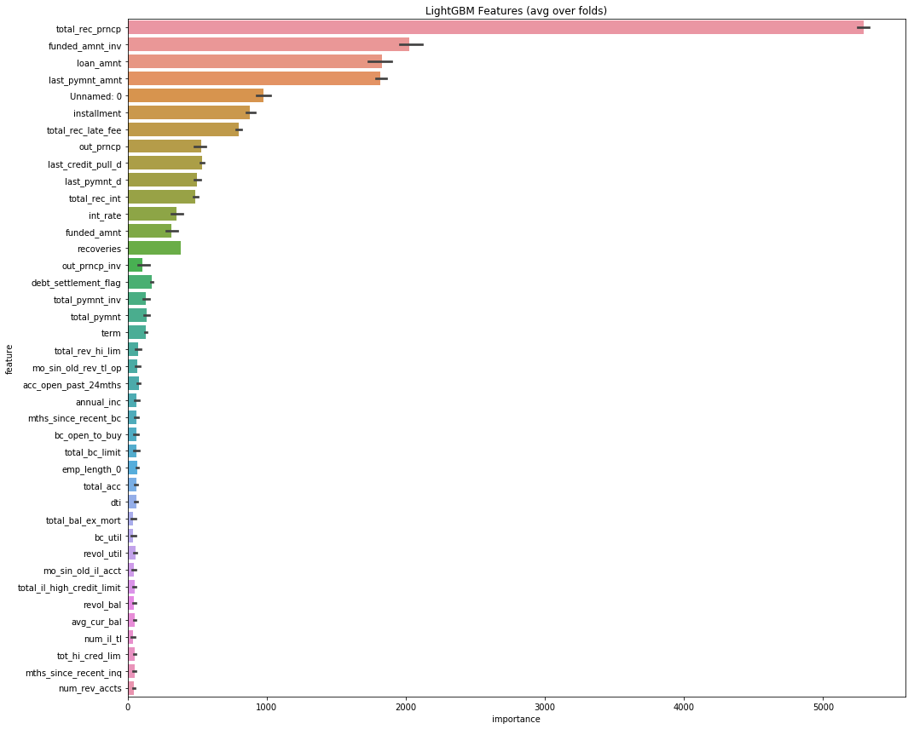
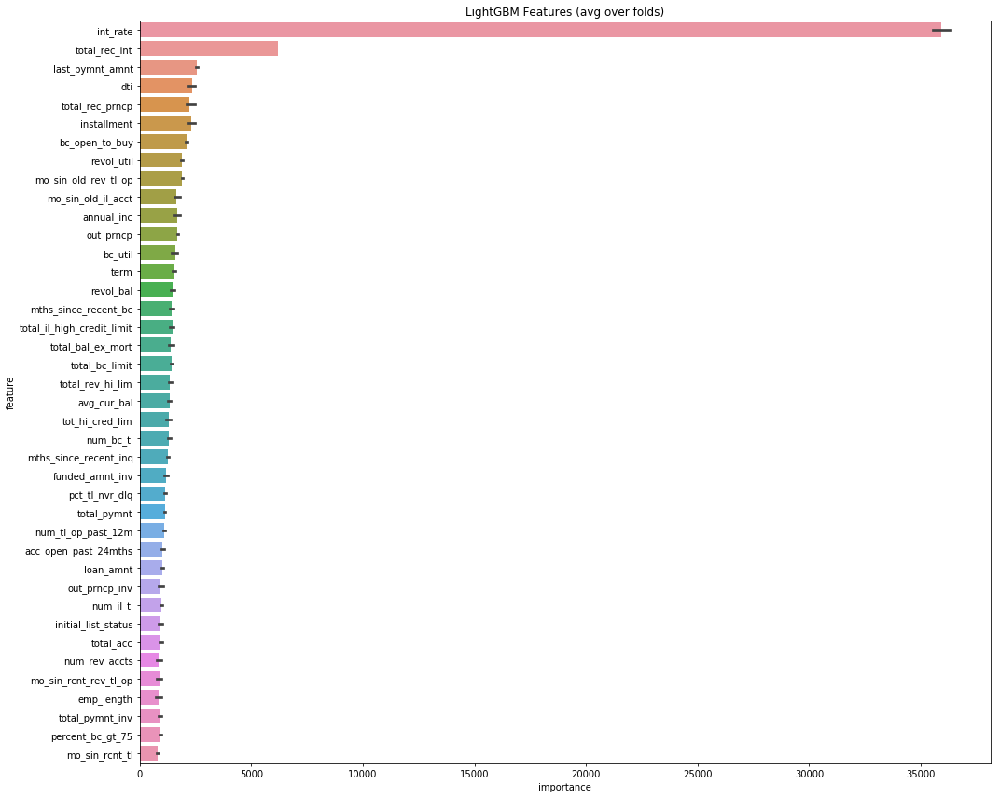

<a href="https://colab.research.google.com/drive/1deAj3URNwyzjfNdtNadR-umTQUHrIatR">
  
</a>


TL.DR version: 

I was able to predict whether the loan is default(including charged off) like most kernals regarding this dataset with 99.96% accuracy. 

But LendingClub also has a internal '**Grade**' like A, B, C, D and '**Subgrade**' like A1, B2, C3 for its customers, which is more ineresting as a metric of business decision than loan status We also reverse enginner LendingClub's 'Grade' and 'Subgrade' rating system with 99.6% accuracy, 13minutes of traiinng with boosting and 99.86% accuracy, 25 minute of trainig with boosting respectively. 

I also used [Fast.AI's tabular module](https://docs.fast.ai/tabular.html) for training, which achieved 97% and 87% accuracy with GPU acceleration. Data cleaning was proven to be critical: before data cleaning and feature enginnering, the accuracy is less than 20%. 

To make LightGBM training faster, I attemped to setup LightBGM but met many problems. A [pull request](https://github.com/microsoft/LightGBM/pull/2279) is submitted with potentially more to come to Microsoft's LightBGM team. 

Thanks for reading! I would really appreciate any feedback. 

Happy coding, 
Alex Li 
alex@alexli.me


```python
# The Python 3 environment comes with many helpful analytics libraries installed
# It is defined by the kaggle/python docker image: https://github.com/kaggle/docker-python
# For example, here's several helpful packages to load in 

import numpy as np # linear algebra
import pandas as pd # data processing, CSV file I/O (e.g. pd.read_csv)
import matplotlib.pyplot as plt 
import seaborn as sns
# Input data files are available in the "../input/" directory.
# For example, running this (by clicking run or pressing Shift+Enter) will list the files in the input directory

import os
print(os.listdir("./input"))

# Any results you write to the current directory are saved as output.
```


The loan_untouched data is the dataset that we can download from Kaggle Lending Club Data. These files contain complete loan data for all loans issued through the 2007-2015, including the current loan status (Current, Late, Fully Paid, etc.) and latest payment information. The file containing loan data through the "present" contains complete loan data for all loans issued through the previous completed calendar quarter. Additional features include credit scores, number of finance inquiries, address including zip codes, and state, and collections among others. The file is a matrix of about 890 thousand observations and 75 variables. 

https://www.kaggle.com/wendykan/lending-club-loan-data


```python
##Reading the dataset
df = pd.read_csv("./input/loan_untouched.csv", low_memory=False)
df.head(3)
```

Note that it has consumed about 10Gb of memory, 11.8GB specifically. This is a sign that we need to be very careful about memory mangagement, especially in a low-resource setting.

Let us check some basics about the dataset. First about its size and then about its dimensions. 


```python
df.shape 
```


```python
df.columns
```

What does the various columns mean? We can rely on the dictionary provided by the Lending Street. We use Pandas to read the xlsx file, along with display style formatting


```python
df_description = pd.read_excel('./input/LCDataDictionary.xlsx').dropna()
df_description.style.set_properties(subset=['Description'], **{'width': '1000px'})
```

## Exploratory Data Analytics

We start out with the metric of the game: loan status


```python
df["loan_status"].value_counts()
```


```python
df["loan_status"].value_counts().plot(kind='bar');

```

We see that there are only 31 default cases. In the light that harges off means that the consumer has defaulted for long enough time such that the creditors has 'given up' in getting the money back, we include them in our default cases. 


```python
target_list = [1 if i=='Default' or i=='Charged Off' else 0 for i in df['loan_status']]

df['TARGET'] = target_list
df['TARGET'].value_counts()
```

Even after including the charges off cases, we have a class imbalance issue: the 'positive' cases of defaults are much less frequent than the 'negative' non-default cases. Later in training, we need to be careful about this. 


```python
# loan_status cross
loan_status_cross = pd.crosstab(df['addr_state'], df['loan_status']).apply(lambda x: x/x.sum() * 100)
number_of_loanstatus = pd.crosstab(df['addr_state'], df['loan_status'])


# Round our values
loan_status_cross['Charged Off'] = loan_status_cross['Charged Off'].apply(lambda x: round(x, 2))
loan_status_cross['Default'] = loan_status_cross['Default'].apply(lambda x: round(x, 2))
loan_status_cross['Does not meet the credit policy. Status:Charged Off'] = loan_status_cross['Does not meet the credit policy. Status:Charged Off'].apply(lambda x: round(x, 2))
loan_status_cross['In Grace Period'] = loan_status_cross['In Grace Period'].apply(lambda x: round(x, 2))
loan_status_cross['Late (16-30 days)'] = loan_status_cross['Late (16-30 days)'].apply(lambda x: round(x, 2))
loan_status_cross['Late (31-120 days)'] = loan_status_cross['Late (31-120 days)'].apply(lambda x: round(x, 2))


number_of_loanstatus['Total'] = number_of_loanstatus.sum(axis=1) 
# number_of_badloans
number_of_loanstatus
```

Actually, after we set the target column, we can drop the loan_status column, as a role of thumb


```python
df.drop('loan_status',axis=1,inplace=True)
```


```python
df.info()

```

# Exploratory Data Visualization


```python
from plotly import tools
import chart_studio.plotly as py
import plotly.figure_factory as ff
import plotly.graph_objs as go
from plotly.offline import download_plotlyjs, init_notebook_mode, plot, iplot
init_notebook_mode(connected=True)
```


```python
plt.figure(figsize=(8, 5))
sns.barplot(y=df.term.value_counts(), x=df.term.value_counts().index)
plt.xticks(rotation=0)
plt.title("Loan's Term Distribution")
plt.ylabel("Count")
```


```python
plt.figure(figsize=(18, 5))
sns.barplot(y=df.grade.value_counts(), x=df.grade.value_counts().index)
plt.xticks(rotation=0)
plt.title("Grade Distribution")
plt.ylabel("Count")
```


```python
plt.figure(figsize=(18, 10))
sns.barplot(y=df.sub_grade.value_counts(), x=df.sub_grade.value_counts().index)
plt.xticks(rotation=0)
plt.title("Subgrade Distribution")
plt.ylabel("Count")
```


```python
plt.figure(figsize=(18, 10))
sns.barplot(y=df.purpose.value_counts(), x=df.purpose.value_counts().index)
plt.xticks(rotation=0)
plt.title("Purpose Distribution")
plt.ylabel("Count")
plt.xticks(rotation=30)
```


```python
plt.figure(figsize=(18, 10))
sns.barplot(y=df.emp_title.value_counts()[:15], x=df.emp_title.value_counts()[:15].index)
plt.xticks(rotation=0)
plt.title("Top 15 most popular employment title")
plt.ylabel("Count")
plt.xticks(rotation=30)
```


```python
plt.figure(figsize = (14,6))

sns.barplot(x='grade', y='loan_amnt', 
              data=df)
g.set_xticklabels(g.get_xticklabels(),rotation=90)
g.set_xlabel("Duration Distribuition", fontsize=15)
g.set_ylabel("Mean amount", fontsize=15)
g.set_title("Loan Amount by Grades", fontsize=20)
plt.legend(loc=1)
plt.show()
```

## Missing Value Analysis

### Dataset-wide analysis


```python
def null_values(df):
        mis_val = df.isnull().sum()
        mis_val_percent = 100 * df.isnull().sum() / len(df)
        mis_val_table = pd.concat([mis_val, mis_val_percent], axis=1)
        mis_val_table_ren_columns = mis_val_table.rename(
        columns = {0 : 'Missing Values', 1 : '% of Total Values'})
        mis_val_table_ren_columns = mis_val_table_ren_columns[
            mis_val_table_ren_columns.iloc[:,1] != 0].sort_values(
        '% of Total Values', ascending=False).round(1)
        print ("Dataframe has " + str(df.shape[1]) + " columns.\n"      
            "There are " + str(mis_val_table_ren_columns.shape[0]) +
              " columns that have missing values.")
        return mis_val_table_ren_columns
```


```python
missing_values = null_values(df)
```


```python
missing_values
```

More specifically, we can look at the missing values for float64 type of columns, sorted by the percentage of missing


```python
df.select_dtypes(include=['float64']).describe()\
.T.assign(missing = df.apply(lambda x : (1 - x.count() /len(x)))).sort_values(by = 'missing',ascending = False)

```

We can also look at the missing values for object type of columns, sorted by the percentage of missing


```python
df.select_dtypes(include=['O']).describe()\
.T.assign(missing = df.apply(lambda x : (1 - x.count() /len(x)))).sort_values(by = 'missing',ascending = False)
```

We decides to drop the columns where 25% or more values is missing 


```python
df.dropna(
    axis=1, thresh=int(0.75 * len(df)),
    inplace=True)
```

We can take a look at the new dataframe


```python
df.describe().T.assign(
    missing_pct=df.apply(
        lambda x: (1 - x.count() / len(x)))).sort_values(
            by='missing_pct', ascending=False)
```

### Part 2, finding columns with missing value that needs to be filled with mean instead of zero

Here we look at each columns in the above, we can just take a look at the top columns and analyze the financial context of each column. 

The basic logic below is that we assume a 'good' population that follow a summary statistics that makes sense simply by common sense, like positive annual income (instead of 0 income)

mths_since_recent_inq: should be filled with mean


num_tl_120dpd_2m: Number of accounts currently 120 days past due: should be filled with mean


mo_sin_old_il_acct:Months since oldest bank installment account opened. Should be filled with mean

bc_util: Ratio of total current balance to high credit/credit limit for all bankcard accounts: Should be filled with mean

percent_bc_gt_75: Percentage of all bankcard accounts > 75% of limit: should be filled with zero 

bc_open_to_buy: Total open to buy on revolving bankcards. Should be filled with zero

mths_since_recent_bc: Months since most recent bankcard account opened: Should be filled with zero 

pct_tl_nvr_dlq: Percent of trades never delinquent: should be filled with zero 

avg_cur_bal: Average current balance of all accounts: should be filled with zero 

mo_sin_rcnt_rev_tl_op: Months since most recent revolving account opened: should be filled with zero 

mo_sin_old_rev_tl_op: Months since most recent revolving account opened: should be filled with mean

num_rev_accts:Number of revolving accounts: should be filled with zero 

tot_cur_bal: Total current balance of all accounts: should be filled with zero 

num_il_tl:  Number of installment accounts: should be filled with zero 

tot_coll_amt: Total collection amounts ever owed: Should be filled with zero 

num_accts_ever_120_pd:Number of accounts ever 120 or more days past due: Should be filled with zero


```python
cols_fill_with_mean = ['mths_since_recent_inq',
                       'num_tl_120dpd_2m',
                       'mo_sin_old_il_acct',
                       'bc_util',
                       'mo_sin_old_rev_tl_op',
                       'revol_util', 'open_acc', 'total_acc', 
                       'annual_inc']

```


```python
for col in cols_fill_with_mean:
    mean_of_col = df[col].mean()
    df[col] = df[col].fillna(mean_of_col)
```

### Dropping columns that does not contribute to analysis


```python
df['emp_title']
```


```python
df['emp_title'].value_counts()
```


```python
df['title']
```


```python
df['title'].value_counts()
```


```python
df['zip_code']
```

For emp_title and title, we notice that there are too many entries that appears only once. If we were to do one-hot encoding, they would add unnecessary complexity to our parameter space. We do recognize that if we have more time, we should convert low-frequency title and emp-titles into one category while keeping high-frequency titles. For zip_code, since the last two digits are missing, it also will add necessary complexity in parameter space while not contributing to analysis. 


```python
df.drop(['emp_title','title','zip_code'],axis=1,inplace=True)
```


```python
df.shape
```

### column(feature)-specific missing value analysis and cleaning for object columns

As the last step we take a look at the columns with missing values after basic cleaning and dropping. We need to specifiy object columns and number columns


```python
df.select_dtypes(include=['O']).describe()\
.T.assign(missing = df.apply(lambda x : (1 - x.count() /len(x)))).sort_values(by = 'missing',ascending = False)
```

Note that only the first four columns have value missing. 

Since there are only a few columns


```python
df['emp_length']
```

Let us fill in the null values with 0 assuming the applicant does not work and consequently does not report their employment length. And then we convert the format of the column from object to 


```python
df['emp_length'].fillna(value=0,inplace=True)

df['emp_length'].replace(to_replace='[^0-9]+', value='', inplace=True, regex=True)

df['emp_length'].value_counts().sort_values().plot(kind='barh',figsize=(18,8))
plt.title('Number of loans distributed by Employment Years',fontsize=20)
plt.xlabel('Number of loans',fontsize=15)
plt.ylabel('Years worked',fontsize=15);
```

Also, there are four month/date object that we can simply use pandas built-in toolbox to convert to datetime object. Instead of filling the null values with zero values, we can fill with the most frequenct value. 


```python
df['last_pymnt_d'].value_counts().sort_values().tail()
```

We know we want to fill the missing value with Feb-2019 as the most frequent date for last_pymnt_d


```python
df['last_pymnt_d']= pd.to_datetime(df['last_pymnt_d'].fillna('2016-09-01'))

```


```python
df['last_credit_pull_d'].value_counts().sort_values().tail()
```

We know we want to fill the missing value with Feb-2019 as the most frequent date for last_credit_pull_d


```python
df['last_credit_pull_d']= pd.to_datetime(df['last_credit_pull_d'].fillna("2016-09-01"))

```


```python
df['earliest_cr_line'].value_counts().sort_values().tail()
```

We know we want to fill the missing value with Sep-2004 as the most frequent date for earliest_cr_line


```python
df['earliest_cr_line']= pd.to_datetime(df['earliest_cr_line'].fillna('2004-09-01'))

```

Now we shall use label encoding to encode the object columns with two unique values or less

We know we want to fill the missing value with Mar 2016 as the most frequent date for issue_d


```python
df['issue_d'].value_counts().sort_values().tail()
```


```python
df['issue_d']= pd.to_datetime(df['issue_d'].fillna("2016-03-01"))


```

**Save the dataframe**


```python
df.to_pickle('Before_datetime')
```

## Datetime Feature Enginnering 


```python
import numpy as np # linear algebra
import pandas as pd # data processing, CSV file I/O (e.g. pd.read_csv)
import matplotlib.pyplot as plt 
import seaborn as sns
```


```python
df = pd.read_pickle('Before_datetime')
```


```python
df.select_dtypes(exclude=[np.number,object]).head()
```

Two metric we can feature enginnering is: 

1. The months between issue date and last payment date, which is how long the loan has been around
2. The months between earliest credit line and the last credit pull date, which is similar to the length of credit history


```python
df['months_of_loan']= (df['last_pymnt_d']-df['issue_d'])/np.timedelta64(1,'M')
```


```python
df['months_of_loan']=df['months_of_loan'].astype(int)
```


```python
df['months_of_credit_hisotory']= (df['last_credit_pull_d']-df['earliest_cr_line'])/np.timedelta64(1,'M')
```


```python
df['months_of_credit_hisotory']=df['months_of_credit_hisotory'].astype(int)
```

## Feature Cleaning up  


```python
df.info()
```


```python
df.select_dtypes(object).head()
```

We see that the term of the loan is still in string/object format, let us convert that into int


```python
df['term'].replace(to_replace='[^0-9]+', value='', inplace=True, regex=True)
df['term']=df['term'].astype(int)
```

Check if 'term' is properly converted


```python
df['term'].head()
```

We remember that we converted emp_length. Check if it is in int format, if not, convert it to int


```python
df['emp_length'].head()
```


```python
df['emp_length']= df['emp_length'].astype(int)
```


```python
df.select_dtypes(object).columns
```


```python
df.to_pickle('ReadyforModelling')
```

**Note that ideally, we would like to model three metrics
**
1. **Loan Status** (We converted it into 'target' column), the lending club's final decision. However
We do recognize that Lending Club's business case is unique in terms of P2P lending. We should also 
model other parameters. 
2. **'Grade'**. This is Lending Club's secret sauce of assigning a grade to a borrower. More universal and thus more interesting to model. 
3. **'Subgrade'**. 'Grade' metric is added by another single digit number to further distingusih between different customers

When we model loan status, it is considered common to include 'Grade' and 'Subgrade'.
But when we model 'Grade' and 'Subgrade', it is debetable to include Loan Status or not
However, we know for certain that 'Subgrade' should not be a metric for 'Grade' modelling
And reversely, 'Grade' should not be a metric for 'Subgrade' 


```python
import pandas as pd
from sklearn.ensemble import RandomForestClassifier
from sklearn.model_selection import cross_val_score, cross_val_predict
from sklearn.metrics import accuracy_score, classification_report, confusion_matrix
```


```python
df=pd.read_pickle('ReadyforModelling')
```

# 1. Loan Status Modelling


Label encoding the binary objects


```python
from sklearn import preprocessing
count = 0

for col in df:
    if df[col].dtype == 'object':
        if len(list(df[col].unique())) <= 2:     
            le = preprocessing.LabelEncoder()
            df[col] = le.fit_transform(df[col])
            count += 1
            print (col)
            
print('%d columns were label encoded.' % count)
```

Now we can use get_dummies to one hot encode all the rest categorical columns. We just need to convert the datetime objects back to strings


```python
df['last_pymnt_d'] = df['last_pymnt_d'].dt.strftime('%Y-%m')
df['issue_d'] =df['issue_d'].dt.strftime('%Y-%m')
df['last_credit_pull_d']=df['last_credit_pull_d'].dt.strftime('%Y-%m')
df['earliest_cr_line']=df['earliest_cr_line'].dt.strftime('%Y-%m')
```


```python
df = pd.get_dummies(df)
```

And we can drop the remaining null values now


```python
df.dropna(inplace=True)
```

## 1. Bagging


```python
import pandas as pd
from sklearn.ensemble import RandomForestClassifier
from sklearn.model_selection import cross_val_score, cross_val_predict
from sklearn.metrics import accuracy_score, classification_report, confusion_matrix
import os
import gc
```


```python
def print_score(clf, X_train, y_train, X_test, y_test, train=True):
    if train:
        print("Train Result:\n")
        print("accuracy score: {0:.4f}\n".format(accuracy_score(y_train, clf.predict(X_train))))
        print("Classification Report: \n {}\n".format(classification_report(y_train, clf.predict(X_train))))
        print("Confusion Matrix: \n {}\n".format(confusion_matrix(y_train, clf.predict(X_train))))

        res = cross_val_score(clf, X_train, y_train, cv=10, scoring='accuracy')
        print("Average Accuracy: \t {0:.4f}".format(np.mean(res)))
        print("Accuracy SD: \t\t {0:.4f}".format(np.std(res)))
        
    elif train==False:
        print("Test Result:\n")        
        print("accuracy score: {0:.4f}\n".format(accuracy_score(y_test, clf.predict(X_test))))
        print("Classification Report: \n {}\n".format(classification_report(y_test, clf.predict(X_test))))
        print("Confusion Matrix: \n {}\n".format(confusion_matrix(y_test, clf.predict(X_test))))    
        
```


```python
from sklearn.model_selection import train_test_split
```


```python
X_train, X_test, y_train, y_test = train_test_split(df.drop('TARGET',axis=1),df['TARGET'],test_size=0.15,random_state=101)
```


```python
from sklearn.preprocessing import StandardScaler
```


```python
sc = StandardScaler()
X_train = sc.fit_transform(X_train)
X_test=sc.transform(X_test)
```

    /opt/anaconda3/lib/python3.7/site-packages/sklearn/preprocessing/data.py:625: DataConversionWarning: Data with input dtype int64, float64 were all converted to float64 by StandardScaler.
      return self.partial_fit(X, y)
    /opt/anaconda3/lib/python3.7/site-packages/sklearn/base.py:462: DataConversionWarning: Data with input dtype int64, float64 were all converted to float64 by StandardScaler.
      return self.fit(X, **fit_params).transform(X)
    /opt/anaconda3/lib/python3.7/site-packages/ipykernel_launcher.py:3: DataConversionWarning: Data with input dtype int64, float64 were all converted to float64 by StandardScaler.
      This is separate from the ipykernel package so we can avoid doing imports until


## 
We can create a baseline for accuracty and recall using logistics regression


```python
from sklearn.linear_model import LogisticRegression

log_reg = LogisticRegression(C = 0.0001,random_state=21)

log_reg.fit(X_train, y_train)
```

    /opt/anaconda3/lib/python3.7/site-packages/sklearn/linear_model/logistic.py:433: FutureWarning: Default solver will be changed to 'lbfgs' in 0.22. Specify a solver to silence this warning.
      FutureWarning)


    LogisticRegression(C=0.0001, class_weight=None, dual=False,
              fit_intercept=True, intercept_scaling=1, max_iter=100,
              multi_class='warn', n_jobs=None, penalty='l2', random_state=21,
              solver='warn', tol=0.0001, verbose=0, warm_start=False)


```python
print_score(log_reg, X_train, y_train, X_test, y_test, train=False)
```

    Test Result:
    
    accuracy score: 0.9786
    
    Classification Report: 
                   precision    recall  f1-score   support
    
               0       0.98      1.00      0.99    287182
               1       1.00      0.82      0.90     37342
    
       micro avg       0.98      0.98      0.98    324524
       macro avg       0.99      0.91      0.94    324524
    weighted avg       0.98      0.98      0.98    324524
    
    
    Confusion Matrix: 
     [[287048    134]
     [  6825  30517]]
    


**Note that for our business case, we would like to reduce the top right number in the confusion matrix which is false postive: we think that the applicant is a good loan borrower but he/she is not. Compared to the bottom left number, which is false negative, we as a business does not loss when we reject a good applicant, at least not as much as giving loan to a bad loaner. **


```python
from sklearn.ensemble import RandomForestClassifier
```


```python
clf_rf = RandomForestClassifier(n_estimators=40, random_state=21)
clf_rf.fit(X_train, y_train)
```


    RandomForestClassifier(bootstrap=True, class_weight=None, criterion='gini',
                max_depth=None, max_features='auto', max_leaf_nodes=None,
                min_impurity_decrease=0.0, min_impurity_split=None,
                min_samples_leaf=1, min_samples_split=2,
                min_weight_fraction_leaf=0.0, n_estimators=40, n_jobs=None,
                oob_score=False, random_state=21, verbose=0, warm_start=False)


```python
print_score(clf_rf, X_train, y_train, X_test, y_test, train=False)
```

    Test Result:
    
    accuracy score: 0.9968
    
    Classification Report: 
                   precision    recall  f1-score   support
    
               0       1.00      1.00      1.00    287182
               1       1.00      0.97      0.99     37342
    
       micro avg       1.00      1.00      1.00    324524
       macro avg       1.00      0.99      0.99    324524
    weighted avg       1.00      1.00      1.00    324524
    
    
    Confusion Matrix: 
     [[287182      0]
     [  1052  36290]]
    


##  Boosting:

* Train weak classifiers 
* Add them to a final strong classifier by weighting. Weighting by accuracy (typically)
* Once added, the data are reweighted
  * Misclassified samples gain weight 
  * Algo is forced to learn more from misclassified samples   


```python
import numpy as np # linear algebra
import pandas as pd # data processing, CSV file I/O (e.g. pd.read_csv)
import matplotlib.pyplot as plt 
import seaborn as sns
from sklearn.metrics import roc_auc_score, roc_curve
from sklearn.model_selection import KFold, StratifiedKFold
from lightgbm import LGBMClassifier
import numpy as np
import matplotlib.pyplot as plt 
import seaborn as sns
import gc
from sklearn.model_selection import cross_val_score, cross_val_predict
from sklearn.metrics import accuracy_score, classification_report, confusion_matrix
```


```python
df=pd.read_pickle('ReadyforModelling')
```


```python
def kfold_lightgbm(train_df, num_folds, stratified = False):
    print("Starting LightGBM. Train shape: {}".format(train_df.shape))
    
    # Cross validation model
    if stratified:
        folds = StratifiedKFold(n_splits= num_folds, shuffle=True, random_state=47)
    else:
        folds = KFold(n_splits= num_folds, shuffle=True, random_state=47)

    oof_preds = np.zeros(train_df.shape[0])

    feature_importance_df = pd.DataFrame()
    feats = [f for f in train_df.columns if f not in ['TARGET']]
    
    # Splitting the training set into folds for Cross Validation
    for n_fold, (train_idx, valid_idx) in enumerate(folds.split(train_df[feats], train_df['TARGET'])):
        train_x, train_y = train_df[feats].iloc[train_idx], train_df['TARGET'].iloc[train_idx]
        valid_x, valid_y = train_df[feats].iloc[valid_idx], train_df['TARGET'].iloc[valid_idx]

        # LightGBM parameters found by Bayesian optimization
        clf = LGBMClassifier(
            nthread=12,#previous number 4
            n_estimators=1000, # Previous number 10000
            learning_rate=0.02,
            num_leaves=32,
            colsample_bytree=0.9497036,
            subsample=0.8715623,
            max_depth=8,
            reg_alpha=0.04,
            reg_lambda=0.073,
            min_split_gain=0.0222415,
            min_child_weight=40,
            silent=-1,
            verbose=-1
            #device= 'gpu',gpu_platform_id= 0,gpu_device_id= 0
            )

        # Fitting the model and evaluating by AUC
        clf.fit(train_x, train_y, eval_set=[(train_x, train_y), (valid_x, valid_y)], 
            eval_metric= 'auc', verbose= 1000, early_stopping_rounds= 200)
        print_score(clf, train_x, train_y, valid_x, valid_y, train=False)
        # Dataframe holding the different features and their importance
        fold_importance_df = pd.DataFrame()
        fold_importance_df["feature"] = feats
        fold_importance_df["importance"] = clf.feature_importances_
        fold_importance_df["fold"] = n_fold + 1
        feature_importance_df = pd.concat([feature_importance_df, fold_importance_df], axis=0)
        
        # Freeing up memory
        del clf, train_x, train_y, valid_x, valid_y
        gc.collect()

    display_importances(feature_importance_df)
    return feature_importance_df
```


```python
def print_score(clf, X_train, y_train, X_test, y_test, train=True):
    if train:
        print("Train Result:\n")
        print("accuracy score: {0:.4f}\n".format(accuracy_score(y_train, clf.predict(X_train))))
        print("Classification Report: \n {}\n".format(classification_report(y_train, clf.predict(X_train))))
        print("Confusion Matrix: \n {}\n".format(confusion_matrix(y_train, clf.predict(X_train))))

        res = cross_val_score(clf, X_train, y_train, cv=10, scoring='accuracy')
        print("Average Accuracy: \t {0:.4f}".format(np.mean(res)))
        print("Accuracy SD: \t\t {0:.4f}".format(np.std(res)))
        
    elif train==False:
        print("Test Result:\n")        
        print("accuracy score: {0:.4f}\n".format(accuracy_score(y_test, clf.predict(X_test))))
        print("Classification Report: \n {}\n".format(classification_report(y_test, clf.predict(X_test))))
        print("Confusion Matrix: \n {}\n".format(confusion_matrix(y_test, clf.predict(X_test))))  
```


```python
def display_importances(feature_importance_df_):
    cols = feature_importance_df_[["feature", "importance"]].groupby("feature").mean().sort_values(by="importance", ascending=False)[:40].index
    best_features = feature_importance_df_.loc[feature_importance_df_.feature.isin(cols)]
    plt.figure(figsize=(15, 12))
    sns.barplot(x="importance", y="feature", data=best_features.sort_values(by="importance", ascending=False))
    plt.title('LightGBM Features (avg over folds)')
    plt.tight_layout()
    plt.savefig('lgbm_importances.png')
```


```python
feat_importance = kfold_lightgbm(df, num_folds= 5, stratified= False)
```

    Starting LightGBM. Train shape: (2163488, 343)
    Training until validation scores don't improve for 200 rounds.
    [1000]	training's binary_logloss: 0.00154127	training's auc: 0.999953	valid_1's binary_logloss: 0.00183299	valid_1's auc: 0.999887
    Did not meet early stopping. Best iteration is:
    [1000]	training's binary_logloss: 0.00154127	training's auc: 0.999953	valid_1's binary_logloss: 0.00183299	valid_1's auc: 0.999887
    Test Result:
    
    accuracy score: 0.9996
    
    Classification Report: 
                   precision    recall  f1-score   support
    
               0       1.00      1.00      1.00    383090
               1       1.00      1.00      1.00     49608
    
       micro avg       1.00      1.00      1.00    432698
       macro avg       1.00      1.00      1.00    432698
    weighted avg       1.00      1.00      1.00    432698
    
    
    Confusion Matrix: 
     [[383090      0]
     [   168  49440]]
    
    Training until validation scores don't improve for 200 rounds.
    [1000]	training's binary_logloss: 0.00153117	training's auc: 0.999951	valid_1's binary_logloss: 0.00180118	valid_1's auc: 0.999917
    Did not meet early stopping. Best iteration is:
    [1000]	training's binary_logloss: 0.00153117	training's auc: 0.999951	valid_1's binary_logloss: 0.00180118	valid_1's auc: 0.999917
    Test Result:
    
    accuracy score: 0.9996
    
    Classification Report: 
                   precision    recall  f1-score   support
    
               0       1.00      1.00      1.00    382983
               1       1.00      1.00      1.00     49715
    
       micro avg       1.00      1.00      1.00    432698
       macro avg       1.00      1.00      1.00    432698
    weighted avg       1.00      1.00      1.00    432698
    
    
    Confusion Matrix: 
     [[382983      0]
     [   167  49548]]
    
    Training until validation scores don't improve for 200 rounds.
    [1000]	training's binary_logloss: 0.00154649	training's auc: 0.999949	valid_1's binary_logloss: 0.00173747	valid_1's auc: 0.999929
    Did not meet early stopping. Best iteration is:
    [1000]	training's binary_logloss: 0.00154649	training's auc: 0.999949	valid_1's binary_logloss: 0.00173747	valid_1's auc: 0.999929
    Test Result:
    
    accuracy score: 0.9996
    
    Classification Report: 
                   precision    recall  f1-score   support
    
               0       1.00      1.00      1.00    382891
               1       1.00      1.00      1.00     49807
    
       micro avg       1.00      1.00      1.00    432698
       macro avg       1.00      1.00      1.00    432698
    weighted avg       1.00      1.00      1.00    432698
    
    
    Confusion Matrix: 
     [[382890      1]
     [   177  49630]]
    
    Training until validation scores don't improve for 200 rounds.
    [1000]	training's binary_logloss: 0.0015465	training's auc: 0.999951	valid_1's binary_logloss: 0.00164619	valid_1's auc: 0.999948
    Did not meet early stopping. Best iteration is:
    [1000]	training's binary_logloss: 0.0015465	training's auc: 0.999951	valid_1's binary_logloss: 0.00164619	valid_1's auc: 0.999948
    Test Result:
    
    accuracy score: 0.9996
    
    Classification Report: 
                   precision    recall  f1-score   support
    
               0       1.00      1.00      1.00    382931
               1       1.00      1.00      1.00     49766
    
       micro avg       1.00      1.00      1.00    432697
       macro avg       1.00      1.00      1.00    432697
    weighted avg       1.00      1.00      1.00    432697
    
    
    Confusion Matrix: 
     [[382931      0]
     [   169  49597]]
    
    Training until validation scores don't improve for 200 rounds.
    [1000]	training's binary_logloss: 0.00151123	training's auc: 0.999956	valid_1's binary_logloss: 0.00182654	valid_1's auc: 0.999912
    Did not meet early stopping. Best iteration is:
    [1000]	training's binary_logloss: 0.00151123	training's auc: 0.999956	valid_1's binary_logloss: 0.00182654	valid_1's auc: 0.999912
    Test Result:
    
    accuracy score: 0.9996
    
    Classification Report: 
                   precision    recall  f1-score   support
    
               0       1.00      1.00      1.00    383173
               1       1.00      1.00      1.00     49524
    
       micro avg       1.00      1.00      1.00    432697
       macro avg       1.00      1.00      1.00    432697
    weighted avg       1.00      1.00      1.00    432697
    
    
    Confusion Matrix: 
     [[383173      0]
     [   169  49355]]
    


    /opt/anaconda3/lib/python3.7/site-packages/scipy/stats/stats.py:1713: FutureWarning: Using a non-tuple sequence for multidimensional indexing is deprecated; use `arr[tuple(seq)]` instead of `arr[seq]`. In the future this will be interpreted as an array index, `arr[np.array(seq)]`, which will result either in an error or a different result.
      return np.add.reduce(sorted[indexer] * weights, axis=axis) / sumval





**We are relative excited by the 0 false positve value in the confusion matrix. This means that we did not borrow money to anyone who was going to default**

Admittedly, due to time constraints (time conflicts with other job commitments) I was unable to produce complete analysis of Grade and Subgrade. 
The following is the fastai/pytorch code. It shall be run in a new envionment with Fastai installed with GPU/CUDA support


```python
from fastai.tabular import * # Fast AI tabular package

```


```python
pd.read_csv("./input/loan_untouched.csv", low_memory=False)
```


```python
procs = [FillMissing, Normalize]

```

To split our data into training and validation sets, we use valid indexes


```python
valid_idx = range(len(df)-2000, len(df))

```

Let us use the helper function that returns column names of cont and cat variables from given df.


Now we're ready to pass this information to TabularDataBunch.from_df to create the DataBunch that we'll use for training. Once we have our data ready in a DataBunch, we just need to create a model to then define a Learner and start training. The fastai library has a flexible and powerful TabularModel in models.tabular. To use that function, we just need to specify the embedding sizes for each of our categorical variables.


```python
dep_var='grade'
cont_list, cat_list = cont_cat_split(df=df, max_card=2000, dep_var='TARGET')
cont_list, cat_list
```


```python
data = TabularDataBunch.from_df(path, df, dep_var, valid_idx=valid_idx, procs=procs, cat_names=cat_list)
print(data.train_ds.cont_names)  # `cont_names` defaults to: set(df)-set(cat_names)-{dep_var}
```


```python
learn = tabular_learner(data, layers=[200,100], metrics=accuracy)
```


```python
learn.model_dir=Path("../")
```


```python
lr_find(learn)
```


```python
learn.fit_one_cycle(1, 1e-6)

```

# Grade Modeling


```python
import numpy as np # linear algebra
import pandas as pd # data processing, CSV file I/O (e.g. pd.read_csv)
import matplotlib.pyplot as plt 
import seaborn as sns
```


```python
df = pd.read_pickle('ReadyforModelling')
```


```python
df['last_pymnt_d'] = df['last_pymnt_d'].dt.strftime('%Y-%m')
df['issue_d'] =df['issue_d'].dt.strftime('%Y-%m')
df['last_credit_pull_d']=df['last_credit_pull_d'].dt.strftime('%Y-%m')
df['earliest_cr_line']=df['earliest_cr_line'].dt.strftime('%Y-%m')
```


```python
df.info()
```

** Let us convert the grades and subgrades into numerical categories **


```python
factor_grade = pd.factorize(df['grade'])
factor_grade
```


```python
df['grade'] = factor_grade[0]
```


```python
factor_subgrade = pd.factorize(df['sub_grade'])
factor_subgrade
```


```python
df['sub_grade'] = factor_subgrade[0]
```


```python
df.select_dtypes(exclude=[np.number]).head()
```

We see that the term of the loan is still in string/object format, let us convert that into int


```python
df['term'].replace(to_replace='[^0-9]+', value='', inplace=True, regex=True)
df['term']=df['term'].astype(int)
```

Check if 'term' is properly converted


```python
df['term'].head()
```

We remember that we converted emp_length. Check if it is in int format, if not, convert it to int


```python
df['emp_length'].head()
```


```python
df['emp_length']= df['emp_length'].astype(int)
```


```python
df.select_dtypes(object).columns
```


```python
from sklearn import preprocessing
count = 0

for col in df:
    if df[col].dtype == 'object':
        if len(list(df[col].unique())) <= 2:     
            le = preprocessing.LabelEncoder()
            df[col] = le.fit_transform(df[col])
            count += 1
            print (col)
            
print('%d columns were label encoded.' % count)
```


```python
df.select_dtypes(object).columns
```

For object columsn with more than 2 classes, we shall use one hot encoding instead. If we were to apply label encoding for multi class objects, we would potentailly make the system think that there is order between 0, 1, and 2, etc. as representation type. 


```python
df = pd.get_dummies(df)
print(df.shape)
```

We now fill in the null values with zero in place


```python
df.dropna(inplace=True)
```


```python
df.to_pickle('Before_Modeling_Grades')
```

### One word about data leakage

Note that loan status can be included in the features, and I do not consider it a data leakage program since in reality, we always have the loan status in hand. Our goal is to reproduce the grading system that Lending Club uses. 

### 1. Bagging


```python
df.read_pickle('Before_Modeling_Grades')
```


```python
df.drop('sub_grade', axis =1)
```


```python
import pandas as pd
from sklearn.ensemble import RandomForestClassifier
from sklearn.model_selection import cross_val_score, cross_val_predict
from sklearn.metrics import accuracy_score, classification_report, confusion_matrix
import gc
```


```python
def print_score(clf, X_train, y_train, X_test, y_test, train=True):
    if train:
        print("Train Result:\n")
        print("accuracy score: {0:.4f}\n".format(accuracy_score(y_train, clf.predict(X_train))))
        print("Classification Report: \n {}\n".format(classification_report(y_train, clf.predict(X_train))))
        print("Confusion Matrix: \n {}\n".format(confusion_matrix(y_train, clf.predict(X_train))))

        res = cross_val_score(clf, X_train, y_train, cv=10, scoring='accuracy')
        print("Average Accuracy: \t {0:.4f}".format(np.mean(res)))
        print("Accuracy SD: \t\t {0:.4f}".format(np.std(res)))
        
    elif train==False:
        print("Test Result:\n")        
        print("accuracy score: {0:.4f}\n".format(accuracy_score(y_test, clf.predict(X_test))))
        print("Classification Report: \n {}\n".format(classification_report(y_test, clf.predict(X_test))))
        print("Confusion Matrix: \n {}\n".format(confusion_matrix(y_test, clf.predict(X_test))))    
        
```


```python
from sklearn.model_selection import train_test_split
```


```python
X_train, X_test, y_train, y_test = train_test_split(df.drop('grade',axis=1),df['grade'],test_size=0.15,random_state=101)
```


```python
gc.collect()
```


    8783


```python
from sklearn.preprocessing import StandardScaler
```


```python
sc = StandardScaler()
X_train = sc.fit_transform(X_train)
X_test=sc.transform(X_test)
```

    /opt/anaconda3/lib/python3.7/site-packages/sklearn/preprocessing/data.py:625: DataConversionWarning: Data with input dtype uint8, int64, float64 were all converted to float64 by StandardScaler.
      return self.partial_fit(X, y)
    /opt/anaconda3/lib/python3.7/site-packages/sklearn/base.py:462: DataConversionWarning: Data with input dtype uint8, int64, float64 were all converted to float64 by StandardScaler.
      return self.fit(X, **fit_params).transform(X)
    /opt/anaconda3/lib/python3.7/site-packages/ipykernel_launcher.py:3: DataConversionWarning: Data with input dtype uint8, int64, float64 were all converted to float64 by StandardScaler.
      This is separate from the ipykernel package so we can avoid doing imports until


```python
from sklearn.ensemble import RandomForestClassifier
```


```python
clf_rf = RandomForestClassifier(n_estimators=10, random_state=21) # I changed it to 10 for faster training time
clf_rf.fit(X_train, y_train)
```


    RandomForestClassifier(bootstrap=True, class_weight=None, criterion='gini',
                max_depth=None, max_features='auto', max_leaf_nodes=None,
                min_impurity_decrease=0.0, min_impurity_split=None,
                min_samples_leaf=1, min_samples_split=2,
                min_weight_fraction_leaf=0.0, n_estimators=10, n_jobs=None,
                oob_score=False, random_state=21, verbose=0, warm_start=False)


```python
print_score(clf_rf, X_train, y_train, X_test, y_test, train=False)
```

    Test Result:
    
    accuracy score: 0.7605
    
    Classification Report: 
                   precision    recall  f1-score   support
    
               0       0.69      0.88      0.77     94286
               1       0.60      0.51      0.56     46374
               2       0.82      0.86      0.84     94793
               3       0.96      0.86      0.91     62402
               4       0.49      0.22      0.30     19194
               5       0.47      0.08      0.13      5807
               6       0.42      0.01      0.02      1668
    
       micro avg       0.76      0.76      0.76    324524
       macro avg       0.64      0.49      0.50    324524
    weighted avg       0.75      0.76      0.74    324524
    
    
    Confusion Matrix: 
     [[83121  3432  7304   257   164     8     0]
     [19081 23837  1443    60  1880    72     1]
     [10969   349 81431  2032    12     0     0]
     [  585    37  8009 53771     0     0     0]
     [ 5346  8971   426    10  4169   267     5]
     [ 1276  2194    66     2  1801   449    19]
     [  304   594    30     1   556   165    18]]
    


### 2. Boosting


```python
!git clone --recursive https://github.com/microsoft/LightGBM
!cd LightGBM
!mkdir build  
!cd build
!cmake -DUSE_GPU=1 ..
```

    Cloning into 'LightGBM'...
    remote: Enumerating objects: 20, done.
    remote: Counting objects: 100% (20/20), done.
    remote: Compressing objects: 100% (17/17), done.
    remote: Total 13861 (delta 4), reused 8 (delta 3), pack-reused 13841
    Receiving objects: 100% (13861/13861), 9.69 MiB | 28.19 MiB/s, done.
    Resolving deltas: 100% (9920/9920), done.
    Submodule 'include/boost/compute' (https://github.com/boostorg/compute) registered for path 'compute'
    Cloning into '/content/LightGBM/compute'...
    remote: Enumerating objects: 72, done.        
    remote: Counting objects: 100% (72/72), done.        
    remote: Compressing objects: 100% (47/47), done.        
    remote: Total 21728 (delta 30), reused 44 (delta 19), pack-reused 21656        
    Receiving objects: 100% (21728/21728), 8.53 MiB | 30.03 MiB/s, done.
    Resolving deltas: 100% (17550/17550), done.
    Submodule path 'compute': checked out '36c89134d4013b2e5e45bc55656a18bd6141995a'
    CMake Error: The source directory "/" does not appear to contain CMakeLists.txt.
    Specify --help for usage, or press the help button on the CMake GUI.


```python
?import numpy as np # linear algebra
import pandas as pd # data processing, CSV file I/O (e.g. pd.read_csv)
import matplotlib.pyplot as plt 
import seaborn as sns
from sklearn.metrics import roc_auc_score, roc_curve
from sklearn.model_selection import KFold, StratifiedKFold
from lightgbm import LGBMClassifier
import numpy as np
import matplotlib.pyplot as plt 
import seaborn as sns
import gc
from sklearn.model_selection import cross_val_score, cross_val_predict
from sklearn.metrics import accuracy_score, classification_report, confusion_matrix
```


```python
df=pd.read_pickle('Before_Modeling_Grades')
df = df.drop('sub_grade', axis =1)
```


```python
def kfold_lightgbm(train_df, num_folds, stratified = False):
    print("Starting LightGBM. Train shape: {}".format(train_df.shape))
    
    # Cross validation model
    if stratified:
        folds = StratifiedKFold(n_splits= num_folds, shuffle=True, random_state=47)
    else:
        folds = KFold(n_splits= num_folds, shuffle=True, random_state=47)

    oof_preds = np.zeros(train_df.shape[0])

    feature_importance_df = pd.DataFrame()
    feats = [f for f in train_df.columns if f not in ['grade']]
    
    # Splitting the training set into folds for Cross Validation
    for n_fold, (train_idx, valid_idx) in enumerate(folds.split(train_df[feats], train_df['grade'])):
        train_x, train_y = train_df[feats].iloc[train_idx], train_df['grade'].iloc[train_idx]
        valid_x, valid_y = train_df[feats].iloc[valid_idx], train_df['grade'].iloc[valid_idx]

        # LightGBM parameters found by Bayesian optimization
        clf = LGBMClassifier(
            nthread=12,#previous number 4
            n_estimators=100, # Previous number 10000
            learning_rate=0.1,
            num_leaves=32,
            colsample_bytree=0.9497036,
            subsample=0.8715623,
            max_depth=8,
            reg_alpha=0.04,
            reg_lambda=0.073,
            min_split_gain=0.0222415,
            min_child_weight=40,
            silent=-1,
            verbose=-1
            #device= 'gpu',gpu_platform_id= 0,gpu_device_id= 0
            )

        # Fitting the model and evaluating by AUC
        clf.fit(train_x, train_y, eval_set=[(train_x, train_y), (valid_x, valid_y)], 
            eval_metric= 'logloss', verbose= 1000, early_stopping_rounds= 200)
        print_score(clf, train_x, train_y, valid_x, valid_y, train=False)
        # Dataframe holding the different features and their importance
        fold_importance_df = pd.DataFrame()
        fold_importance_df["feature"] = feats
        fold_importance_df["importance"] = clf.feature_importances_
        fold_importance_df["fold"] = n_fold + 1
        feature_importance_df = pd.concat([feature_importance_df, fold_importance_df], axis=0)
        
        # Freeing up memory
        del clf, train_x, train_y, valid_x, valid_y
        gc.collect()

    display_importances(feature_importance_df)
    return feature_importance_df
```


```python
def print_score(clf, X_train, y_train, X_test, y_test, train=True):
    if train:
        print("Train Result:\n")
        print("accuracy score: {0:.4f}\n".format(accuracy_score(y_train, clf.predict(X_train))))
        print("Classification Report: \n {}\n".format(classification_report(y_train, clf.predict(X_train))))
        print("Confusion Matrix: \n {}\n".format(confusion_matrix(y_train, clf.predict(X_train))))

        res = cross_val_score(clf, X_train, y_train, cv=10, scoring='accuracy')
        print("Average Accuracy: \t {0:.4f}".format(np.mean(res)))
        print("Accuracy SD: \t\t {0:.4f}".format(np.std(res)))
        
    elif train==False:
        print("Test Result:\n")        
        print("accuracy score: {0:.4f}\n".format(accuracy_score(y_test, clf.predict(X_test))))
        print("Classification Report: \n {}\n".format(classification_report(y_test, clf.predict(X_test))))
        print("Confusion Matrix: \n {}\n".format(confusion_matrix(y_test, clf.predict(X_test))))  
```


```python
def display_importances(feature_importance_df_):
    cols = feature_importance_df_[["feature", "importance"]].groupby("feature").mean().sort_values(by="importance", ascending=False)[:40].index
    best_features = feature_importance_df_.loc[feature_importance_df_.feature.isin(cols)]
    plt.figure(figsize=(15, 12))
    sns.barplot(x="importance", y="feature", data=best_features.sort_values(by="importance", ascending=False))
    plt.title('LightGBM Features (avg over folds)')
    plt.tight_layout()
    plt.savefig('lgbm_importances.png')
```


```python
feat_importance = kfold_lightgbm(df, num_folds= 3, stratified= False)
```

    Starting LightGBM. Train shape: (2163488, 1317)
    Training until validation scores don't improve for 200 rounds.
    [1000]	training's multi_logloss: 0.0028125	training's multi_logloss: 0.0028125	valid_1's multi_logloss: 0.00508117	valid_1's multi_logloss: 0.00508117
    Did not meet early stopping. Best iteration is:
    [1000]	training's multi_logloss: 0.0028125	training's multi_logloss: 0.0028125	valid_1's multi_logloss: 0.00508117	valid_1's multi_logloss: 0.00508117
    Test Result:
    
    accuracy score: 0.9986
    
    Classification Report: 
                   precision    recall  f1-score   support
    
               0       1.00      1.00      1.00    209325
               1       1.00      1.00      1.00    103212
               2       1.00      1.00      1.00    211657
               3       1.00      1.00      1.00    137587
               4       0.99      1.00      1.00     42575
               5       0.99      0.99      0.99     13062
               6       0.98      0.96      0.97      3745
    
       micro avg       1.00      1.00      1.00    721163
       macro avg       0.99      0.99      0.99    721163
    weighted avg       1.00      1.00      1.00    721163
    
    
    Confusion Matrix: 
     [[209149    122     41      5      8      0      0]
     [    56 102993      4      2    157      0      0]
     [   104      3 211520     26      4      0      0]
     [     1      1      6 137579      0      0      0]
     [     7     99      0      1  42415     51      2]
     [     0      2      0      0     72  12910     78]
     [     0      0      0      0      7    135   3603]]
    
    Training until validation scores don't improve for 200 rounds.
    [1000]	training's multi_logloss: 0.00263011	training's multi_logloss: 0.00263011	valid_1's multi_logloss: 0.00482896	valid_1's multi_logloss: 0.00482896
    Did not meet early stopping. Best iteration is:
    [1000]	training's multi_logloss: 0.00263011	training's multi_logloss: 0.00263011	valid_1's multi_logloss: 0.00482896	valid_1's multi_logloss: 0.00482896
    Test Result:
    
    accuracy score: 0.9988
    
    Classification Report: 
                   precision    recall  f1-score   support
    
               0       1.00      1.00      1.00    208644
               1       1.00      1.00      1.00    103404
               2       1.00      1.00      1.00    211804
               3       1.00      1.00      1.00    137763
               4       0.99      1.00      1.00     42858
               5       0.99      0.99      0.99     12948
               6       0.99      0.97      0.98      3742
    
       micro avg       1.00      1.00      1.00    721163
       macro avg       1.00      0.99      0.99    721163
    weighted avg       1.00      1.00      1.00    721163
    
    
    Confusion Matrix: 
     [[208507     84     43      5      5      0      0]
     [    30 103225      5      1    143      0      0]
     [   134      1 211654     14      1      0      0]
     [     3      0      9 137750      1      0      0]
     [     5    124      7      0  42665     51      6]
     [     2      4      0      0     70  12846     26]
     [     0      4      0      0     14     97   3627]]
    
    Training until validation scores don't improve for 200 rounds.
    [1000]	training's multi_logloss: 0.00276678	training's multi_logloss: 0.00276678	valid_1's multi_logloss: 0.00515879	valid_1's multi_logloss: 0.00515879
    Did not meet early stopping. Best iteration is:
    [1000]	training's multi_logloss: 0.00276678	training's multi_logloss: 0.00276678	valid_1's multi_logloss: 0.00515879	valid_1's multi_logloss: 0.00515879
    Test Result:
    
    accuracy score: 0.9986
    
    Classification Report: 
                   precision    recall  f1-score   support
    
               0       1.00      1.00      1.00    209083
               1       1.00      1.00      1.00    102822
               2       1.00      1.00      1.00    211557
               3       1.00      1.00      1.00    138042
               4       0.99      1.00      1.00     42819
               5       0.98      0.99      0.98     13073
               6       0.97      0.96      0.96      3766
    
       micro avg       1.00      1.00      1.00    721162
       macro avg       0.99      0.99      0.99    721162
    weighted avg       1.00      1.00      1.00    721162
    
    
    Confusion Matrix: 
     [[208920     96     47     13      7      0      0]
     [    49 102612      3      3    155      0      0]
     [    94      1 211435     27      0      0      0]
     [     3      1     12 138026      0      0      0]
     [     4    105      5      1  42650     53      1]
     [     1      3      0      0     57  12884    128]
     [     1      2      0      0     12    152   3599]]
    


    /opt/anaconda3/lib/python3.7/site-packages/scipy/stats/stats.py:1713: FutureWarning: Using a non-tuple sequence for multidimensional indexing is deprecated; use `arr[tuple(seq)]` instead of `arr[seq]`. In the future this will be interpreted as an array index, `arr[np.array(seq)]`, which will result either in an error or a different result.
      return np.add.reduce(sorted[indexer] * weights, axis=axis) / sumval





We use **htop** in command line to monitor the cpu usage. To our delight, LightGBM is able to multi thread since we set the number of threads to be 12, and our **12-core** CPU were all used at full during training. However, the wait time is still very, very long


In the mean time for training, this is what I started doing

1. Grabed some water, preferably sparkling water
2. Started another jupyter notebook for subgrade modeling, with the knowledge that not all Google Cloud 12 Cores are being used. Run the bagging for subgrades. 
3. While waiting for (2). Started another instance trying to do lightGBM on a gpu. This is based on a docker file of lightGBM on gpu https://github.com/microsoft/LightGBM/tree/master/docker/gpu. Starting an PyTorch from NVIDIA Google Cloud instance with nv-docker from Google CloudThis is a new instance based on the docker file of LightGBM on GPU provided in the official github. 

 Side note: I encountered many problem installing the docker file, mostly a conda yes/no question, and I figured out a better way to do that. I ended up submitting a **[pull request](https://github.com/microsoft/LightGBM/pull/2279
)** to the LightGBM hosted by Microsoft. But even after the pull request, the docker is not set up properly as the preinstalled pandas version is too old to even read our pickle file. We spent 1-hour installing a new, clean environment with useable pandas, which also made the LightBGM-on-GPU not callable. We did not pursue further

### Fast.AI  neural nets


```python
import numpy as np # linear algebra
import pandas as pd # data processing, CSV file I/O (e.g. pd.read_csv)
import matplotlib.pyplot as plt 
import seaborn as sns
from fastai.tabular import *
```


```python
df = pd.read_pickle('0930SundayUntitled')
```

Converting the datetime objects into regular objects


```python
df['last_pymnt_d'] = df['last_pymnt_d'].dt.strftime('%Y-%m')
df['issue_d'] =df['issue_d'].dt.strftime('%Y-%m')
df['last_credit_pull_d']=df['last_credit_pull_d'].dt.strftime('%Y-%m')
df['earliest_cr_line']=df['earliest_cr_line'].dt.strftime('%Y-%m')
```

Dealing with converting grade and subgrade into categories 


```python
factor_grade = pd.factorize(df['grade'])
df['grade'] = factor_grade[0]
factor_subgrade = pd.factorize(df['sub_grade'])
df['sub_grade'] = factor_subgrade[0]
```

Dealing with term column


```python
df['term'].replace(to_replace='[^0-9]+', value='', inplace=True, regex=True)
df['term']=df['term'].astype(int)
```

Dealing with Employment Length


```python
df['emp_length']= df['emp_length'].astype(int)

```


```python
#df.to_csv('BeforeFastai.csv')
```


```python
#df = pd.read_csv('BeforeFastai.csv')
```


```python
dep_var = 'grade'
df = df.drop('sub_grade',axis=1)
```


```python
cat_names = df.select_dtypes(include=object).columns
```


```python
procs = [FillMissing, Categorify, Normalize]


```


```python
size=len(df)*0.2
```


```python
test_index = np.random.choice(df.index, size=int(len(df)*0.2), replace=False)
```


```python
cont_list, cat_list = cont_cat_split(df=df, max_card=25, dep_var='grade')

```


```python
cat_list
```


    ['term',
     'emp_length',
     'home_ownership',
     'verification_status',
     'issue_d',
     'pymnt_plan',
     'purpose',
     'addr_state',
     'earliest_cr_line',
     'initial_list_status',
     'last_pymnt_d',
     'last_credit_pull_d',
     'policy_code',
     'application_type',
     'hardship_flag',
     'disbursement_method',
     'debt_settlement_flag',
     'TARGET']


```python
data = TabularDataBunch.from_df('BeforeFastai.csv', df, dep_var=dep_var, valid_idx=test_index, procs=procs, cat_names=cat_list)
```


```python
learn = tabular_learner(data, layers=[200,100], metrics=accuracy)

```


```python
learn.fit_one_cycle(1, 1e-2)

```


<table border="1" class="dataframe">
  <thead>
    <tr style="text-align: left;">
      <th>epoch</th>
      <th>train_loss</th>
      <th>valid_loss</th>
      <th>accuracy</th>
      <th>time</th>
    </tr>
  </thead>
  <tbody>
    <tr>
      <td>0</td>
      <td>0.234671</td>
      <td>0.180922</td>
      <td>0.979110</td>
      <td>12:35</td>
    </tr>
  </tbody>
</table>


Notice that we achieved 0.979 accuracy with just one cycle trainig at 1e-2 learning rate. 

Training time takes **12:35 minutes** . This is a about 5 times faster than the most accurate model we tried, boosting with LightGBM, with bearable amount of performance compromise that should be able to minimized by further hyperparameter tuning. 

# Subgrade Modeling


```python
import numpy as np # linear algebra
import pandas as pd # data processing, CSV file I/O (e.g. pd.read_csv)
import matplotlib.pyplot as plt 
from sklearn.metrics import roc_auc_score, roc_curve
from sklearn.model_selection import KFold, StratifiedKFold
from lightgbm import LGBMClassifier
import numpy as np
import gc
from sklearn.model_selection import cross_val_score, cross_val_predict
from sklearn.metrics import accuracy_score, classification_report, confusion_matrix
```


```python
df = pd.read_pickle('Before_Modeling_Grades')
```


```python
df = df.drop('grade', axis =1)
```

### 1. Bagging


```python
def print_score(clf, X_train, y_train, X_test, y_test, train=True):
    if train:
        print("Train Result:\n")
        print("accuracy score: {0:.4f}\n".format(accuracy_score(y_train, clf.predict(X_train))))
        print("Classification Report: \n {}\n".format(classification_report(y_train, clf.predict(X_train))))
        print("Confusion Matrix: \n {}\n".format(confusion_matrix(y_train, clf.predict(X_train))))

        res = cross_val_score(clf, X_train, y_train, cv=10, scoring='accuracy')
        print("Average Accuracy: \t {0:.4f}".format(np.mean(res)))
        print("Accuracy SD: \t\t {0:.4f}".format(np.std(res)))
        
    elif train==False:
        print("Test Result:\n")        
        print("accuracy score: {0:.4f}\n".format(accuracy_score(y_test, clf.predict(X_test))))
        print("Classification Report: \n {}\n".format(classification_report(y_test, clf.predict(X_test))))
        print("Confusion Matrix: \n {}\n".format(confusion_matrix(y_test, clf.predict(X_test))))    
```


```python
from sklearn.model_selection import train_test_split
```


```python
X_train, X_test, y_train, y_test = train_test_split(df.drop('sub_grade',axis=1),df['sub_grade'],test_size=0.15,random_state=101)
gc.collect()
```


    57


```python
from sklearn.preprocessing import StandardScaler
```


```python
sc = StandardScaler()
X_train = sc.fit_transform(X_train)
X_test=sc.transform(X_test)
```

    /home/alexanderli/anaconda3/lib/python3.7/site-packages/sklearn/preprocessing/data.py:645: DataConversionWarning: Data with input dtype uint8, int64, float64 were all converted to float64 by StandardScaler.
      return self.partial_fit(X, y)
    /home/alexanderli/anaconda3/lib/python3.7/site-packages/sklearn/base.py:464: DataConversionWarning: Data with input dtype uint8, int64, float64 were all converted to float64 by StandardScaler.
      return self.fit(X, **fit_params).transform(X)
    /home/alexanderli/anaconda3/lib/python3.7/site-packages/ipykernel_launcher.py:3: DataConversionWarning: Data with input dtype uint8, int64, float64 were all converted to float64 by StandardScaler.
      This is separate from the ipykernel package so we can avoid doing imports until


```python
from sklearn.ensemble import RandomForestClassifier
```


```python
clf_rf = RandomForestClassifier(n_estimators=10, random_state=21)
clf_rf.fit(X_train, y_train)
print_score(clf_rf, X_train, y_train, X_test, y_test, train=False)
```

    Test Result:
    
    accuracy score: 0.2473
    
    Classification Report: 
                   precision    recall  f1-score   support
    
               0       0.21      0.41      0.28     21033
               1       0.12      0.19      0.15     10328
               2       0.14      0.18      0.16     11777
               3       0.20      0.29      0.24     18524
               4       0.20      0.24      0.22     18653
               5       0.19      0.20      0.19     19187
               6       0.12      0.09      0.10      6906
               7       0.23      0.29      0.26     18524
               8       0.28      0.37      0.32     13608
               9       0.29      0.28      0.29     19849
              10       0.21      0.18      0.19     16889
              11       0.12      0.07      0.09      8162
              12       0.10      0.05      0.07      4684
              13       0.10      0.04      0.05      3242
              14       0.29      0.25      0.27     20010
              15       0.13      0.07      0.09      9201
              16       0.70      0.84      0.76     12757
              17       0.11      0.04      0.06      3182
              18       0.27      0.22      0.24     18411
              19       0.30      0.24      0.27     17999
              20       0.32      0.23      0.27     15385
              21       0.04      0.01      0.01       711
              22       0.32      0.19      0.24     10489
              23       0.10      0.03      0.05      3869
              24       0.44      0.25      0.31     10163
              25       0.10      0.03      0.05      4217
              26       0.09      0.01      0.02       881
              27       0.05      0.01      0.01       559
              28       0.06      0.01      0.01       376
              29       0.09      0.02      0.03      1929
              30       0.05      0.01      0.01      1249
              31       0.07      0.01      0.02      1037
              32       0.08      0.00      0.01       213
              33       0.00      0.00      0.00       310
              34       0.00      0.00      0.00       210
    
       micro avg       0.25      0.25      0.25    324524
       macro avg       0.17      0.15      0.15    324524
    weighted avg       0.24      0.25      0.24    324524
    
    
    Confusion Matrix: 
     [[8577  289  377 ...    0    0    0]
     [1038 1916 1525 ...    0    0    0]
     [1196 1599 2163 ...    0    0    0]
     ...
     [   6   25   17 ...    1    0    0]
     [  13   38   25 ...    0    0    0]
     [   9   27   16 ...    1    0    0]]
    


We are not very happy with the **0.24** accuracy. Let us proceed to boosting with LightGBM for subgrade classification

### 2. Boosting


```python
def kfold_lightgbm(train_df, num_folds, stratified = False):
    print("Starting LightGBM. Train shape: {}".format(train_df.shape))
    
    # Cross validation model
    if stratified:
        folds = StratifiedKFold(n_splits= num_folds, shuffle=True, random_state=47)
    else:
        folds = KFold(n_splits= num_folds, shuffle=True, random_state=47)

    oof_preds = np.zeros(train_df.shape[0])

    feature_importance_df = pd.DataFrame()
    feats = [f for f in train_df.columns if f not in ['sub_grade']]
    
    # Splitting the training set into folds for Cross Validation
    for n_fold, (train_idx, valid_idx) in enumerate(folds.split(train_df[feats], train_df['sub_grade'])):
        train_x, train_y = train_df[feats].iloc[train_idx], train_df['sub_grade'].iloc[train_idx]
        valid_x, valid_y = train_df[feats].iloc[valid_idx], train_df['sub_grade'].iloc[valid_idx]

        # LightGBM parameters found by Bayesian optimization
        clf = LGBMClassifier(
            nthread=12,#previous number 4
            n_estimators=1000, # Previous number 10000
            learning_rate=0.02,
            num_leaves=32,
            colsample_bytree=0.9497036,
            subsample=0.8715623,
            max_depth=8,
            reg_alpha=0.04,
            reg_lambda=0.073,
            min_split_gain=0.0222415,
            min_child_weight=40,
            silent=-1,
            verbose=-1
            #device_type=gpu,gpu_platform_id= 0,gpu_device_id= 0
            )

        # Fitting the model and evaluating by AUC
        clf.fit(train_x, train_y, eval_set=[(train_x, train_y), (valid_x, valid_y)], 
            eval_metric= 'logloss', verbose= 1000, early_stopping_rounds= 200)
        print_score(clf, train_x, train_y, valid_x, valid_y, train=False)
        # Dataframe holding the different features and their importance
        fold_importance_df = pd.DataFrame()
        fold_importance_df["feature"] = feats
        fold_importance_df["importance"] = clf.feature_importances_
        fold_importance_df["fold"] = n_fold + 1
        feature_importance_df = pd.concat([feature_importance_df, fold_importance_df], axis=0)
        
        # Freeing up memory
        del clf, train_x, train_y, valid_x, valid_y

    display_importances(feature_importance_df)
    return feature_importance_df
```


```python
def print_score(clf, X_train, y_train, X_test, y_test, train=True):
    if train:
        print("Train Result:\n")
        print("accuracy score: {0:.4f}\n".format(accuracy_score(y_train, clf.predict(X_train))))
        print("Classification Report: \n {}\n".format(classification_report(y_train, clf.predict(X_train))))
        print("Confusion Matrix: \n {}\n".format(confusion_matrix(y_train, clf.predict(X_train))))

        res = cross_val_score(clf, X_train, y_train, cv=10, scoring='accuracy')
        print("Average Accuracy: \t {0:.4f}".format(np.mean(res)))
        print("Accuracy SD: \t\t {0:.4f}".format(np.std(res)))
        
    elif train==False:
        print("Test Result:\n")        
        print("accuracy score: {0:.4f}\n".format(accuracy_score(y_test, clf.predict(X_test))))
        print("Classification Report: \n {}\n".format(classification_report(y_test, clf.predict(X_test))))
        print("Confusion Matrix: \n {}\n".format(confusion_matrix(y_test, clf.predict(X_test))))  
```


```python
def display_importances(feature_importance_df_):
    cols = feature_importance_df_[["feature", "importance"]].groupby("feature").mean().sort_values(by="importance", ascending=False)[:40].index
    best_features = feature_importance_df_.loc[feature_importance_df_.feature.isin(cols)]
    plt.figure(figsize=(15, 12))
    sns.barplot(x="importance", y="feature", data=best_features.sort_values(by="importance", ascending=False))
    plt.title('LightGBM Features (avg over folds)')
    plt.tight_layout()
    plt.savefig('lgbm_importances.png')
```


```python
feat_importance = kfold_lightgbm(df, num_folds= 3, stratified= False)
```

    Starting LightGBM. Train shape: (2163488, 1317)
    Training until validation scores don't improve for 200 rounds.
    [1000]	training's multi_logloss: 0.0028125	training's multi_logloss: 0.0028125	valid_1's multi_logloss: 0.00508117	valid_1's multi_logloss: 0.00508117
    Did not meet early stopping. Best iteration is:
    [1000]	training's multi_logloss: 0.0028125	training's multi_logloss: 0.0028125	valid_1's multi_logloss: 0.00508117	valid_1's multi_logloss: 0.00508117
    Test Result:
    
    accuracy score: 0.9986
    
    Classification Report: 
                   precision    recall  f1-score   support
    
               0       1.00      1.00      1.00    209325
               1       1.00      1.00      1.00    103212
               2       1.00      1.00      1.00    211657
               3       1.00      1.00      1.00    137587
               4       0.99      1.00      1.00     42575
               5       0.99      0.99      0.99     13062
               6       0.98      0.96      0.97      3745
    
       micro avg       1.00      1.00      1.00    721163
       macro avg       0.99      0.99      0.99    721163
    weighted avg       1.00      1.00      1.00    721163
    
    
    Confusion Matrix: 
     [[209149    122     41      5      8      0      0]
     [    56 102993      4      2    157      0      0]
     [   104      3 211520     26      4      0      0]
     [     1      1      6 137579      0      0      0]
     [     7     99      0      1  42415     51      2]
     [     0      2      0      0     72  12910     78]
     [     0      0      0      0      7    135   3603]]
    
    Training until validation scores don't improve for 200 rounds.
    [1000]	training's multi_logloss: 0.00263011	training's multi_logloss: 0.00263011	valid_1's multi_logloss: 0.00482896	valid_1's multi_logloss: 0.00482896
    Did not meet early stopping. Best iteration is:
    [1000]	training's multi_logloss: 0.00263011	training's multi_logloss: 0.00263011	valid_1's multi_logloss: 0.00482896	valid_1's multi_logloss: 0.00482896
    Test Result:
    
    accuracy score: 0.9988
    
    Classification Report: 
                   precision    recall  f1-score   support
    
               0       1.00      1.00      1.00    208644
               1       1.00      1.00      1.00    103404
               2       1.00      1.00      1.00    211804
               3       1.00      1.00      1.00    137763
               4       0.99      1.00      1.00     42858
               5       0.99      0.99      0.99     12948
               6       0.99      0.97      0.98      3742
    
       micro avg       1.00      1.00      1.00    721163
       macro avg       1.00      0.99      0.99    721163
    weighted avg       1.00      1.00      1.00    721163
    
    
    Confusion Matrix: 
     [[208507     84     43      5      5      0      0]
     [    30 103225      5      1    143      0      0]
     [   134      1 211654     14      1      0      0]
     [     3      0      9 137750      1      0      0]
     [     5    124      7      0  42665     51      6]
     [     2      4      0      0     70  12846     26]
     [     0      4      0      0     14     97   3627]]
    
    Training until validation scores don't improve for 200 rounds.
    [1000]	training's multi_logloss: 0.00276678	training's multi_logloss: 0.00276678	valid_1's multi_logloss: 0.00515879	valid_1's multi_logloss: 0.00515879
    Did not meet early stopping. Best iteration is:
    [1000]	training's multi_logloss: 0.00276678	training's multi_logloss: 0.00276678	valid_1's multi_logloss: 0.00515879	valid_1's multi_logloss: 0.00515879
    Test Result:
    
    accuracy score: 0.9986
    
    Classification Report: 
                   precision    recall  f1-score   support
    
               0       1.00      1.00      1.00    209083
               1       1.00      1.00      1.00    102822
               2       1.00      1.00      1.00    211557
               3       1.00      1.00      1.00    138042
               4       0.99      1.00      1.00     42819
               5       0.98      0.99      0.98     13073
               6       0.97      0.96      0.96      3766
    
       micro avg       1.00      1.00      1.00    721162
       macro avg       0.99      0.99      0.99    721162
    weighted avg       1.00      1.00      1.00    721162
    
    
    Confusion Matrix: 
     [[208920     96     47     13      7      0      0]
     [    49 102612      3      3    155      0      0]
     [    94      1 211435     27      0      0      0]
     [     3      1     12 138026      0      0      0]
     [     4    105      5      1  42650     53      1]
     [     1      3      0      0     57  12884    128]
     [     1      2      0      0     12    152   3599]]
    


    /opt/anaconda3/lib/python3.7/site-packages/scipy/stats/stats.py:1713: FutureWarning: Using a non-tuple sequence for multidimensional indexing is deprecated; use `arr[tuple(seq)]` instead of `arr[seq]`. In the future this will be interpreted as an array index, `arr[np.array(seq)]`, which will result either in an error or a different result.
      return np.add.reduce(sorted[indexer] * weights, axis=axis) / sumval


For a training time of 25 minutes and 25 secs, boosting training is finished with 0.9986 accuracy

## Fast.AI neural nets

Importing the data


```python
import numpy as np # linear algebra
import pandas as pd # data processing, CSV file I/O (e.g. pd.read_csv)
import matplotlib.pyplot as plt 
import seaborn as sns
from fastai.tabular import *
```


```python
df = pd.read_pickle('0930SundayUntitled')
```

Converting the datetime objects into regular objects


```python
df['last_pymnt_d'] = df['last_pymnt_d'].dt.strftime('%Y-%m')
df['issue_d'] =df['issue_d'].dt.strftime('%Y-%m')
df['last_credit_pull_d']=df['last_credit_pull_d'].dt.strftime('%Y-%m')
df['earliest_cr_line']=df['earliest_cr_line'].dt.strftime('%Y-%m')
```

Dealing with converting grade and subgrade into categories 


```python
factor_grade = pd.factorize(df['grade'])
df['grade'] = factor_grade[0]
factor_subgrade = pd.factorize(df['sub_grade'])
df['sub_grade'] = factor_subgrade[0]
```

Dealing with term column


```python
df['term'].replace(to_replace='[^0-9]+', value='', inplace=True, regex=True)
df['term']=df['term'].astype(int)
```

Dealing with Employment Length


```python
df['emp_length']= df['emp_length'].astype(int)

```


```python
df.to_csv('BeforeFastai.csv')
```


```python
df = pd.read_csv('BeforeFastai.csv')
```


```python
dep_var = 'sub_grade'
df = df.drop('grade',axis=1)
```


```python
cat_names = df.select_dtypes(include=object).columns
```


```python
procs = [FillMissing, Categorify, Normalize]


```


```python
size=len(df)*0.2
```


```python
test_index = np.random.choice(df.index, size=int(len(df)*0.2), replace=False)
```


```python
cont_list, cat_list = cont_cat_split(df=df, max_card=25, dep_var='sub_grade')

```


```python
cat_list
```


    ['term',
     'emp_length',
     'home_ownership',
     'verification_status',
     'issue_d',
     'pymnt_plan',
     'purpose',
     'addr_state',
     'earliest_cr_line',
     'initial_list_status',
     'last_pymnt_d',
     'last_credit_pull_d',
     'policy_code',
     'application_type',
     'hardship_flag',
     'disbursement_method',
     'debt_settlement_flag',
     'TARGET']


```python
data = TabularDataBunch.from_df('BeforeFastai.csv', df, dep_var=dep_var, valid_idx=test_index, procs=procs, cat_names=cat_list)
```


```python
learn = tabular_learner(data, layers=[200,100], metrics=accuracy)

```


```python
learn.fit_one_cycle(1, 1e-2)

```


<table border="1" class="dataframe">
  <thead>
    <tr style="text-align: left;">
      <th>epoch</th>
      <th>train_loss</th>
      <th>valid_loss</th>
      <th>accuracy</th>
      <th>time</th>
    </tr>
  </thead>
  <tbody>
    <tr>
      <td>0</td>
      <td>1.162667</td>
      <td>103.812439</td>
      <td>0.877249</td>
      <td>12:54</td>
    </tr>
  </tbody>
</table>


We are very happy with being able to achieve 0.877249 accuracy, with just 12:54 minutes of time in **fastai**. Compared to 0.9939 with **boosting** and 0.24 with **bagging**(random forrest), fast ai achieves accpetable amount of accuracy with less than one tenth training than than boosting. 

# Final Remark

In both cases of modeling grading and subgrading, we see that the fast.ai neural nets are the best model in terms of best balance between training time and performance. In production environment, we might still use LightGBM and boosting for the ultimate benchmark. But during traiing, it is both too long and distracting to use any training method that simply takes more than a cup-of-coffee time. 

The above picture shows that our boosting training havn't stopped after 3 hours of using 12 high-powered cpu, with early stopping enabled and turned on in the LightGBM module. 

* why cup-of-coffee time is important? 

If it takes more than what is needed to consume a cup of coffee, our data scientists would most likely be distracted during training. He/She might be browsing Hackernews, going to social media, engage in small talks, and he/she will most likely forget what hyperparameters were used along the way. As a enginner, we really want the flow to stay productive.

**update
We were able to shrink down the training time by hyperparameter tuning, from over three hour to 25 minutes. **

##LightGBM issues 
Microsoft has responded to my pull request regarding the LightBGM docker stuck in the permission granting phase during the installation [here](https://github.com/microsoft/LightGBM/pull/2279#issuecomment-514819855). From our conversation, I think they are considering some updates. I tried to follow their guide to install it from Github instead(which was a pain given the lack of docs and quality of writing). 

There are some problems with LightBGM support for GPU: 

1. The three parameters, device, gpu_platform_id and gpu_device_id was a bit confusing for beginners.

2. You can only get GPU support by installing lightbgm from the offical github repo, compile it from CMAKE, and go to their subdirectory 'python-package' to install the python interface with 'install-gpu' specifically requested. Again confusing. Most people would need to uninstall their lightbgm from pip/conda, and do this again manually. 

3. The LightBGMclassifer does not have support for GPU. 

I would like to take this further by potentially developing a high level wrapper of LightGBM on GPU like how FastAI has native support. 

### Acknowledgement:

This is my individual work, with the help of Interent/Stackoverflow/Kaggle Kernels. I was inspired by the kernals listed by Kaggle Lending Club dataset, and made significant changes to my logic flow and use case

Alex Shengzhi Li, 2019. 
alex@alexli.me
